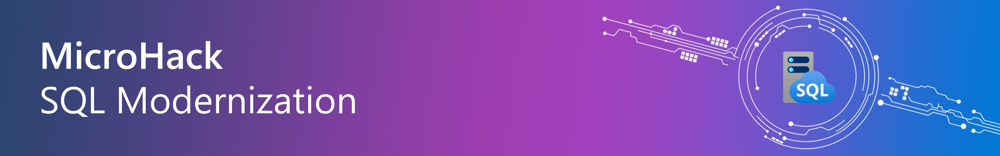

# MicroHack — SQL Modernization (2026 edition)

- [**MicroHack introduction**](#microhack-introduction)
- [**MicroHack context**](#microhack-context)
- [**Objectives**](#objectives)
- [**Pre-Lab Setup**](#pre-lab-setup)
- [**MicroHack Challenges**](#microhack-challenges)
- [**Documentation**](#documentation)
- [**Contributors**](#contributors)
- [**Original microhack & attribution**](#original-microhack--attribution)
- [**License**](#license)

# MicroHack introduction

This MicroHack walks through SQL Server modernization with a focus on current Microsoft-supported
assessment and migration paths for Azure SQL Managed Instance.

**What changed since the original:** Azure Data Studio was retired on 28-Feb-2026 and the Azure SQL
Migration extension was deprecated. This edition replaces that flow with Azure Database Migration
Service (DMS), Managed Instance Link, and Log Replay Service (LRS). The lab uses a single
**SQL Server 2019** IaaS source hosting restored sample databases (AdventureWorks2019 /
WideWorldImporters): it is assessed in Challenge 1 against **all** Azure SQL targets (Azure SQL
Database, Azure SQL Managed Instance, and SQL Server on Azure VM), then migrated to Azure SQL
Database with DMS in Challenge 2 and to Azure SQL Managed Instance with MI Link in Challenge 3.
The original Microsoft MicroHack is credited here:
<https://github.com/microsoft/MicroHack/tree/main/03-Azure/01-02%20Data/02-SQL_Modernization>

# MicroHack context

This scenario modernizes SQL Server workloads to Azure and highlights cost optimization, flexibility,
scalability, improved security and compliance, and simplified management and monitoring.

# Objectives

After completing this MicroHack you will be able to:

- Implement a proof-of-concept (PoC) for migrating an on-premises SQL Server 2019/2022 database into Azure SQL Managed Instance
- Perform assessments to reveal feature parity, compatibility, and modernization issues
- Migrate databases using currently supported Microsoft migration services (DMS, MI Link, LRS)
- Enable advanced SQL MI features to improve security, monitoring, and performance
- Understand how to implement a cloud migration solution for business-critical applications

# Pre-Lab Setup

**Before you start Challenge 1**, deploy the lab environment.
See [`scripts/RUN-ME.md`](./scripts/RUN-ME.md) for the single-user (5-minute) path or
[`scripts/README.md`](./scripts/README.md) for the full multi-team configuration reference.

Prerequisites:

- Azure subscription with Owner or Contributor + User Access Administrator role
- Az CLI 2.60+ and Az PowerShell 11+
- SSMS 20+ and VS Code with the MSSQL extension

> **Estimated cost:** ~$8-15/hour for a 2-team deployment (SQL VM + JumpBox x2 + Bastion).
> Auto-shutdown is configured at 19:00 UTC. See [`docs/cost-model.md`](./docs/cost-model.md) for details.

# MicroHack challenges

## Challenges

- [Challenge 0 — SQL Server access setup](challenges/challenge-00.md) **<- Start here**
- [Challenge 1 — Assessment](challenges/challenge-01.md)
- [Challenge 2 — DMS migration (SQL 2019 → Azure SQL DB)](challenges/challenge-02.md)
- [Challenge 3 — Managed Instance Link migration](challenges/challenge-03.md)
- [Challenge 4 — Monitoring and Performance on Azure SQL Managed Instance](challenges/challenge-04.md)
- [Challenge 5 — Security & Defender for SQL on Azure SQL Managed Instance](challenges/challenge-05.md)

## Solutions - Spoilerwarning

- [Solution 0](./walkthrough/challenge-00/solution-00.md)
- [Solution 1](./walkthrough/challenge-01/solution-01.md)
- [Solution 2](./walkthrough/challenge-02/solution-02.md)
- [Solution 3](./walkthrough/challenge-03/solution-03.md)
- [Solution 4](./walkthrough/challenge-04/solution-04.md)
- [Solution 5](./walkthrough/challenge-05/solution-05.md)

# Documentation

| Document | Description |
| --- | --- |
| [`docs/architecture.md`](./docs/architecture.md) | Network diagram, component table, per-team isolation |
| [`docs/facilitator-guide.md`](./docs/facilitator-guide.md) | Timing guide, cohort sizes, troubleshooting |
| [`docs/student-cheatsheet.md`](./docs/student-cheatsheet.md) | Connection strings, KQL queries, migration path comparison |
| [`docs/faq.md`](./docs/faq.md) | Frequently asked questions |
| [`docs/cost-model.md`](./docs/cost-model.md) | Per-resource rates, session cost scenarios, cost controls |
| [`docs/compliance-notes.md`](./docs/compliance-notes.md) | Data residency, credentials handling, MCAPS notes |
| [`scripts/RUN-ME.md`](./scripts/RUN-ME.md) | Quick-start deployment guide |
| [`scripts/README.md`](./scripts/README.md) | Full deploy.ps1 parameter reference |

# Contributors

- Alfonso Del Valle — Microsoft CSA Data & AI ([LinkedIn](https://www.linkedin.com/in/alfonsodelvalle/))

# Original microhack & attribution

This lab is a derivative of the Microsoft MicroHack SQL Modernization lab. Original contributors:

- Cornel Sukalla ([LinkedIn](https://www.linkedin.com/in/cornelsukalla/))
- Mert Seguner ([LinkedIn](https://www.linkedin.com/in/mertsenguner/))
- Sean Cowburn ([LinkedIn](https://www.linkedin.com/in/sean-cowburn/))

# License

This is a derivative work licensed under MIT. The original is available in the Microsoft MicroHack repository:
<https://github.com/microsoft/MicroHack/tree/main/03-Azure/01-02%20Data/02-SQL_Modernization>
