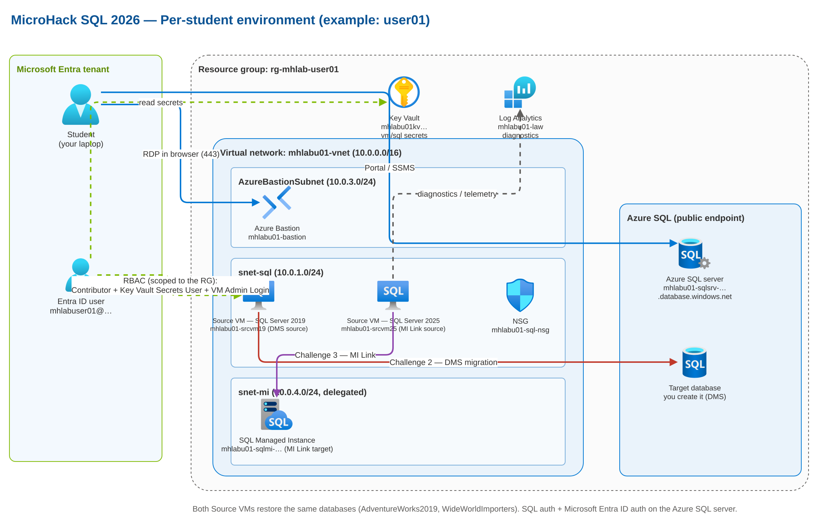
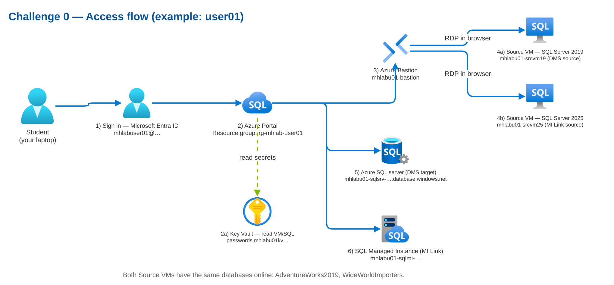

# Challenge 0 — Introduction & environment access

**[Home](../Readme.md)** - [Next Challenge](challenge-01.md)

Welcome to the **MicroHack SQL 2026**! In this lab you will **assess** a SQL Server 2019
instance and **migrate** to Azure — first from a **SQL Server 2019** source to **Azure SQL
Database** with Azure Database Migration Service (DMS), and then from a **SQL Server 2025** source
to **Azure SQL Managed Instance** with Managed Instance Link.

Challenge 0 makes sure that, before you touch any migration, you can reach **every** component
of your personal lab environment and you understand how it fits together. Work through the steps
in order; each one ends with a success check.

## Goal

Understand the lab architecture, sign in with your assigned identity, reach your isolated
resource group, connect to the source SQL Servers through Azure Bastion, and locate both
migration targets (Azure SQL Database and Azure SQL Managed Instance). When every check below
passes, you are ready for Challenge 1.

## The architecture

Each attendee gets a fully **isolated, personal** environment: one resource group
(`rg-<prefix>-user<NN>`, for example `rg-mhlab-user01`) that contains everything you need. You do
**not** share resources with the rest of the class.



| Component | What it is | You use it to |
| --- | --- | --- |
| **Entra ID user** | Your identity (`<prefix>user<NN>@<tenant>`, e.g. `mhlabuser01@…`) | Sign in to the Azure portal and the VM. |
| **Resource group** | `rg-<prefix>-user<NN>` (e.g. `rg-mhlab-user01`) | Holds all your resources; only you can access it. |
| **Source VM 1 (SQL 2019)** | Windows Server 2022 + SQL Server 2019 Developer (`mhlabu01-srcvm19`) | The **source** for the DMS migration (Challenge 2). Ships with SSMS, Azure CLI and VS Code. |
| **Source VM 2 (SQL 2025)** | Windows Server 2025 + SQL Server 2025 Enterprise Dev (`mhlabu01-srcvm25`) | The **source** for the MI Link migration (Challenge 3). Same DBs and tools as VM 1. |
| **Azure Bastion** | Browser-based RDP (`mhlabu01-bastion`) | Connect to both source VMs securely, no public RDP client. |
| **Key Vault** | Per-user secret store (`mhlabu01kv…`) | Look up the VM and SQL passwords you need. |
| **Azure SQL server** | PaaS logical server, public endpoint (`mhlabu01-sqlsrv-…`) | **Target** of the DMS migration (Challenge 2). You create the target database. |
| **Azure SQL Managed Instance** | Managed PaaS instance (`mhlabu01-sqlmi-…`) | **Target** of the MI Link migration (Challenge 3). |

> Networking is **public by design** to keep the lab simple — there are no private endpoints or
> peering to configure. Both source VMs already have **AdventureWorks2019** and
> **WideWorldImporters** restored and online.

## Access flow



## What the facilitator gives you

| Item | Pattern | Example (user01) |
| --- | --- | --- |
| Your sign-in user | `<prefix>user<NN>@<tenant>` | `mhlabuser01@MngEnvMCAP274168.onmicrosoft.com` |
| Your initial password | provided separately (temporary) | `Temporal01!` |
| Your resource group | `rg-<prefix>-user<NN>` | `rg-mhlab-user01` |

Everyone else uses `user02`, `user03`, and so on — you only have access to **your own**
resource group.

## Actions

### Step 1 — Sign in to the Azure portal

1. Open <https://portal.azure.com> in a private/incognito window (avoids mixing accounts).
2. Sign in with your user `mhlabuser01@…` and the **temporary password** the facilitator gives
   you (the lab default is `Temporal01!`).
3. On this **first sign-in you must change your password** — set a new one and keep it safe.
4. Complete the **multi-factor authentication (MFA)** registration when prompted.

✅ **Success:** you reach the Azure portal home page.

### Step 2 — Locate your resource group

1. In the top search bar, type **Resource groups**.
2. Open your group `rg-mhlab-user01`. It must be the **only** group you can access.
3. Confirm it contains at least: **two VMs** (`mhlabu01-srcvm19` and `mhlabu01-srcvm25`), an
   **Azure Bastion** (`mhlabu01-bastion`), an **Azure SQL server** (`mhlabu01-sqlsrv-…`), a
   **SQL managed instance** (`mhlabu01-sqlmi-…`), and a **Key Vault** (`mhlabu01kv…`).

✅ **Success:** you can see your resource group and its resources.

### Step 2a — Read your credentials from Key Vault

Every credential you need is stored in your personal **Key Vault** (`mhlabu01kv…`). Your account
has the **Key Vault Secrets User** role on your resource group, so you can read (but not change)
them. Get them now — you need the VM password in the next step.

1. In your resource group, open the Key Vault `mhlabu01kv…`.
2. Go to **Objects → Secrets**. You will find six secrets:
   - `student-username` / `student-password` — your Entra ID sign-in. `student-password` holds
     the **initial temporary** value (`Temporal01!`) only; you set your own at first sign-in.
   - `vm-admin-username` / `vm-admin-password` — the VM **local** administrator (`mhadmin`).
     **This is the password you actually use to connect to the machine and to SQL.**
   - `sql-admin-login` / `sql-admin-password` — the Azure SQL / Managed Instance admin login.
3. Open a secret and select **Show Secret Value**, or use the Azure CLI:

```powershell
az keyvault secret show --vault-name mhlabu01kv<hash> --name vm-admin-password --query value -o tsv
```

✅ **Success:** you can read your VM and SQL passwords from your Key Vault.

### Step 3 — Connect to the source VMs with Bastion

Your environment has **two** source VMs: `mhlabu01-srcvm19` (SQL Server 2019, the DMS source for
Challenge 2) and `mhlabu01-srcvm25` (SQL Server 2025, the MI Link source for Challenge 3). Both have
the same databases and tooling.

1. In your resource group, open the virtual machine `mhlabu01-srcvm19`.
2. Select **Connect → Bastion**.
3. Enter the VM credentials:
   - **Username:** `mhadmin` (the VM local administrator)
   - **Password:** the `vm-admin-password` you read from Key Vault in Step 2a.
4. Select **Connect**. A Windows desktop opens in a new browser tab (allow pop-ups).
5. Repeat for `mhlabu01-srcvm25` to confirm access to the SQL Server 2025 VM.

✅ **Success:** you reach the Windows desktop of both source VMs.

### Step 4 — Connect to the source SQL Server with SSMS

1. Inside either source VM (for Challenge 0, `mhlabu01-srcvm19` is fine), open **SQL Server
   Management Studio (SSMS)** from the Start menu.
2. In the connection dialog:
   - **Server name:** `localhost`
   - **Authentication:** Windows Authentication, **or** SQL Server Authentication with the
     `sa` / `sqladmin` login and the `vm-admin-password` value.
   - Select **Trust server certificate** if the warning appears.
3. Select **Connect** and expand **Databases**.
4. Confirm **AdventureWorks2019** and **WideWorldImporters** are present and online.

> Need to reach the source SQL Server **from your laptop** instead? Point SSMS at the
> **VM public IP, port 1433** with SQL authentication (`sqladmin` / `vm-admin-password`). The
> NSG allows 1433 inbound (public lab). Not required for Challenge 0.

✅ **Success:** you see both sample databases online.

### Step 5 — Identify your Azure SQL server (DMS target)

1. Back in the Azure portal, open your **Azure SQL server** (logical server) `mhlabu01-sqlsrv-…`.
2. Copy its **FQDN** (for example `mhlabu01-sqlsrv-….database.windows.net`). You need it in
   **Challenge 2** for the DMS migration. No target database exists yet — you create it there.

✅ **Success:** you locate your Azure SQL server and note its FQDN.

### Step 6 — Identify your Azure SQL Managed Instance (MI Link target)

1. In your resource group, open the **SQL managed instance** `mhlabu01-sqlmi-…`.
2. Check its status. **MI provisioning can take several hours**: if it is still in a *Creating*
   state, tell the facilitator. You use it in **Challenge 3**.

✅ **Success:** you locate your Managed Instance (or confirm it is still provisioning).

## Success criteria

- [ ] You signed in to the Azure portal with your `<prefix>user<NN>@<tenant>` account and changed the temporary password + set up MFA.
- [ ] You can see **only** your resource group `rg-mhlab-user01`.
- [ ] You opened your **Key Vault** and read the `vm-admin-password` secret.
- [ ] You connected to `mhlabu01-srcvm19` and `mhlabu01-srcvm25` through Azure Bastion.
- [ ] SSMS on the VM shows **AdventureWorks2019** and **WideWorldImporters** online.
- [ ] You located your Azure SQL server and noted its FQDN.
- [ ] You located your Azure SQL Managed Instance (or confirmed it is provisioning).

## Credentials you will handle

Every credential is stored in your personal **Key Vault** (`mhlabu01kv…`). There are **three
different passwords** — do not confuse them.

| Credential | Used for | Where to find it |
| --- | --- | --- |
| Entra ID user (`mhlabuser01@…`) | Azure portal and VM sign-in | **Temporary** password from facilitator (`Temporal01!`); you change it at first sign-in. Initial value also in `student-password`. |
| VM local admin (`mhadmin`) | VM sign-in through Bastion | Key Vault secret `vm-admin-password` |
| Source SQL login (`sa` / `sqladmin`) | SQL inside the source VM | Key Vault secret `vm-admin-password` (equals the VM admin password) |
| Azure SQL / MI login (`sqladmin`) | The Azure targets | Key Vault secret `sql-admin-password` |

> You still type each password yourself into Bastion / SSMS — the Key Vault is just where you
> look them up. The **source** SQL login and the **Azure SQL** login are **different** passwords
> (`vm-admin-password` vs `sql-admin-password`).

## Troubleshooting

| Symptom | Likely cause | What to do |
| --- | --- | --- |
| Cannot sign in | Password / MFA | Ask the facilitator for a reset. |
| No resource group visible | Access not assigned yet | Ask the facilitator to re-check your role assignment. |
| Cannot read Key Vault secrets | Role still propagating | Wait a few minutes; you need **Key Vault Secrets User**. |
| Bastion will not connect | VM credentials | Verify `mhadmin` and its password. |
| SSMS does not see the databases | Restore still running | Tell the facilitator. |
| Managed Instance not visible | Slow provisioning | Wait / ask; MI can take 3–6 hours. |

## Learning resources

- [Connect to a VM using Azure Bastion](https://learn.microsoft.com/azure/bastion/bastion-connect-vm-rdp-windows)
- [Azure RBAC overview](https://learn.microsoft.com/azure/role-based-access-control/overview)
- [Connect with SSMS](https://learn.microsoft.com/sql/ssms/quickstarts/ssms-connect-query-sql-server)
- [Azure SQL Managed Instance overview](https://learn.microsoft.com/azure/azure-sql/managed-instance/sql-managed-instance-paas-overview)

When all checks pass, you are ready for **[Challenge 1](challenge-01.md)**. 🎉
