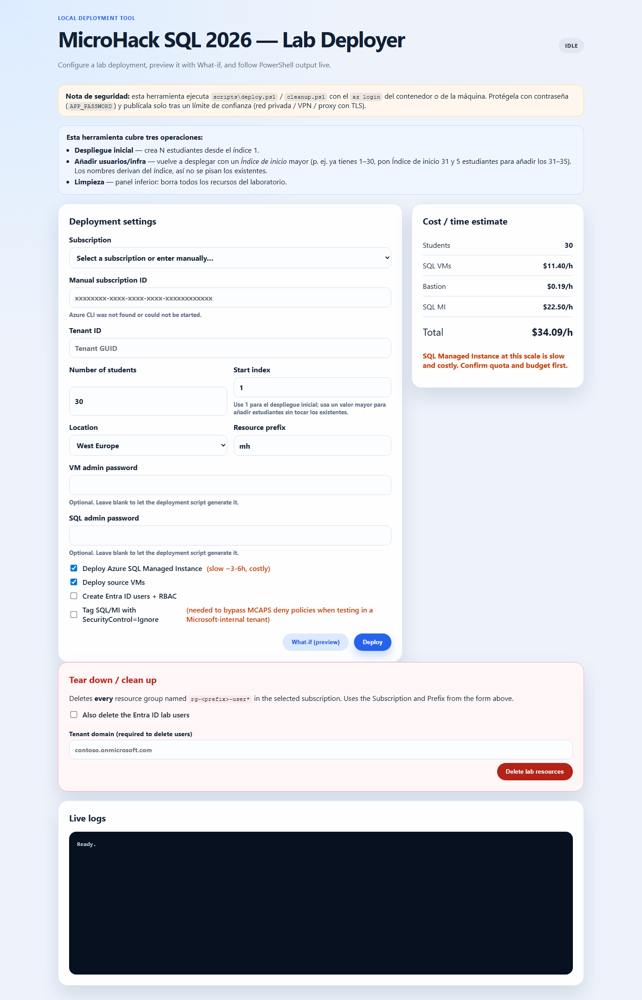

# Infrastructure — MicroHack SQL 2026

This folder contains everything needed to **provision the lab infrastructure** for as many
attendees as you want, in **your own Azure tenant and subscription**. Each attendee gets a fully
isolated environment so they can complete Challenge 0 through Challenge 5 without interfering with
anyone else.

> 🔐 **No secrets are stored in this repository.** You authenticate with your own Azure
> credentials at deploy time, and the VM / SQL passwords are passed at runtime (or generated) and
> stored in a per-user Azure Key Vault. Never commit a real `parameters.json`, `.env`, or password.

## What gets deployed (per attendee)

One resource group `rg-<prefix>-user<NN>` (e.g. `rg-mhlab-user01`) containing:

| Resource | Module | Purpose |
| --- | --- | --- |
| Entra ID user `<prefix>user<NN>@<tenant>` | `scripts/create-users.ps1` | Attendee identity (temporary password, MFA + change at first sign-in). |
| Virtual network + NSGs + Bastion | `bicep/modules/network.bicep`, `bastion.bicep` | Secure access to the source VM (public networking, no peering). |
| Source VM (Windows + SQL Server 2019) | `bicep/modules/sourceVm.bicep` | Migration **source**; SSMS, VS Code, AdventureWorks2019 + WideWorldImporters restored. |
| Azure SQL logical server | `bicep/modules/sqlServer.bicep` | DMS migration **target** (Challenge 2). |
| Azure SQL Managed Instance | `bicep/modules/sqlMi.bicep` | MI Link migration **target** (Challenge 3). |
| Key Vault | `bicep/modules/keyVault.bicep` | Stores the attendee's VM / SQL credentials. |
| RBAC | `bicep/modules/userEnvironment.bicep` | Contributor + Key Vault Secrets User + VM Administrator Login on the user's RG. |

See `docs/architecture.md` and `docs/diagrams/` for the full architecture and Azure diagrams.

## Folder contents

```text
infra/
  README.md                 ← this file
  bicep/                    ← per-student Infrastructure-as-Code (authoritative)
    main.bicep              Subscription-scoped orchestrator (loops per user)
    main.parameters.json    Parameter template (placeholders only — no secrets)
    modules/                network, bastion, sourceVm, sqlServer, sqlMi, keyVault, userEnvironment
    scripts/
      setup-source-vm.ps1   VM Custom Script Extension: installs tools, restores sample DBs
  scripts/                  ← deployment automation (Option 1)
    deploy.ps1              Orchestrator: validates, stages setup script, deploys, creates users
    add-user.ps1            Provision one extra environment on demand
    create-users.ps1        Create/refresh Entra ID users + RBAC
    cleanup.ps1             Tear down resource groups, users and staging
    parameters.example.json Example parameters (placeholders only)
    README.md               Script reference
  web/                      ← deployment web UI (Option 2)
    server.js, public/      Local Node.js app to launch deployments from a browser
  docs/                     ← deployment guide, access guide, cost model, diagrams, screenshots
```

## Prerequisites

- An Azure **subscription** where you have **Owner** (needed to create role assignments) and
  permission to **create Entra ID users** (User Administrator or similar).
- [Azure CLI](https://learn.microsoft.com/cli/azure/install-azure-cli) and
  [PowerShell 7+](https://learn.microsoft.com/powershell/scripting/install/installing-powershell).
- The [Bicep CLI](https://learn.microsoft.com/azure/azure-resource-manager/bicep/install)
  (`az bicep install`).
- For the web UI: [Node.js 18+](https://nodejs.org).
- A region with **Azure SQL Managed Instance** quota (e.g. `westeurope`, `spaincentral`).

> ⏱️ **Managed Instance takes 3–6 hours to provision.** Start deployments well ahead of the lab.

### Sign in to your own tenant

```powershell
az login --tenant <your-tenant-id>
az account set --subscription <your-subscription-id>
az bicep install
```

Everything below uses **your** subscription and tenant — there are no hardcoded credentials.

---

## Option 1 — Deploy with commands (PowerShell / CLI)

The `scripts/deploy.ps1` orchestrator is the recommended path. It validates inputs, stages the VM
setup script to a private storage account (using an Azure AD user-delegation SAS, so no storage
keys are needed), deploys the Bicep template once per user, and optionally creates the Entra ID
users with the right RBAC.

### Deploy for N attendees

```powershell
cd infra
./scripts/deploy.ps1 `
  -SubscriptionId <your-subscription-id> `
  -TenantId       <your-tenant-id> `
  -UserCount      30 `
  -Location       westeurope `
  -Prefix         mh `
  -CreateUsers
```

- `-UserCount` — how many attendee environments to create (e.g. `30`).
- `-StartIndex` — first user number (default `1`, so you get `user01`…`user30`).
- `-Prefix` — short name prefix (≤ 8 chars) used in every resource name.
- `-CreateUsers` — also create the Entra ID users + role assignments.
- `-VmAdminPassword` / `-SqlAdminPassword` — optional; **strong passwords are generated** and
  stored in each user's Key Vault if you omit them. Pass `SecureString` values to set your own.
- `-InitialPassword` — temporary Entra ID password (default `Temporal01!`); users must change it
  and register MFA at first sign-in.
- `-DeploySqlMi` / `-DeploySourceVm` — `true`/`false` toggles (both default `true`).
- `-WhatIf` — preview the deployment without creating anything.

Preview first:

```powershell
./scripts/deploy.ps1 -SubscriptionId <your-subscription-id> -UserCount 30 -WhatIf
```

### Add one extra attendee later

Deployed 20 and a 21st attendee shows up? Provision a single environment without touching the
others:

```powershell
./scripts/add-user.ps1 `
  -SubscriptionId <your-subscription-id> `
  -TenantId       <your-tenant-id> `
  -StartIndex     21 `
  -Count          1
```

### Deploy the Bicep template directly (optional)

```powershell
az deployment sub create `
  --location westeurope `
  --template-file infra/bicep/main.bicep `
  --parameters infra/bicep/main.parameters.json `
  --parameters vmAdminPassword='<strong-pwd>' sqlAdminPassword='<strong-pwd>'
```

Pass passwords on the command line or via a local `parameters.json` you **do not commit**.

### Clean up after the lab

```powershell
# Remove every lab resource group, the Entra ID users and the staging account
./scripts/cleanup.ps1 -SubscriptionId <your-subscription-id> -Prefix mh -All -DeleteUsers -IncludeStaging -Force
```

Full reference: `scripts/README.md` and `docs/deployment-guide.md`.

---

## Option 2 — Deploy with the web app

A local web UI lets you pick the subscription, number of attendees and options, then launches the
same `deploy.ps1` and streams live logs to your browser.

```powershell
cd infra/web
npm install
npm start
```

Open <http://127.0.0.1:3000>, then:

1. Select your **Azure subscription** (read from your `az login` session).
2. Choose the **number of attendees**, **start index**, **region** and **prefix**.
3. Toggle **Create users**, **Deploy SQL MI**, **Deploy source VM** and **Preview (What-If)**.
4. Start the job and watch the streamed deployment logs.



> ⚠️ **Security:** the web app binds to `127.0.0.1` only and runs deployments **as your current
> `az login` identity**. Run it only on a trusted machine; never expose it to a network. It does
> not store or transmit any credential — it shells out to the Azure CLI session you already
> control.

---

## Where credentials live

| Credential | How it is set | Where it is stored |
| --- | --- | --- |
| Attendee Entra ID password | Temporary value (`-InitialPassword`, default `Temporal01!`) | Forced change + MFA at first sign-in; initial value also in Key Vault `student-password`. |
| VM local admin password | Generated (or `-VmAdminPassword`) | Per-user Key Vault secret `vm-admin-password`. |
| Azure SQL / MI admin password | Generated (or `-SqlAdminPassword`) | Per-user Key Vault secret `sql-admin-password`. |

No password is ever written to this repository. Attendees read their own credentials from their
Key Vault (they have the **Key Vault Secrets User** role on their resource group).

## Cost

Each environment is dominated by the **SQL Managed Instance** and the **source VM**. See
`docs/cost-model.md` for an estimate and cost-control tips (auto-shutdown is enabled on the VM at
`19:00` by default). Always run `cleanup.ps1` when the lab finishes.
