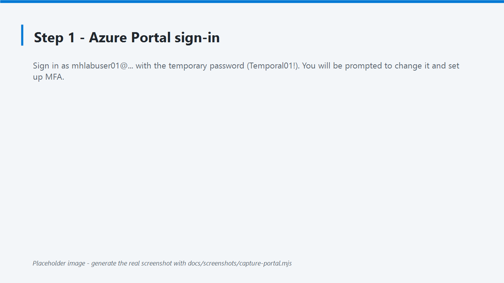
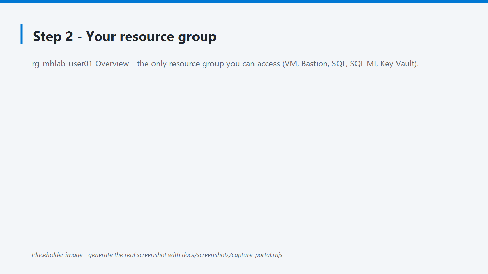
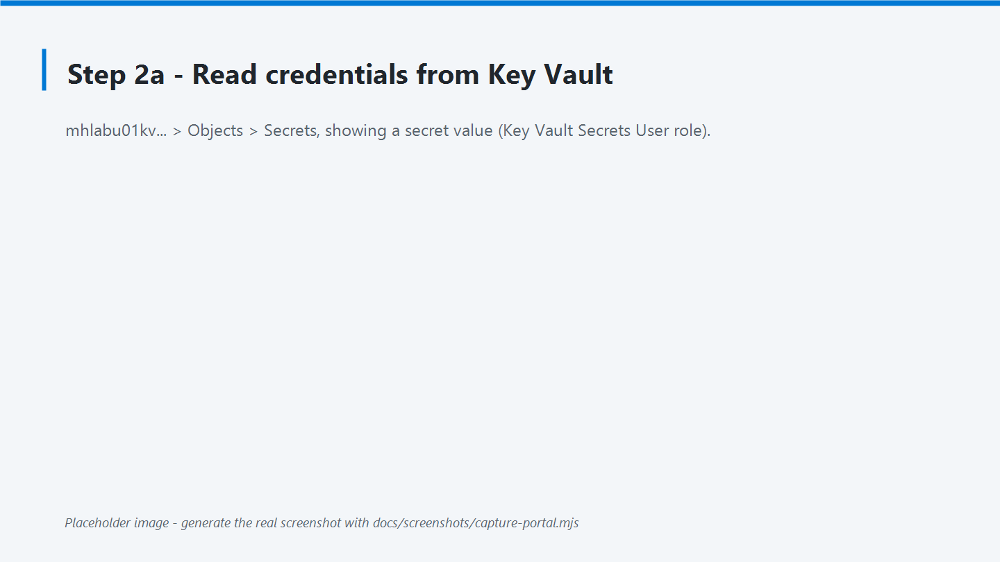
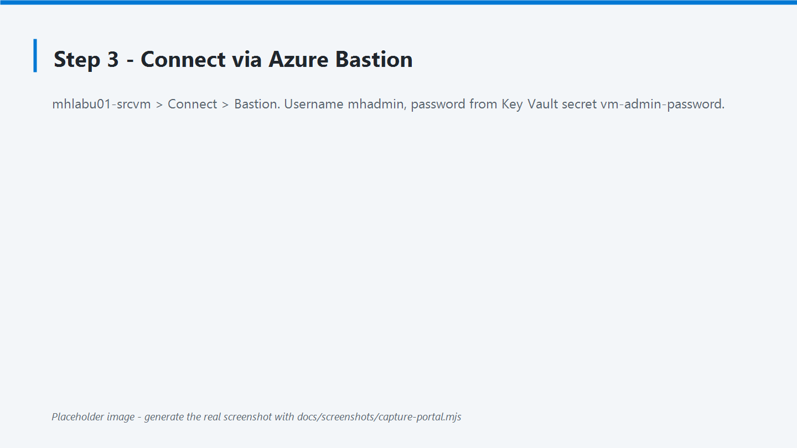
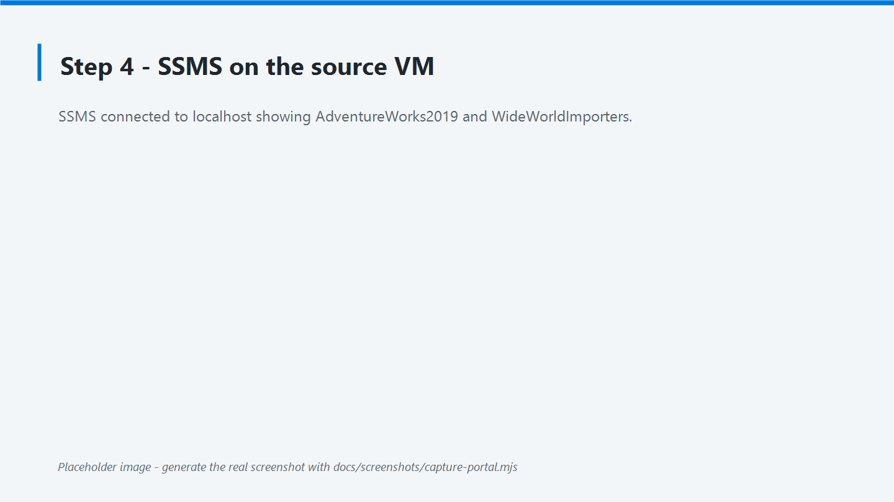
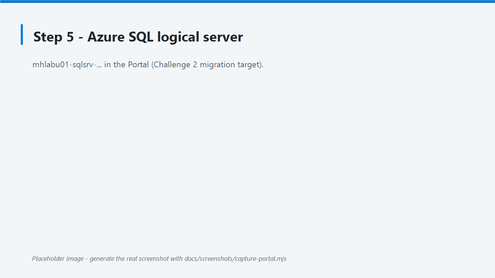
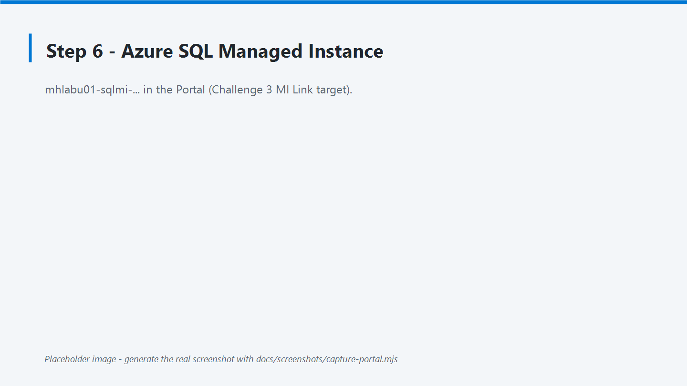

# Challenge 0 — Environment access setup

**[Home](../README.md)** - [Architecture](architecture.md) - [Introduction](introduction.md)

Before you start the SQL modernization challenges, confirm that you can reach **every**
component of your personal lab environment. Work through the steps in order. Each step has a
matching screenshot under [`images/`](images/) and a success check.

> **Facilitators:** the numbered Portal / Bastion / SSMS screenshots (`images/01-…` … `07-…`)
> currently ship as **labeled placeholders**. Regenerate the real ones against your own tenant
> with the Playwright helper in [`screenshots/`](screenshots/README.md) — it writes to the same
> file names, so they will replace the placeholders automatically. The guide is fully usable as-is.

## Access flow


## What the facilitator gives you

| Item | Pattern | Example (user01) |
| --- | --- | --- |
| Your sign-in user | `<prefix>user<NN>@<tenant>` | `mhlabuser01@<your-tenant>.onmicrosoft.com` |
| Your initial password | provided separately | — |
| Your resource group | `rg-<prefix>-user<NN>` | `rg-mhlab-user01` |

Everyone else in the class uses `user02`, `user03`, and so on. You only have access to **your
own** resource group.

## Goal

Verify that you can sign in, reach your isolated resource group, connect to the source SQL
Server through Azure Bastion, and locate both migration targets (Azure SQL Database and Azure
SQL Managed Instance). When all the checks below pass, you are ready for Challenge 1.

## Actions

### Step 1 — Sign in to the Azure portal

1. Open <https://portal.azure.com> in a private/incognito window (avoids mixing accounts).
2. Sign in with your user `mhlabuser01@<your-tenant>.onmicrosoft.com` and the **temporary
   password** your facilitator gives you (the lab default is `Temporal01!`).
3. On this **first sign-in you must change your password** — set a new one and keep it safe.
4. Complete the **multi-factor authentication (MFA)** registration when prompted.



✅ **Success:** you reach the Azure portal home page.

### Step 2 — Locate your resource group

1. In the top search bar, type **Resource groups**.
2. Open your group `rg-mhlab-user01`. It must be the **only** group you can access.
3. Confirm it contains, at minimum: a **VM** (`mhlabu01-srcvm`), an **Azure Bastion**
   (`mhlabu01-bastion`), an **Azure SQL server** (`mhlabu01-sqlsrv-…`), a
   **SQL managed instance** (`mhlabu01-sqlmi-…`), and a **Key Vault** (`mhlabu01kv…`).



✅ **Success:** you can see your resource group and its resources.

### Step 2a — Read your credentials from Key Vault

All lab credentials are stored in your personal **Key Vault** (`mhlabu01kv…`). Your account has the
**Key Vault Secrets User** role on your resource group, so you can read (but not change) them. Get
them now — you will need the VM password in the next step.

1. In your resource group, open the Key Vault `mhlabu01kv…`.
2. Go to **Objects → Secrets**. You will find six secrets:
   - `student-username` / `student-password` — your Azure (Entra ID) sign-in. `student-password`
     holds the **initial temporary** password (`Temporal01!`) only; the student sets their own at
     first sign-in.
   - `vm-admin-username` / `vm-admin-password` — the VM **local** administrator (`mhadmin`). **This
     is the password you actually need to connect to the machines and SQL.**
   - `sql-admin-login` / `sql-admin-password` — the Azure SQL / Managed Instance admin login.
3. Open a secret and select **Show Secret Value** to copy it.



Or use the Azure CLI (Cloud Shell or the source VM):

```powershell
az keyvault secret show --vault-name mhlabu01kv<hash> --name vm-admin-password --query value -o tsv
```

✅ **Success:** you can read your VM and SQL passwords from your Key Vault.

### Step 3 — Connect to the source VM with Bastion

1. In your resource group, open the virtual machine `mhlabu01-srcvm`.
2. Select **Connect → Bastion**.
3. Enter the VM credentials:
   - **Username:** `mhadmin` (the VM local administrator)
   - **Password:** the `vm-admin-password` you read from Key Vault in Step 2a.
4. Select **Connect**. A Windows desktop opens in a new browser tab.



> Allow pop-ups for this site if your browser blocks the Bastion window.

✅ **Success:** you see the Windows Server 2022 desktop of your source VM.

### Step 4 — Connect to the source SQL Server with SSMS

1. Inside the VM, open **SQL Server Management Studio (SSMS)** from the Start menu.
2. In the connection dialog:
   - **Server name:** `localhost`
   - **Authentication:** Windows Authentication (or SQL Server Authentication with the
     `sa` / `sqladmin` login and the password the facilitator provides)
   - Select **Trust server certificate** if the warning appears.
3. Select **Connect**.
4. Expand **Databases** and confirm that **AdventureWorks2019** and **WideWorldImporters**
   are present and online.



> Need to reach the source SQL Server **from outside** the VM (your laptop)? It is possible by
> pointing SSMS at the **VM public IP**, port 1433, using SQL authentication. Ask the
> facilitator — it is not required for Challenge 0.

✅ **Success:** you see both sample databases online.

### Step 5 — Identify your Azure SQL server (DMS target)

1. Back in the Azure portal, open your **Azure SQL server** (logical server) in your
   resource group: `mhlabu01-sqlsrv-…`.
2. Copy its **server name / FQDN** (for example
   `mhlabu01-sqlsrv-yzrgvstb4csl2.database.windows.net`). You will need it in **Challenge 2**
   for the DMS migration. No target database exists yet — you create it during Challenge 2.



✅ **Success:** you locate your Azure SQL server and note its FQDN.

### Step 6 — Identify your Azure SQL Managed Instance (MI Link target)

1. In your resource group, open the **SQL managed instance** resource `mhlabu01-sqlmi-…`.
2. Check its status. **MI provisioning can take several hours**: if it does not appear yet or
   is in a *Creating* state, let the facilitator know. You will use it in **Challenge 3**.



✅ **Success:** you locate your Managed Instance (or confirm with the facilitator that it is
still provisioning).

## Success criteria

- [ ] You signed in to the Azure portal with your `<prefix>user<NN>@<tenant>` account.
- [ ] You can see **only** your resource group `rg-mhlab-user01`.
- [ ] You opened your **Key Vault** and read the `vm-admin-password` secret.
- [ ] You connected to `mhlabu01-srcvm` through Azure Bastion.
- [ ] SSMS on the VM shows **AdventureWorks2019** and **WideWorldImporters** online.
- [ ] You located your Azure SQL server and noted its FQDN.
- [ ] You located your Azure SQL Managed Instance (or confirmed it is provisioning).

## Credentials you will handle

Every credential is stored in your personal **Key Vault**; you have **Key Vault Secrets User**
access to read them. Mind that there are **three different passwords** — do not confuse them.

| Credential | Used for | Where to find it |
| --- | --- | --- |
| Entra ID user (`mhlabuser01@…`) | Azure portal and VM sign-in (Bastion) | **Temporary** password from facilitator (`Temporal01!`); change at first sign-in. Also in Key Vault `student-password`. |
| VM local admin (`mhadmin`) | Alternate VM sign-in through Bastion | **Key Vault** secret `vm-admin-password` |
| Source SQL login (`sa` / `sqladmin`) | SQL connection inside the source VM | **Key Vault** secret `vm-admin-password` (equals the VM admin password) |
| Azure SQL / MI login (`sqladmin`) | Connection to the Azure targets | **Key Vault** secret `sql-admin-password` |

> You still type each password into Bastion / SSMS yourself — the Key Vault is the single place
> where you look them up. The **source** SQL login and the **Azure SQL** login are **different
> passwords** (`vm-admin-password` vs `sql-admin-password`).

## Troubleshooting

| Symptom | Likely cause | What to do |
| --- | --- | --- |
| Cannot sign in | Password / MFA | Ask the facilitator for a reset. |
| No resource group visible | RBAC not assigned | Facilitator re-runs the role assignment. |
| Cannot read Key Vault secrets | Role still propagating | Wait a few minutes; you need **Key Vault Secrets User**. |
| Bastion will not connect | VM credentials | Verify user `mhadmin` and its password. |
| SSMS does not see the databases | Restore still running | Tell the facilitator (check the Custom Script Extension). |
| Managed Instance not visible | Slow provisioning | Wait / ask; MI takes 3-6 hours. |

## Learning resources

- [Connect to a VM using Azure Bastion](https://learn.microsoft.com/azure/bastion/bastion-connect-vm-rdp-windows)
- [Azure RBAC overview](https://learn.microsoft.com/azure/role-based-access-control/overview)
- [Connect with SSMS](https://learn.microsoft.com/sql/ssms/quickstarts/ssms-connect-query-sql-server)
- [Azure SQL Managed Instance overview](https://learn.microsoft.com/azure/azure-sql/managed-instance/sql-managed-instance-paas-overview)

When all checks pass, you are ready for **Challenge 1**. 🎉
