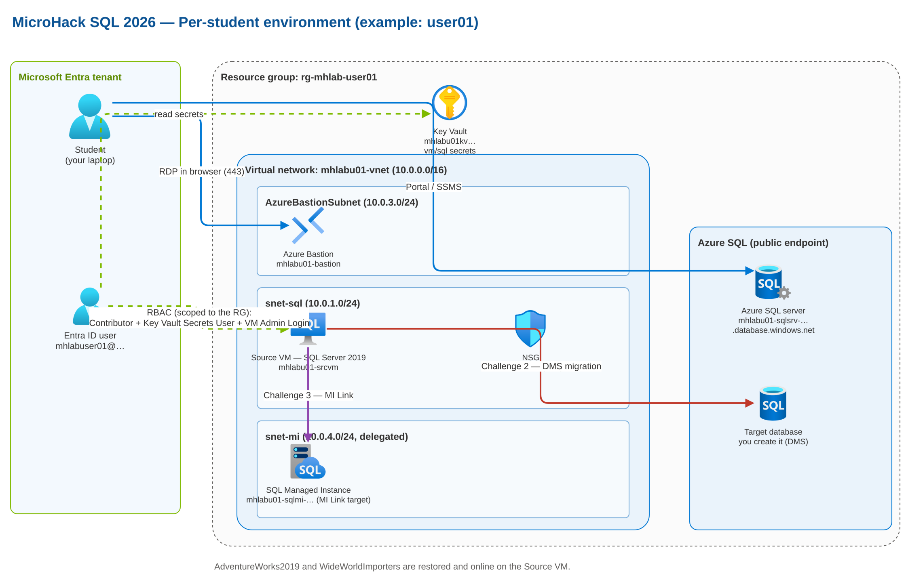

# MicroHack SQL 2026 — Lab introduction & objectives

**[Home](../README.md)** - [Architecture](architecture.md) - [Student introduction](introduction.md) - [Access guide (Challenge 0)](access-guide.md)

This is the front-door for the **MicroHack SQL 2026** lab. Read it first to understand what the
lab is, what you will build and do, and what you should be able to do by the end. Facilitators use
it to brief a cohort; attendees use it to get oriented before Challenge 0.

## What this lab is

A hands-on **SQL Server modernization** MicroHack. You start from a **SQL Server 2019** instance
running on a Windows virtual machine (the *source*) and **migrate it to Azure** using the tools
Microsoft recommends today:

- **Assess** the source with **SSMS** and **Azure Migrate**.
- **Migrate to Azure SQL Database** with **Azure Database Migration Service (DMS)**.
- **Migrate to Azure SQL Managed Instance** with **Managed Instance (MI) Link**.

Every attendee works in a **fully isolated, personal environment** — one Azure resource group per
person — so nobody can interfere with anyone else. Networking is **public by design** to keep the
focus on SQL modernization rather than on private networking setup.

## What you will do (challenge roadmap)

| Challenge | What you do | Primary resource |
| --- | --- | --- |
| **0 — Introduction & access** | Sign in, reach your isolated resource group, connect to the source SQL Server, and locate both migration targets. | Identity, portal, Key Vault, Bastion, source VM |
| **1 — Assess the source** | Analyze the SQL Server 2019 workload (readiness + sizing) with SSMS and Azure Migrate. | Source VM |
| **2 — Migrate to Azure SQL Database** | Run an online migration with DMS into an Azure SQL Database you create. | Azure SQL logical server |
| **3 — Migrate to Azure SQL Managed Instance** | Replicate and migrate with Managed Instance Link. | Azure SQL Managed Instance |
| **4 — Validate & modernize** | Compare source and targets; validate data and apps. | All targets |
| **5 — Cleanup & review** | Tear down and review what you learned. | Resource group / facilitator |

## Objectives

By the end of the lab you will be able to:

- **Assess** a SQL Server 2019 instance for Azure readiness and choose a target SKU with a cost
  estimate.
- **Plan and run** a low-downtime migration to **Azure SQL Database** with DMS, including the
  Self-Hosted Integration Runtime and source/target connectivity.
- **Set up Managed Instance Link** and migrate to **Azure SQL Managed Instance**.
- **Validate** a migration (schema, data, row counts) and reason about the differences between
  Azure SQL Database and Azure SQL Managed Instance.
- Understand the **Azure footprint** of a per-student lab: identity, RBAC, networking, Key Vault,
  diagnostics, and clean teardown.

## Your environment at a glance

Each attendee receives one resource group (`rg-<prefix>-user<NN>`, e.g. `rg-mhlab-user01`)
containing everything needed for all challenges:

| Component | Role in the lab |
| --- | --- |
| Entra ID user + scoped RBAC | Your identity, limited to your own resource group. |
| Source VM (Windows Server 2022 + SQL Server 2019) | The migration **source**; ships with SSMS, Azure CLI, VS Code and the sample databases restored. |
| Azure Bastion | Browser-based RDP to the source VM (no public RDP client). |
| Azure SQL logical server | **Target** of the DMS migration (Challenge 2). |
| Azure SQL Managed Instance | **Target** of the MI Link migration (Challenge 3). |
| Key Vault | Holds your VM and SQL credentials; you read them with Key Vault Secrets User. |
| Log Analytics workspace | Collects diagnostics/telemetry for your lab resources. |

The source VM already has **AdventureWorks2019** and **WideWorldImporters** restored and **online**
— these are your source workload. For the full design (network, NSGs and subscription isolation),
see [architecture.md](architecture.md).

## Who does what

- **Facilitators** provision the environments ahead of time with the automation in
  [`infra/`](../README.md) (Bicep + PowerShell, or the web UI), hand out credentials, and tear
  everything down afterwards. See the [deployment guide](deployment-guide.md) and
  [cost model](cost-model.md).
- **Attendees** start at **Challenge 0** and follow each challenge in order. Begin with the
  [student introduction](introduction.md) and the [access guide](access-guide.md).

## How to get started

1. **Facilitator:** deploy the environments and verify them — see the
   [deployment guide](deployment-guide.md).
2. **Attendee:** read the [student introduction](introduction.md), then complete
   [Challenge 0](../../challenges/challenge-00.md) using the [access guide](access-guide.md).

When your Challenge 0 checks pass, you are ready for Challenge 1. 🎉
