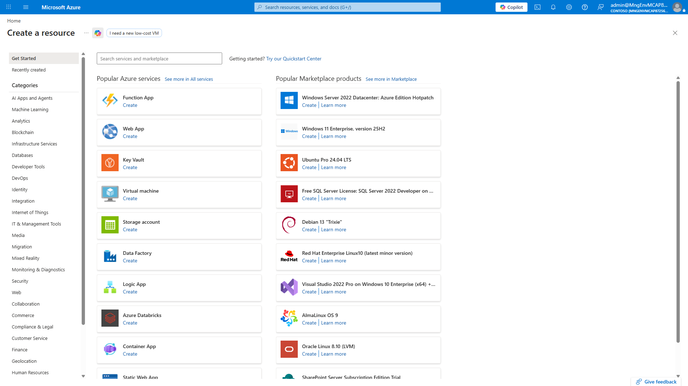
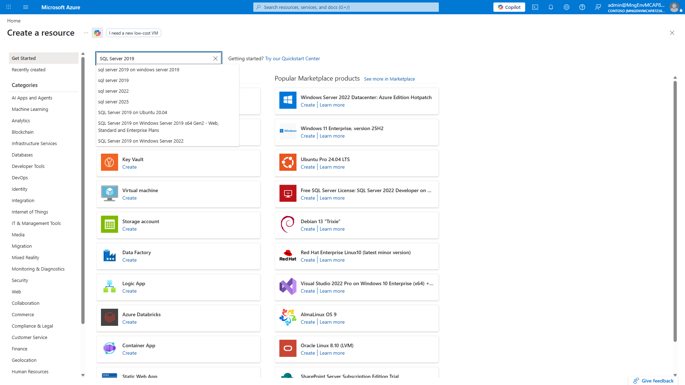
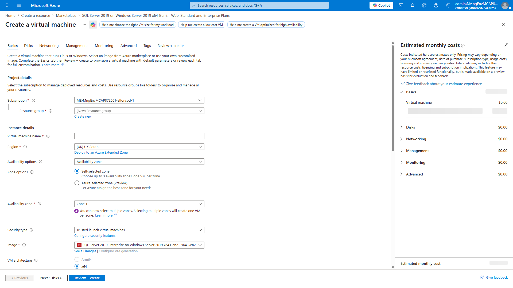
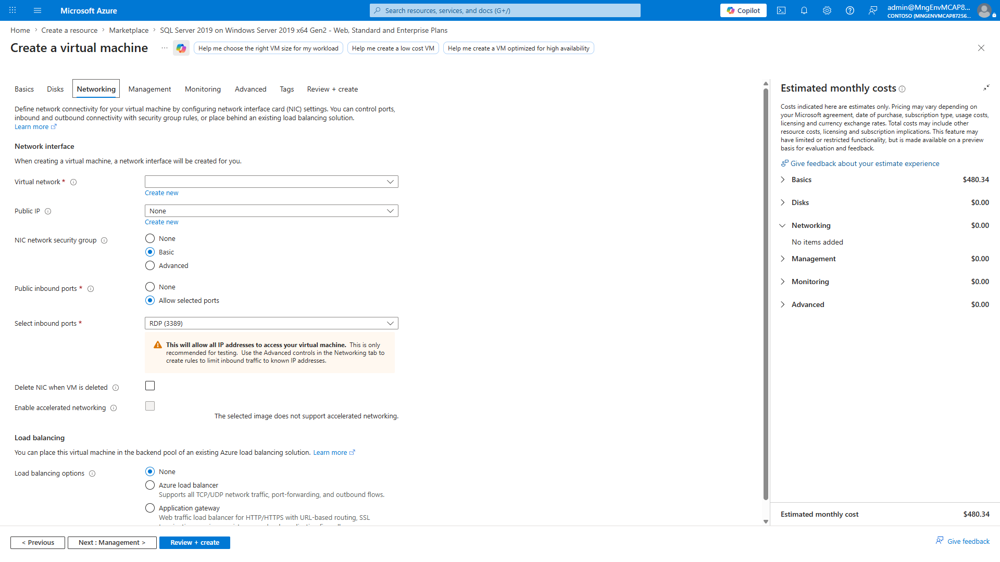
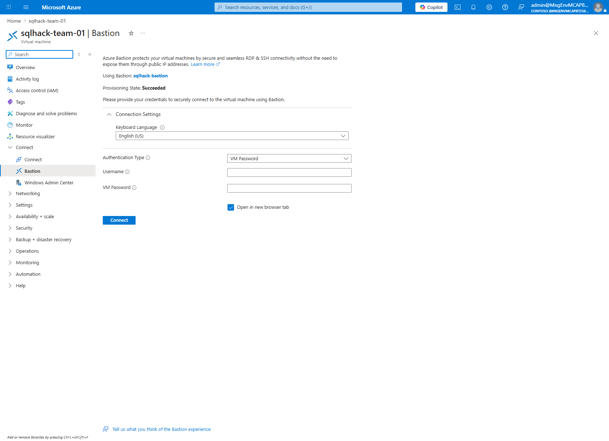
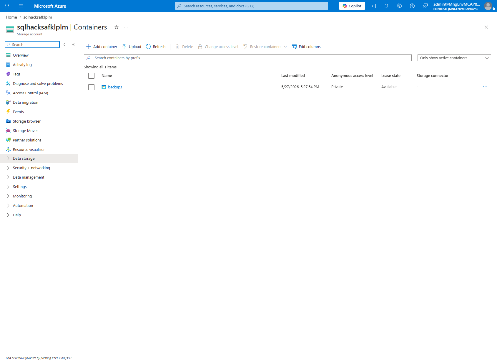
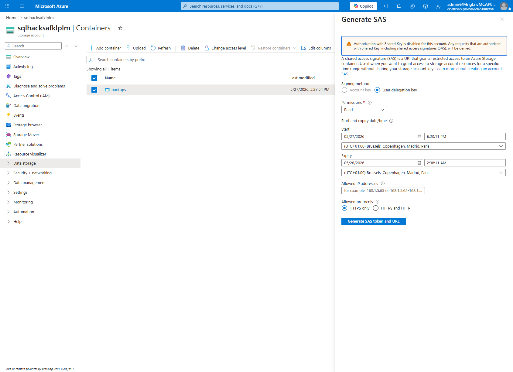

# Solution 1 — Assessment and migration (2026 edition)

[Previous Challenge] - **[Home](../../Readme.md)** - [Next Solution](../challenge-02/solution-02.md)

## What changed since the original

The original MicroHack walkthrough used Azure Data Studio (ADS) plus the Azure SQL Migration extension to assess and migrate the lab databases. Azure Data Studio was retired on **28-Feb-2026**, so this 2026 edition replaces the ADS workflow with Azure-native services and supported management tools.

| Original lab choice | 2026 replacement | Why it changed |
|---|---|---|
| Azure Data Studio + Azure SQL Migration extension | **Azure Database Migration Service (DMS)** through Azure Portal, CLI, PowerShell, or REST | ADS is retired; DMS is the underlying migration service and remains supported. |
| ADS performance collection and SKU recommendation | **Azure Migrate SQL assessment** | Azure Migrate provides discovery, readiness, right-sizing, and cost estimation at scale. |
| SQL Server 2012/2016 source | **SQL Server 2019/2022 Developer** | Keeps the lab current and enables optional Managed Instance Link. |
| Private `TEAMxx_*` application databases | **AdventureWorks2019** + **WideWorldImporters** | Public sample databases make the lab reproducible outside the original workshop tenant. |
| DMA-only compatibility findings | Azure Migrate + injected compatibility issues | The dirty workload makes CLR, trace flags, cross-database references, and SQL Agent findings visible. |
| SSMS only for validation | **VS Code MSSQL extension** + SSMS 20+ | VS Code is the primary query/editor experience; SSMS remains required for MI Link and SQL Agent. |
| One migration path | Three supported paths: DMS, MI Link, LRS | Different customers need orchestrated, near-zero-downtime, or regulated/manual migration patterns. |

> **Default path:** Follow **Path A — DMS via Azure Portal** unless your instructor explicitly assigns Path B or Path C.

## Lab architecture

This challenge simulates an on-premises SQL Server by using an Azure VM in one subnet and migrates two databases to Azure SQL Managed Instance in a delegated subnet. Azure Migrate discovers and assesses the source. DMS uses a Self-hosted Integration Runtime (SHIR) and Azure Storage backup container to stage backups and apply them to SQL MI. Optional paths use Managed Instance Link or Log Replay Service.


**Components**

- Resource group: `rg-microhack-sql-2026`
- Region: `westeurope`
- Source VM: `vm-sql-source` running SQL Server 2019 Developer
- Source databases: `AdventureWorks2019`, `WideWorldImporters`
- Target: SQL Managed Instance `sqlmi-microhack-2026`
- Migration service: `dms-microhack`
- Storage account: `stgmicrohack2026` with container `backups`
- Network: source VM subnet plus dedicated SQL MI delegated subnet
- Optional: Self-hosted Integration Runtime installed on `vm-sql-source`

## Prerequisites

- Azure subscription with permission to create VM, VNet, SQL MI, DMS, Storage, and Azure Migrate resources.
- Cost warning: Azure SQL Managed Instance is an always-on service. A 4 vCore General Purpose instance can cost roughly **$540/month** if left running continuously. Scope the lab to a one-day session and clean up after completion.
- Sample tenant: `MngEnvMCAP594609.onmicrosoft.com` (`708b3979-5e20-47b5-92d4-00b30c13f96b`).
- Source: Windows Server VM with SQL Server 2019 Developer, `AdventureWorks2019`, and `WideWorldImporters` restored.
- Tools on the admin workstation or source VM:
  - SSMS 20+
  - VS Code with the MSSQL extension (`ms-mssql.mssql`)
  - Azure CLI 2.60+
  - PowerShell 7+
  - Az PowerShell 11+
  - Az.DataMigration module for Path C

Login and set the subscription before starting:

```bash
az login --tenant 708b3979-5e20-47b5-92d4-00b30c13f96b
az account set --subscription "<subscription-id>"
az group create --name rg-microhack-sql-2026 --location westeurope
```

PowerShell equivalent:

```powershell
Connect-AzAccount -Tenant "708b3979-5e20-47b5-92d4-00b30c13f96b"
Set-AzContext -Subscription "<subscription-id>"
New-AzResourceGroup -Name "rg-microhack-sql-2026" -Location "westeurope"
```

## Step 1 — Provision the on-premises baseline (lab source)

In the original lab, attendees connected to a prebuilt legacy SQL Server. In this public 2026 edition, you create a reproducible source VM.

### 1.1 Create the SQL Server VM

1. Open the Azure Portal and select **Create a resource**.



2. Search for **SQL Server 2019 Developer on Windows Server** and select a Microsoft marketplace image.



3. Configure the VM basics:
   - Resource group: `rg-microhack-sql-2026`
   - VM name: `vm-sql-source`
   - Region: `westeurope`
   - Image: SQL Server 2019 Developer on Windows Server
   - Size: `Standard_D4s_v5` or equivalent
   - Authentication: local administrator account for the lab



4. Configure networking. Use a VNet such as `vnet-microhack-sql-2026` and subnet `snet-source`. For a public lab, you may temporarily allow RDP from your IP only. Do **not** expose RDP or SQL broadly in real environments.



5. On the SQL Server settings tab, enable SQL authentication and set a strong SQL admin password for the lab. Keep Windows Authentication enabled.


6. Review and create the VM.


Azure CLI equivalent:

```bash
az vm create \
  --resource-group rg-microhack-sql-2026 \
  --name vm-sql-source \
  --location westeurope \
  --image MicrosoftSQLServer:sql2019-ws2022:sqldev-gen2:latest \
  --size Standard_D4s_v5 \
  --admin-username azureadmin \
  --admin-password "<strong-password>" \
  --vnet-name vnet-microhack-sql-2026 \
  --subnet snet-source \
  --public-ip-address vm-sql-source-pip
```

### 1.2 Restore the sample databases

1. Connect to the VM through Bastion or RDP.



2. Open SSMS and connect to the local SQL Server instance.


3. Download the public sample backups from Microsoft SQL Server samples:
   - `AdventureWorks2019.bak`
   - `WideWorldImporters-Full.bak`

4. Restore both databases in SSMS or with T-SQL:

```sql
RESTORE DATABASE AdventureWorks2019
FROM DISK = N'C:\Lab\Backups\AdventureWorks2019.bak'
WITH MOVE N'AdventureWorks2017' TO N'C:\Program Files\Microsoft SQL Server\MSSQL15.MSSQLSERVER\MSSQL\DATA\AdventureWorks2019.mdf',
     MOVE N'AdventureWorks2017_log' TO N'C:\Program Files\Microsoft SQL Server\MSSQL15.MSSQLSERVER\MSSQL\DATA\AdventureWorks2019_log.ldf',
     REPLACE, RECOVERY;
GO

RESTORE DATABASE WideWorldImporters
FROM DISK = N'C:\Lab\Backups\WideWorldImporters-Full.bak'
WITH REPLACE, RECOVERY;
GO
```


5. Verify that both databases are online.

```sql
SELECT name, state_desc, compatibility_level
FROM sys.databases
WHERE name IN ('AdventureWorks2019', 'WideWorldImporters');
```


### 1.3 Configure lab connectivity and backup prerequisites

1. In SQL Server Configuration Manager, ensure TCP/IP is enabled for the SQL Server instance and restart the service if required.


2. In the VM network security group, open TCP 1433 only from your lab admin IP or from the DMS/SHIR network path. This is acceptable for the lab only.


3. Enable SQL Server Agent and configure it to start automatically.


4. Install or confirm SQL Server backup-to-URL support. SQL Server 2019 includes backup to URL, but the lab references `SqlBackupToUrl` behavior from older labs so attendees understand the staging pattern.

5. Create a local backup folder for DMS/LRS staging:

```powershell
New-Item -Path "C:\Lab\Backups" -ItemType Directory -Force
New-SmbShare -Name "SqlBackups" -Path "C:\Lab\Backups" -ChangeAccess "Everyone"
```

## Step 2 — Inject the "dirty" workload (Annex A)

The Microsoft sample databases are intentionally clean. The original MicroHack produced useful findings because the private `TEAMxx_*` databases used CLR, cross-database references, trace flags, and SQL Agent jobs. Run the lab script to reproduce those findings.

1. In SSMS, open `scripts/dirty-script.sql` from the lab repo.


2. Execute it against the source SQL Server. The script creates or configures:
   - CLR-related settings and a lab assembly placeholder
   - Global trace flags used for assessment discussion
   - Cross-database view from `AdventureWorks2019` to `WideWorldImporters`
   - A SQL Agent job that generates light read workload
   - TDE/deprecated crypto metadata for troubleshooting discussion


3. Confirm the workload objects exist.

```sql
SELECT name, is_user_defined FROM sys.assemblies WHERE is_user_defined = 1;
DBCC TRACESTATUS();

USE AdventureWorks2019;
SELECT TOP (10) * FROM Sales.vCustomerFromWWI;

USE msdb;
SELECT name, enabled FROM dbo.sysjobs WHERE name LIKE 'MicroHack%';
```


> The inline reference script is included in **Annex A**. The canonical lab copy should live at `scripts/dirty-script.sql`; do not create it from this walkthrough during the lab.

## Step 3 — Run Azure Migrate discovery & assessment

Azure Migrate replaces the ADS SKU recommendation experience. It discovers SQL Server, collects metadata and performance, assesses readiness for Azure SQL Managed Instance, and estimates cost.

### 3.1 Create an Azure Migrate project

1. In Azure Portal, search for **Azure Migrate** and open the hub.


2. Select **Create project**.


3. Configure:
   - Resource group: `rg-microhack-sql-2026`
   - Project name: `migrate-microhack-sql-2026`
   - Geography: Europe


### 3.2 Add SQL discovery

1. In the Azure Migrate project, select **Discover** under discovery and assessment.


2. Choose discovery for SQL Server. For this simulated on-prem lab, use the Azure Migrate appliance or agentless discovery option available for your environment. If the source is a standalone VM, deploy the appliance and provide SQL Server credentials with sysadmin-level assessment permissions.


3. Register the appliance with the Azure Migrate project.


4. Add SQL Server credentials and start discovery. Allow time for inventory and performance collection. For a classroom lab, 15-30 minutes is enough to demonstrate the flow; for production, collect longer baselines.


CLI note: Azure Migrate SQL discovery is primarily portal/appliance-driven. Use CLI for project automation, but expect discovery configuration to be completed in the portal or appliance UI.

```bash
az migrate project create \
  --resource-group rg-microhack-sql-2026 \
  --name migrate-microhack-sql-2026 \
  --location westeurope
```

### 3.3 Create the Azure SQL assessment

1. In Azure Migrate, open **Assessments** and select **Create assessment**.


2. Set the assessment type to **Azure SQL** and target to **Azure SQL Managed Instance**.


3. Use these lab settings:
   - Sizing criteria: Performance-based if enough data exists; otherwise as-on-premises
   - Target deployment type: Azure SQL Managed Instance
   - Service tier: General Purpose
   - Compute tier: Provisioned
   - Region: `westeurope`
   - Comfort factor: 1.0 for lab, higher for production


4. Select `vm-sql-source` and the discovered SQL instance.


5. Review results:
   - Migration readiness
   - Feature parity findings
   - Compatibility conditions
   - Right-size recommendation
   - Monthly cost estimate


6. Open the SKU recommendation details. Confirm the recommendation is close to the lab target: General Purpose, 4 vCores, 32 GB+ storage.


## Step 4 — Provision Azure SQL Managed Instance

SQL Managed Instance provisioning can take **4-6 hours**. Start this before the instructor lecture or provide a pre-created MI for classroom delivery.

### 4.1 Create the SQL MI networking foundation

SQL MI requires a dedicated delegated subnet. Do not place other resources in the MI subnet.

```bash
az network vnet create \
  --resource-group rg-microhack-sql-2026 \
  --name vnet-microhack-sql-2026 \
  --location westeurope \
  --address-prefix 10.10.0.0/16 \
  --subnet-name snet-source \
  --subnet-prefix 10.10.1.0/24

az network vnet subnet create \
  --resource-group rg-microhack-sql-2026 \
  --vnet-name vnet-microhack-sql-2026 \
  --name snet-sqlmi \
  --address-prefixes 10.10.2.0/27 \
  --delegations Microsoft.Sql/managedInstances
```

PowerShell equivalent:

```powershell
$vnet = New-AzVirtualNetwork -ResourceGroupName "rg-microhack-sql-2026" -Location "westeurope" -Name "vnet-microhack-sql-2026" -AddressPrefix "10.10.0.0/16"
Add-AzVirtualNetworkSubnetConfig -Name "snet-source" -VirtualNetwork $vnet -AddressPrefix "10.10.1.0/24" | Set-AzVirtualNetwork
Add-AzVirtualNetworkSubnetConfig -Name "snet-sqlmi" -VirtualNetwork $vnet -AddressPrefix "10.10.2.0/27" -Delegation (New-AzDelegation -Name "sqlmi" -ServiceName "Microsoft.Sql/managedInstances") | Set-AzVirtualNetwork
```

### 4.2 Create SQL Managed Instance

1. In Azure Portal, search for **Azure SQL** and select **Create**.


2. Select **SQL managed instances** and configure:
   - Managed instance name: `sqlmi-microhack-2026`
   - Region: `westeurope`
   - Compute + storage: General Purpose, 4 vCores, 32 GB
   - Authentication: SQL authentication or Microsoft Entra admin plus SQL admin for the lab


3. On networking, select `vnet-microhack-sql-2026` and `snet-sqlmi`. Confirm the subnet is delegated and has the required route table and NSG configuration created by the service.


4. Configure identity and security settings. For the lab, default identity is enough unless using customer-managed keys.


5. Review and create. Expect long provisioning time.


CLI equivalent:

```bash
az sql mi create \
  --resource-group rg-microhack-sql-2026 \
  --name sqlmi-microhack-2026 \
  --location westeurope \
  --subnet /subscriptions/<subscription-id>/resourceGroups/rg-microhack-sql-2026/providers/Microsoft.Network/virtualNetworks/vnet-microhack-sql-2026/subnets/snet-sqlmi \
  --admin-user sqladminuser \
  --admin-password "<strong-password>" \
  --tier GeneralPurpose \
  --family Gen5 \
  --capacity 4 \
  --storage 32GB \
  --license-type BasePrice
```

## Step 5 — Path A: DMS via Azure Portal (DEFAULT)

Path A is the closest supported replacement for the original ADS migration extension workflow. It uses DMS directly.

### 5.1 Create Storage for backups

1. In the Portal, create a Storage Account:
   - Name: `stgmicrohack2026` (must be globally unique; add digits if needed)
   - Region: `westeurope`
   - Performance: Standard
   - Redundancy: LRS


2. Create a blob container named `backups`.



3. Generate a SAS token scoped to the container with read, write, list, add, create permissions and an expiry after the lab window.



CLI equivalent:

```bash
az storage account create \
  --resource-group rg-microhack-sql-2026 \
  --name stgmicrohack2026 \
  --location westeurope \
  --sku Standard_LRS

az storage container create \
  --account-name stgmicrohack2026 \
  --name backups \
  --auth-mode login

az storage container generate-sas \
  --account-name stgmicrohack2026 \
  --name backups \
  --permissions acdlrw \
  --expiry 2026-12-31T23:59:00Z \
  --auth-mode login \
  --as-user
```

### 5.2 Create Azure Database Migration Service

1. Search for **Azure Database Migration Service** and create a new migration service.


2. Configure:
   - Name: `dms-microhack`
   - Resource group: `rg-microhack-sql-2026`
   - Region: `westeurope`
   - Service mode/SKU: use the SQL migration service experience available in your portal tenant


3. If prompted, create or register a Self-hosted Integration Runtime. Install the SHIR on `vm-sql-source` so DMS can reach SQL Server and the backup path.


CLI equivalent:

```bash
az extension add --name datamigration --upgrade

az datamigration sql-service create \
  --resource-group rg-microhack-sql-2026 \
  --sql-migration-service-name dms-microhack \
  --location westeurope

az datamigration sql-service list-auth-keys \
  --resource-group rg-microhack-sql-2026 \
  --sql-migration-service-name dms-microhack
```

### 5.3 Create the migration project

1. Open `dms-microhack` and select **New migration project**.


2. Configure:
   - Source server type: SQL Server
   - Target server type: Azure SQL Managed Instance
   - Migration activity type: Offline migration for the simplest lab run; Online migration if you want log shipping and cutover.


3. Enter source SQL Server connection information:
   - Server: `vm-sql-source` private IP or FQDN
   - Authentication: SQL authentication or Windows authentication
   - Trust server certificate: enabled only for lab self-signed certificate scenarios


4. Select `AdventureWorks2019` and `WideWorldImporters`.


5. Enter target SQL MI connection information:
   - Managed instance: `sqlmi-microhack-2026`
   - Authentication: SQL admin or Microsoft Entra admin supported by your lab


6. Configure backup settings:
   - Storage account: `stgmicrohack2026`
   - Container: `backups`
   - SAS token: the token generated earlier
   - Backup share: `\\vm-sql-source\SqlBackups` if using network share mode


7. Run pre-migration validation. Resolve blockers before continuing.


8. Start migration and monitor progress.


9. For online migrations, wait until full restore is complete and logs are being applied, then select **Start cutover** during the downtime window.


10. Confirm migration completion.


CLI monitoring example:

```bash
az datamigration sql-managed-instance show \
  --resource-group rg-microhack-sql-2026 \
  --managed-instance-name sqlmi-microhack-2026 \
  --target-db-name AdventureWorks2019 \
  --expand MigrationStatusDetails
```

## Step 6 — Path B: Managed Instance Link (near-zero downtime, optional)

Use this optional path when the source is SQL Server 2019+ and you want continuous replication to SQL MI with near-zero downtime cutover. It is not the default because it requires more networking and Always On prerequisites.

1. In SSMS 20+, connect to `vm-sql-source`.


2. Right-click the database, select **Azure SQL Managed Instance link**, and start **New Managed Instance Link Wizard**.


3. Select the source database, such as `AdventureWorks2019`.


4. Connect to the target SQL MI `sqlmi-microhack-2026`.


5. Let the wizard validate prerequisites: endpoints, certificates, connectivity, and availability group requirements.


6. Create the distributed availability group link and start seeding.


7. Monitor synchronization.

```sql
SELECT DB_NAME(database_id) AS database_name,
       synchronization_state_desc,
       redo_queue_size,
       log_send_queue_size
FROM sys.dm_hadr_database_replica_states;
```


8. When the database is synchronized and the application is stopped or quiesced, run the wizard cutover/failover step.


## Step 7 — Path C: Log Replay Service via PowerShell (custom/regulated, optional)

Log Replay Service (LRS) is useful when you need a controlled backup chain migration to SQL MI without DMS orchestration. This is common in regulated environments where backup files are already produced by existing processes.

No screenshots are required for this optional path. Validate with PowerShell output and SQL MI database state.

```powershell
Install-Module Az.Accounts -Scope CurrentUser -Force
Install-Module Az.Sql -Scope CurrentUser -Force
Install-Module Az.DataMigration -Scope CurrentUser -Force

Connect-AzAccount -Tenant "708b3979-5e20-47b5-92d4-00b30c13f96b"
Set-AzContext -Subscription "<subscription-id>"

$rg = "rg-microhack-sql-2026"
$mi = "sqlmi-microhack-2026"
$storage = "stgmicrohack2026"
$container = "backups"
$sas = "<container-sas-token-without-leading-question-mark>"
$containerUri = "https://$storage.blob.core.windows.net/$container"

# On the source SQL Server: take FULL, DIFF, and LOG backups to local disk or directly to URL.
Backup-SqlDatabase -ServerInstance "vm-sql-source" -Database "AdventureWorks2019" `
  -BackupFile "C:\Lab\Backups\AdventureWorks2019_full.bak" -Initialize

Backup-SqlDatabase -ServerInstance "vm-sql-source" -Database "AdventureWorks2019" `
  -BackupFile "C:\Lab\Backups\AdventureWorks2019_diff.bak" -Incremental

Backup-SqlDatabase -ServerInstance "vm-sql-source" -Database "AdventureWorks2019" `
  -BackupFile "C:\Lab\Backups\AdventureWorks2019_log_001.trn" -BackupAction Log

# Upload the backup chain to Blob. Use AzCopy in a real run.
azcopy copy "C:\Lab\Backups\AdventureWorks2019_full.bak" "$containerUri/AdventureWorks2019_full.bak?$sas"
azcopy copy "C:\Lab\Backups\AdventureWorks2019_diff.bak" "$containerUri/AdventureWorks2019_diff.bak?$sas"
azcopy copy "C:\Lab\Backups\AdventureWorks2019_log_001.trn" "$containerUri/AdventureWorks2019_log_001.trn?$sas"

# Start replay. The exact cmdlet name can vary by Az.Sql/Az.DataMigration version;
# use the LRS cmdlets documented for SQL Managed Instance in your installed module.
Start-AzDataMigrationToSqlManagedInstance `
  -ResourceGroupName $rg `
  -ManagedInstanceName $mi `
  -TargetDbName "AdventureWorks2019" `
  -StorageContainerUri $containerUri `
  -StorageContainerSasToken $sas `
  -Mode "Online"

# Monitor until logs are restored.
Get-AzDataMigrationToSqlManagedInstance `
  -ResourceGroupName $rg `
  -ManagedInstanceName $mi `
  -TargetDbName "AdventureWorks2019"

# Final log backup, upload, then cut over.
Backup-SqlDatabase -ServerInstance "vm-sql-source" -Database "AdventureWorks2019" `
  -BackupFile "C:\Lab\Backups\AdventureWorks2019_log_final.trn" -BackupAction Log
azcopy copy "C:\Lab\Backups\AdventureWorks2019_log_final.trn" "$containerUri/AdventureWorks2019_log_final.trn?$sas"

Start-AzDataMigrationToSqlManagedInstance `
  -ResourceGroupName $rg `
  -ManagedInstanceName $mi `
  -TargetDbName "AdventureWorks2019" `
  -StorageContainerUri $containerUri `
  -StorageContainerSasToken $sas `
  -Mode "OnlineCutover" `
  -LastBackupName "AdventureWorks2019_log_final.trn"
```

Check results:

```powershell
Get-AzSqlInstanceDatabase -ResourceGroupName "rg-microhack-sql-2026" -InstanceName "sqlmi-microhack-2026" | Select-Object Name, Status
```

## Step 8 — Validate migration

Validation confirms that the target is reachable, the databases are online, data counts match, and key workload objects were handled correctly.

### 8.1 Connect with VS Code MSSQL extension

1. Open VS Code and install the MSSQL extension if needed.


2. Select **MS SQL: Connect** and create a connection profile.


3. Use the SQL MI FQDN from the portal:
   - Server: `sqlmi-microhack-2026.<dns-zone>.database.windows.net`
   - Database: leave blank or choose `AdventureWorks2019`
   - Authentication: SQL Login or Microsoft Entra as configured
   - Encrypt: true
   - Trust server certificate: false unless using lab-only self-signed scenarios


4. Run validation queries.

```sql
SELECT @@VERSION AS sql_version;

SELECT name, state_desc, compatibility_level, create_date
FROM sys.databases
WHERE name IN ('AdventureWorks2019', 'WideWorldImporters');

USE AdventureWorks2019;
SELECT 'Sales.SalesOrderHeader' AS table_name, COUNT(*) AS row_count
FROM Sales.SalesOrderHeader
UNION ALL
SELECT 'Sales.SalesOrderDetail', COUNT(*)
FROM Sales.SalesOrderDetail;

SELECT TOP (10)
       soh.SalesOrderID,
       soh.OrderDate,
       soh.TotalDue
FROM Sales.SalesOrderHeader AS soh
ORDER BY soh.TotalDue DESC;

USE WideWorldImporters;
SELECT 'Sales.Orders' AS table_name, COUNT(*) AS row_count FROM Sales.Orders
UNION ALL
SELECT 'Sales.OrderLines', COUNT(*) FROM Sales.OrderLines;
```


5. Check log metadata on SQL MI.

```sql
USE AdventureWorks2019;
SELECT file_id, vlf_count, active_vlf_count
FROM sys.dm_db_log_info(DB_ID());
```


### 8.2 Validate in SSMS

1. Open SSMS and connect to the SQL MI FQDN.


2. Expand Object Explorer and confirm the databases are online.


3. Check whether SQL Agent jobs were migrated or need to be recreated. DMS database migration does not automatically move every instance-level object. Document what must be scripted separately.


Use these queries to compare source and target:

```sql
-- Source and target: capture row counts for selected tables.
USE AdventureWorks2019;
SELECT s.name AS schema_name, t.name AS table_name, SUM(p.rows) AS row_count
FROM sys.tables AS t
JOIN sys.schemas AS s ON s.schema_id = t.schema_id
JOIN sys.partitions AS p ON p.object_id = t.object_id AND p.index_id IN (0,1)
GROUP BY s.name, t.name
ORDER BY s.name, t.name;

-- Target: review user assemblies and compatibility findings.
SELECT name, permission_set_desc, is_user_defined
FROM sys.assemblies
WHERE is_user_defined = 1;

-- Target: confirm SQL Agent job inventory.
USE msdb;
SELECT name, enabled, date_created
FROM dbo.sysjobs
WHERE name LIKE 'MicroHack%';
```

## Step 9 — Cost control (cleanup or pause)

SQL MI is not like a VM. In most subscriptions, you should assume it continues billing while provisioned. Some tenants may have access to preview stop/start capabilities, but the safest lab guidance is: **delete the resource group when finished** or run the lab in a short scheduled window.


Recommended cleanup:

```bash
az group delete --name rg-microhack-sql-2026 --yes --no-wait
```

PowerShell equivalent:

```powershell
Remove-AzResourceGroup -Name "rg-microhack-sql-2026" -Force -AsJob
```

If your subscription has SQL MI stop/start preview enabled, verify current support in your tenant before relying on it:

```powershell
# Preview-only pattern; confirm module support and regional availability first.
Stop-AzSqlInstance -ResourceGroupName "rg-microhack-sql-2026" -Name "sqlmi-microhack-2026"
Start-AzSqlInstance -ResourceGroupName "rg-microhack-sql-2026" -Name "sqlmi-microhack-2026"
```

> For public lab delivery, the most predictable cost-control pattern is to automate rebuild from scripts and delete the entire resource group after each run.

## Annex A — "Dirty" workload script

The lab repository should also include this as `scripts/dirty-script.sql`. It is shown inline here so the assessment findings are transparent.

```sql
/*
MicroHack SQL Modernization 2026 — Dirty workload script
Purpose: introduce assessment findings in otherwise clean Microsoft sample databases.
Run on the source SQL Server 2019/2022 Developer instance before Azure Migrate assessment.
*/

USE master;
GO

PRINT 'Enable advanced options and CLR for lab assessment findings';
EXEC sp_configure 'show advanced options', 1;
RECONFIGURE;
EXEC sp_configure 'clr enabled', 1;
RECONFIGURE;
GO

PRINT 'Enable lab trace flags for assessment discussion';
DBCC TRACEON(1117, -1);
DBCC TRACEON(1118, -1);
DBCC TRACEON(4199, -1);
GO

PRINT 'Create cross-database reference from AdventureWorks2019 to WideWorldImporters';
IF DB_ID(N'AdventureWorks2019') IS NULL OR DB_ID(N'WideWorldImporters') IS NULL
BEGIN
    THROW 51000, 'AdventureWorks2019 and WideWorldImporters must be restored before running this script.', 1;
END;
GO

USE AdventureWorks2019;
GO

CREATE OR ALTER VIEW Sales.vCustomerFromWWI
AS
SELECT TOP (100)
       p.BusinessEntityID,
       p.FirstName,
       p.LastName,
       c.CustomerID AS WWI_CustomerID,
       c.CustomerName AS WWI_CustomerName
FROM Person.Person AS p
CROSS JOIN WideWorldImporters.Sales.Customers AS c;
GO

CREATE OR ALTER PROCEDURE Sales.usp_CrossDatabaseCustomerSample
AS
BEGIN
    SET NOCOUNT ON;
    SELECT TOP (25)
           BusinessEntityID,
           FirstName,
           LastName,
           WWI_CustomerName
    FROM Sales.vCustomerFromWWI
    ORDER BY BusinessEntityID;
END;
GO

PRINT 'Create CLR placeholder metadata for discussion';
USE master;
GO

IF NOT EXISTS (SELECT 1 FROM sys.databases WHERE name = N'MicroHackAdmin')
BEGIN
    CREATE DATABASE MicroHackAdmin;
END;
GO

USE MicroHackAdmin;
GO

CREATE OR ALTER PROCEDURE dbo.usp_ClrFindingPlaceholder
AS
BEGIN
    SET NOCOUNT ON;
    SELECT 'This lab enables CLR and documents where a real CLR assembly would be assessed.' AS Finding;
END;
GO

PRINT 'Create deprecated crypto/TDE-style objects for remediation discussion';
USE master;
GO

IF NOT EXISTS (SELECT 1 FROM sys.symmetric_keys WHERE name = '##MS_DatabaseMasterKey##')
BEGIN
    CREATE MASTER KEY ENCRYPTION BY PASSWORD = 'ReplaceThis-LabOnly-Password-2026!';
END;
GO

IF NOT EXISTS (SELECT 1 FROM sys.certificates WHERE name = N'MicroHackLegacyTDECert')
BEGIN
    CREATE CERTIFICATE MicroHackLegacyTDECert
    WITH SUBJECT = 'MicroHack legacy TDE certificate for migration assessment discussion';
END;
GO

PRINT 'Create SQL Agent workload job';
USE msdb;
GO

IF EXISTS (SELECT 1 FROM dbo.sysjobs WHERE name = N'MicroHack - AdventureWorks read workload')
BEGIN
    EXEC dbo.sp_delete_job @job_name = N'MicroHack - AdventureWorks read workload';
END;
GO

DECLARE @jobId uniqueidentifier;
EXEC dbo.sp_add_job
    @job_name = N'MicroHack - AdventureWorks read workload',
    @enabled = 1,
    @description = N'Generates light read workload for assessment and migration validation.',
    @job_id = @jobId OUTPUT;

EXEC dbo.sp_add_jobstep
    @job_id = @jobId,
    @step_name = N'Run sample revenue query',
    @subsystem = N'TSQL',
    @database_name = N'AdventureWorks2019',
    @command = N'
SELECT TOP (20)
       CustomerID,
       SUM(TotalDue) AS Revenue
FROM Sales.SalesOrderHeader
GROUP BY CustomerID
ORDER BY Revenue DESC;',
    @retry_attempts = 0,
    @retry_interval = 0;

EXEC dbo.sp_add_schedule
    @schedule_name = N'MicroHack every 5 minutes',
    @enabled = 1,
    @freq_type = 4,
    @freq_interval = 1,
    @freq_subday_type = 4,
    @freq_subday_interval = 5;

EXEC dbo.sp_attach_schedule
    @job_id = @jobId,
    @schedule_name = N'MicroHack every 5 minutes';

EXEC dbo.sp_add_jobserver
    @job_id = @jobId,
    @server_name = N'(LOCAL)';
GO

PRINT 'Dirty workload injection complete';
GO
```

## Annex B — Troubleshooting matrix

| Symptom | Likely cause | Fix |
|---|---|---|
| Azure Migrate does not show SQL databases | Appliance cannot authenticate to SQL Server or lacks sysadmin/view server state permissions | Re-enter SQL credentials in the appliance and confirm TCP 1433 connectivity. |
| Azure Migrate assessment says not enough performance data | Collection window is too short | Wait longer or switch the assessment to as-on-premises sizing for the lab. |
| SQL MI provisioning is stuck for hours | SQL MI subnet, delegation, NSG, or route table requirements are not satisfied | Recreate a dedicated delegated subnet and follow SQL MI networking requirements. |
| DMS source connection fails | Firewall, NSG, SQL TCP/IP disabled, or wrong authentication mode | Enable TCP/IP, restart SQL Server, open 1433 only from lab network, verify SQL login. |
| DMS validation fails on TDE certificate | Encrypted database requires certificate/key material on target | Export and securely import the certificate/key material before migration, or disable TDE only for lab data. |
| DMS cannot access backup share | SHIR/DMS account lacks permissions to `\\vm-sql-source\SqlBackups` | Grant share and NTFS permissions to the account used by the migration service. |
| SAS token rejected | SAS lacks read/list/write/create or expired | Regenerate a container SAS with `acdlrw` permissions and lab-duration expiry. |
| Target SQL MI connection times out | Private endpoint/VNet route not reachable from workstation | Connect from VM inside the VNet, configure VPN/peering, or use Bastion and SSMS/VS Code on the source VM. |
| MI Link wizard cannot validate prerequisites | SQL Server version, certificates, endpoints, or port 5022 connectivity missing | Confirm SQL Server 2019+, enable Always On prerequisites, and open required endpoint connectivity. |
| MI Link redo queue does not drain | Source workload is still active or network throughput is insufficient | Pause load job, wait for synchronization, increase bandwidth, or use Path A instead. |
| LRS does not pick up log backups | Backup chain is broken or file names/order are invalid | Retake full, diff, and log backups in sequence; upload all files to the configured Blob container. |
| SQL Agent job missing after DMS migration | Database migration does not always include instance-level objects | Script jobs from source `msdb` and recreate them on SQL MI after database migration. |
| CLR object behavior differs on target | CLR support and permission sets differ by Azure SQL target | SQL MI supports more SQL Server surface area than Azure SQL Database; validate each assembly and permission set. |

## Learning resources

- [Azure Data Studio retirement — What's happening with Azure Data Studio](https://learn.microsoft.com/en-us/sql/tools/whats-happening-azure-data-studio?view=sql-server-ver17)
- [Azure Database Migration Service overview](https://learn.microsoft.com/en-us/azure/dms/dms-overview)
- [Tutorial: Migrate SQL Server to Azure SQL Managed Instance online](https://learn.microsoft.com/en-us/azure/dms/tutorial-sql-server-managed-instance-online)
- [Azure SQL Managed Instance overview](https://learn.microsoft.com/en-us/azure/azure-sql/managed-instance/sql-managed-instance-paas-overview?view=azuresql)
- [SQL Server to Azure SQL Managed Instance migration guide](https://learn.microsoft.com/en-us/azure/azure-sql/migration-guides/managed-instance/sql-server-to-managed-instance-guide?view=azuresql)
- [Azure Migrate SQL assessment calculation](https://learn.microsoft.com/en-us/azure/migrate/concepts-azure-sql-assessment-calculation)
- [Azure Migrate appliance overview](https://learn.microsoft.com/en-us/azure/migrate/migrate-appliance)
- [Managed Instance link feature overview](https://learn.microsoft.com/en-us/azure/azure-sql/managed-instance/managed-instance-link-feature-overview?view=azuresql)
- [Migrate databases by using Log Replay Service](https://learn.microsoft.com/en-us/azure/azure-sql/managed-instance/log-replay-service-migrate?view=azuresql)
- [MSSQL extension for Visual Studio Code](https://learn.microsoft.com/en-us/sql/tools/visual-studio-code-extensions/mssql/mssql-extension-visual-studio-code?view=sql-server-ver17)
- [SQL Server samples: AdventureWorks and WideWorldImporters](https://learn.microsoft.com/en-us/sql/samples/sql-samples-where-are?view=sql-server-ver17)

---

[Previous Challenge] - **[Home](../../Readme.md)** - [Next Solution](../challenge-02/solution-02.md)
