# Solution 1 — Assessment (2026 edition)

[Previous Solution](../challenge-00/solution-00.md) - **[Home](../../Readme.md)** - [Next Solution](../challenge-02/solution-02.md)

## Assessment tooling for this challenge

Per the official
[**SQL Server → Azure SQL Database migration guidance**](https://learn.microsoft.com/en-us/data-migration/sql-server/database/overview?view=azuresql#migration-tools),
Microsoft recommends **two** tools that do **different** jobs:

- **Azure Database Migration Service (DMS)** — the fully managed service that performs the **migration**
  with minimal downtime (Challenge 2).
- **Azure Migrate** — discovers and **assesses a SQL estate at scale**, adding a SKU recommendation and
  monthly cost. It uses a lightweight **appliance**.

**Azure Migrate is the assessment tool for this challenge.** It is the only tool that produces a
**complete** assessment: it runs the rule-mapped **readiness** check *and* returns the **SKU
recommendation + monthly cost** sizing you carry into Challenge 2. It discovers the source through a
lightweight **appliance** deployed on the source network. **SSMS 21/22** ships a migration component
that serves as a **quick readiness-only alternative** when you don't need the sizing. DMS then does
the migration in Challenge 2.

> **Scope of this walkthrough.** Challenge 1 (assessment) and Challenge 2 (DMS migration) run
> against **one** SQL Server 2019 IaaS VM and **one** empty Azure SQL Database target. The assessment
> runs in **Azure Migrate** with a lightweight appliance and a **short** discovery window.

## Lab architecture for this challenge

Everything lives in one resource group, `rg-mh-user01`. The source SQL Server runs on an
IaaS VM; the empty Azure SQL logical server is the migration target you will fill in Challenge 2.

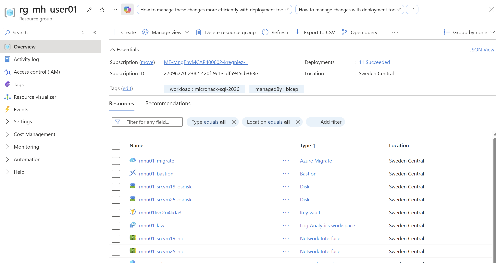

| Component | Name | Notes |
|---|---|---|
| Resource group | `rg-mh-user01` | Spain Central |
| Source VM | `mhu01-srcvm19` | SQL Server 2019 Developer on Windows Server 2022, `Standard_D4as_v5` |
| Source NSG | `mhu01-sql-nsg` | RDP 3389 from your client IP only; 1433 intra-VNet |
| VNet / subnet | `mhu01-vnet` / `snet-sql` | `10.0.0.0/16` / `10.0.1.0/24` |
| Bastion | `mhu01-bastion` | Secure browser RDP to the VM (no public RDP needed) |
| **Migration target** | `mhu01-sqlsrv-<suffix>` | Azure SQL logical server, **Spain Central**, **SQL authentication** (empty until Challenge 2) |

### The source instance

`mhu01-srcvm19` runs SQL Server 2019 with the restored sample databases used for both
challenges:

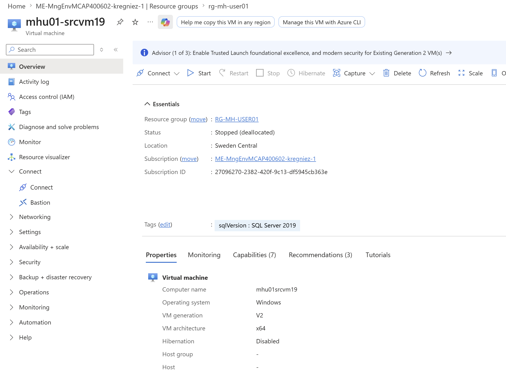

| Database | Based on | Compat level | Why it's interesting for assessment |
|---|---|---|---|
| `AdventureWorks2019` | AdventureWorks2019 (OLTP) | 110 (SQL 2008 R2) | Classic OLTP schema; intentionally low compat level to surface a compatibility advisory. |
| `WideWorldImporters` | WideWorldImporters (OLTP) | 120 (SQL 2014) | Uses **In-Memory OLTP (memory-optimized tables)** — a real tier-impacting finding. |

> The databases sit at **compat 110/120**, below the current Azure SQL Database default. Both are
> *supported* on Azure SQL Database, so this is an **advisory** (raise the compat level post-migration),
> not a blocker — Azure Migrate flags it accordingly.

## Prerequisites

- Challenge 0 complete: the lab resource group is deployed and you can reach the VM.
- Azure subscription with read access to the resource group and permission to use Bastion and the
  pre-provisioned **Azure Migrate** project.
- Tools:
  - **Azure Migrate appliance** (lightweight installer) — the primary assessment path (Step 2); deploys
    on the source VM and runs discovery + the Azure SQL Database assessment.
  - **SSMS 21 / 22** with the **SQL Server hybrid and migration component** — the quick readiness-only
    alternative (Step 3); connects directly to the instance, no appliance.
- SQL Server admin rights on the source instance (the `sqladmin` Windows account is a sysadmin
  context on the VM), used to read SQL metadata.

Sign in to Azure if you want to inspect resources from CLI:

```bash
az login --tenant <tenant-id>
az account set --subscription "<subscription-id>"
```

---

## Step 1 — Connect to the source VM with Bastion

The assessment runs from the **Azure Migrate appliance** installed **on the source VM**; you reach the
VM with **Azure Bastion** (secure, browser-based RDP — no public RDP port required) to deploy the
appliance (and, if you also want the quick readiness-only check, to run SSMS there).

1. Open the VM `mhu01-srcvm19` → **Connect** → **Bastion**.
2. Confirm **Using Bastion: mhu01-bastion** shows **Provisioning State: Succeeded**.
3. Authentication type **VM Password**, enter the VM username/password, then **Connect**.

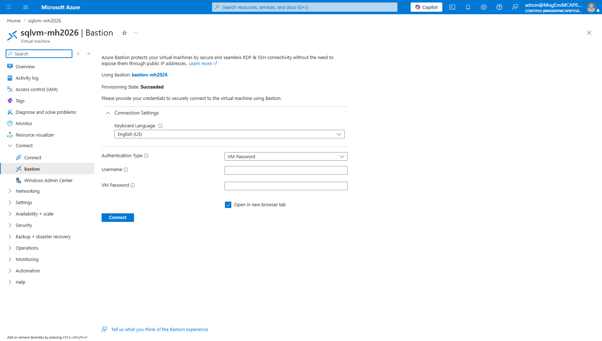

> **Alternative:** if your client IP is allowed on `mhu01-sql-nsg`, you can RDP directly with
> `mstsc /v:<vm-public-ip>`. Bastion is preferred because it needs no inbound RDP from the internet.

---

## Step 2 — Readiness assessment + SKU & cost with Azure Migrate (primary)

**Azure Migrate** is the assessment tool for this challenge. It discovers the source instance, runs the
readiness assessment against the official
[**assessment rules for SQL Server → Azure SQL Database**](https://learn.microsoft.com/en-us/data-migration/sql-server/database/assessment-rules?view=azuresql),
and — unlike the SSMS readiness-only check — also returns the **SKU recommendation + monthly cost**
sizing you carry into Challenge 2. It relies on a lightweight **appliance** deployed on the source
network. For this single-server lab a short discovery window is enough; real engagements collect
performance data for 7–30 days for accurate right-sizing.

### 2.1 Open the Azure Migrate project and set up the appliance

1. In the portal, open **Azure Migrate** → **Get started**.

   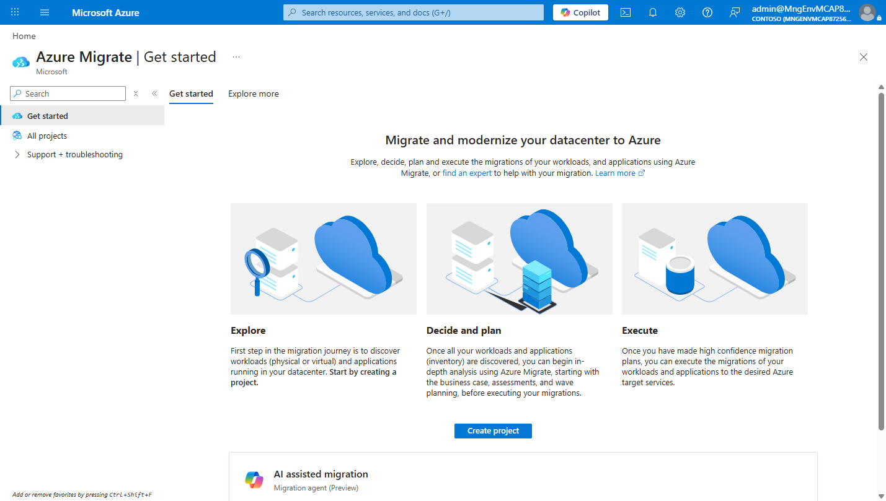

2. Open/use the pre-provisioned Azure Migrate project `mhu01-migrate` that already exists in
   `rg-mh-user01`. Confirm the **subscription**, **resource group**, **project name** and **geography**
   (`Spain`).

   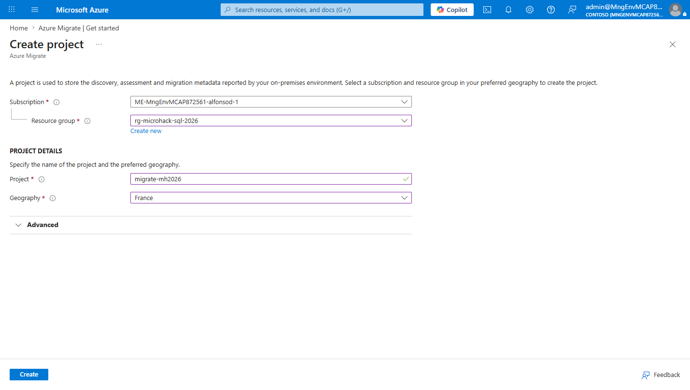

   Once opened, the project **Overview** is your hub for discovery, assessment and migration.

   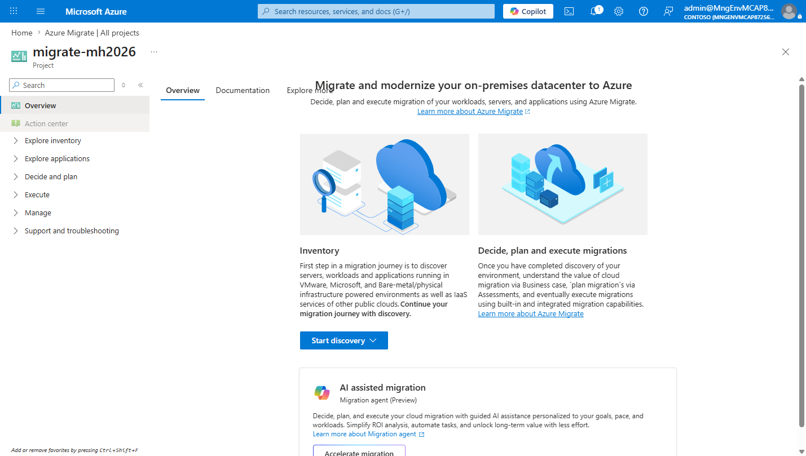

3. From the project **Overview**, click **Start discovery** and pick a discovery method. For this lab
   use **Using appliance → For Azure** (continuous discovery, ideal for detailed SQL inventory).

   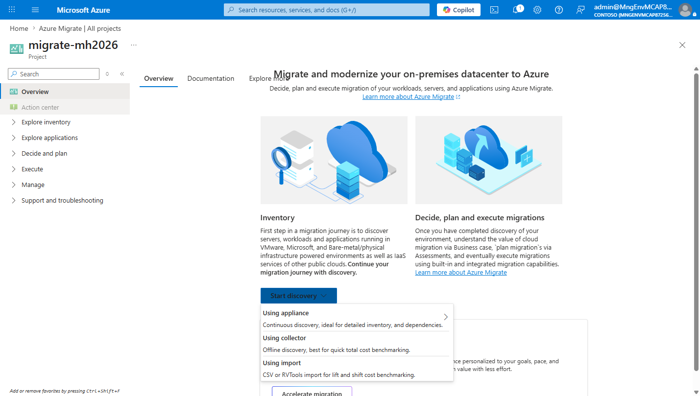

4. On the **Discover** blade, set **Are your servers virtualized?** to **Physical or other (AWS, GCP,
   Xen, etc. or if servers are Arc-enabled)**, then follow the four steps: **(1)** name the appliance
   and **generate the project key**, **(2)** download the appliance **.zip** installer.

   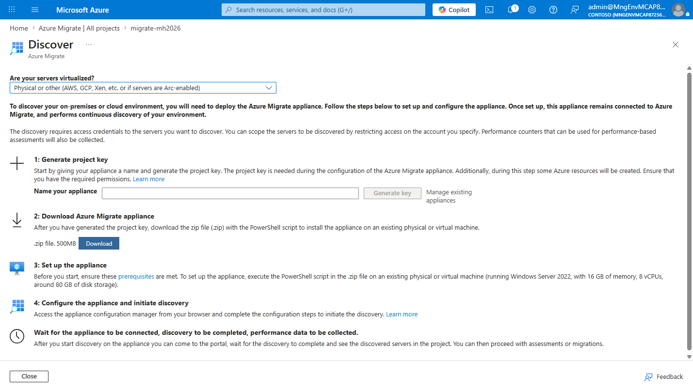

5. **Generate the project key and download the appliance.** Name the appliance (e.g. `migrationsq`)
   and click **Generate key**. Wait for *"All resources have been created successfully"* and copy the
   **project key** — you'll paste it into the appliance configuration manager later. Then under
   **Download Azure Migrate appliance**, download the **.zip** (≈500 MB) installer.

   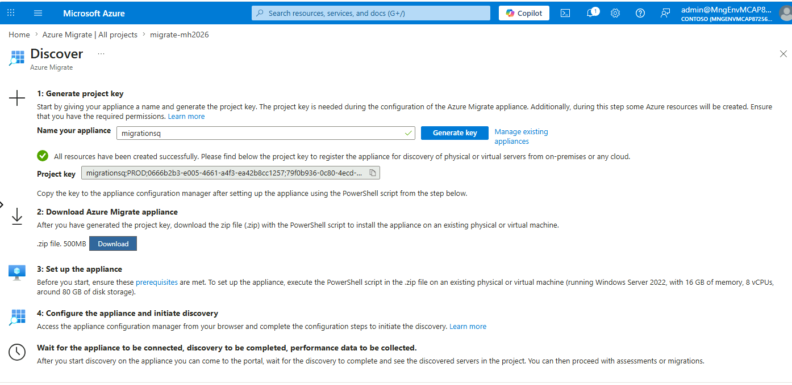

6. **Install the appliance on the VM (via Bastion).** Copy the .zip to `mhu01-srcvm19`, extract it,
   and you'll see the installer set — `AzureMigrateInstaller`, `AzureConnectedMachineAgent`,
   `Dra.Setup.Windows`, etc.

   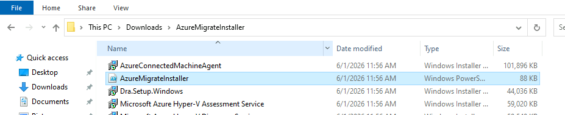

7. **Run the installer and answer the prompts.** Open an elevated **PowerShell** (Run as
   Administrator) and run `AzureMigrateInstaller.ps1`. It validates the host (PowerShell version,
   64-bit, OS, no conflicting ASR components), then asks three questions in sequence:
   **scenario → `3` Physical or other (AWS, GCP, Xen, etc.)**, **cloud → `1` Azure Public**, and
   **connectivity → `1` default (public endpoint)**. Confirm with **`Y`** to start the deployment (it
   first removes any previously installed agents — this can take 2–3 minutes).

   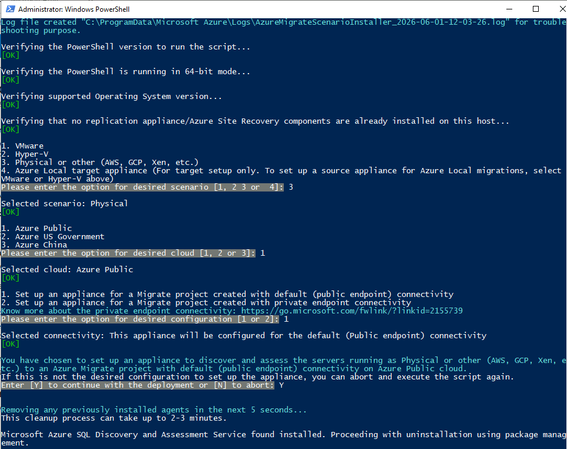

8. **Set up prerequisites and register the appliance.** When the installer finishes it opens the
   appliance **configuration manager** in the browser. It runs the prerequisite checks — **connectivity**,
   **time sync**, **appliance auto-update** — then **paste the project key** and click **Verify**; once
   the key is validated, click **Register** (registration can take up to 10 minutes).

   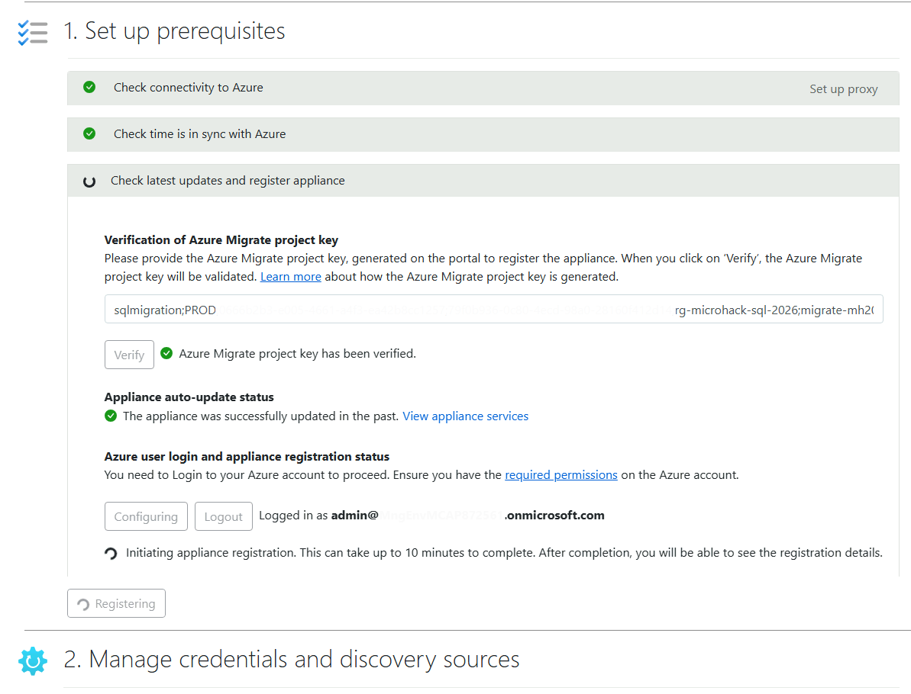

9. **Add credentials and the discovery source.** Below registration, the appliance opens **Manage
   credentials and discovery sources**. This is the step that trips people up, so follow it carefully.

   **9a — Add the Windows credential (Step 1 on the page).** Click **Add credentials → Windows Server**.
   The username here is a **local Windows account on the VM, *not* a SQL login** — use the same
   `sqladmin` account you log in to Bastion with (it is already a local Administrator, which WMI/WinRM
   discovery requires). Enter it **without** a `domain\` prefix.

   | Field | Value |
   |---|---|
   | Source type | **Windows Server** |
   | Friendly name | `SQLServerOnPrem` |
   | Username | `sqladmin`  *(local account, no `domain\`)* |
   | Password | *the VM password* |

   > **Gotcha (the #1 validation failure):** a *SQL Server login* will **not** work here — Azure Migrate
   > authenticates to the OS over WMI/WinRM, so it needs a **local Windows Administrator**. Reuse the
   > Bastion account (`sqladmin`); don't create a separate account. If WinRM isn't already enabled on
   > the VM, run this once in an elevated PowerShell on `mhu01-srcvm19`:
   > ```powershell
   > Enable-PSRemoting -Force
   > winrm quickconfig -quiet
   > ```

   **9b — Add the discovery source (Step 2 on the page).** Leave the *enforce-HTTPS* slider **off** (it
   falls back to HTTP if the cert prerequisites aren't met — fine for the lab). Click **Add discovery
   source** and add the VM itself (the appliance discovers the host it runs on):

   | Field | Value |
   |---|---|
   | Source type | **Windows Server** |
   | Mapped credentials | **SQLServerOnPrem** |
   | IP address / FQDN | the VM **private IP**, e.g. `10.0.1.4` (VM → Networking) |

   Save and wait ~1 minute. The row must reach **Status: Validation successful** (✓), with the WinRM
   ports `5985/5986` shown. If it stays in error, it's one of: credential isn't a local admin, WinRM
   isn't running (run the snippet in 9a), or the **local-account WinRM gotcha** below.

   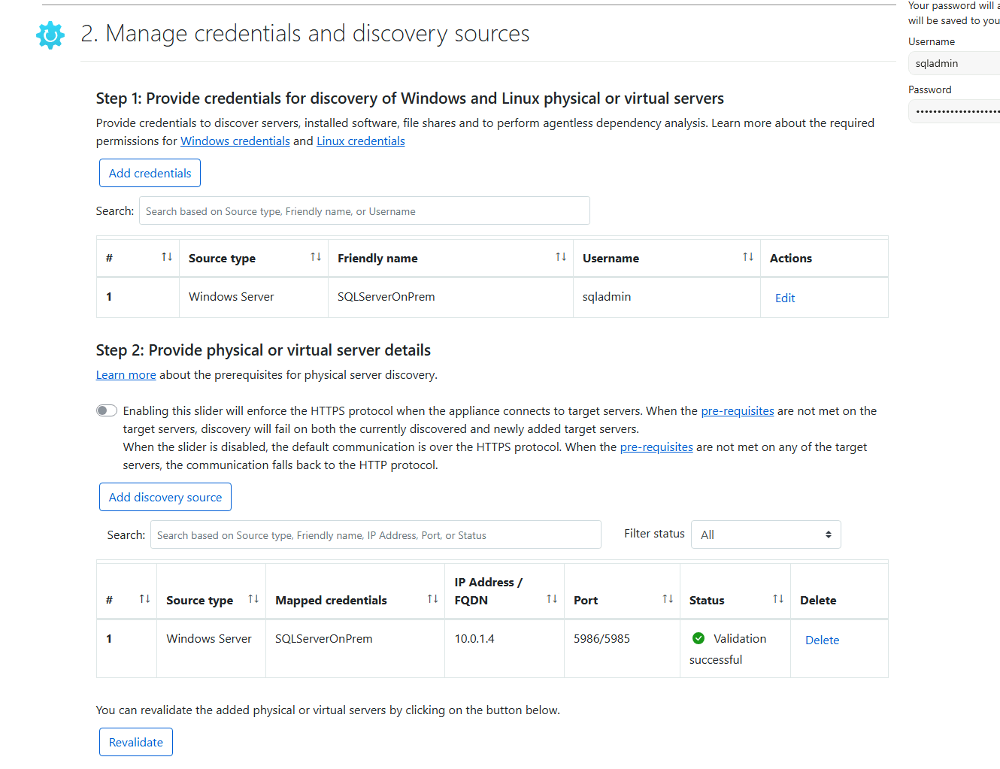

   > **Troubleshooting — `WinRM error 0x8009030d` / "A specified logon session does not exist"
   > (Gotcha #2).** With a **local** account (`sqladmin`), WinRM/Negotiate falls back to Kerberos —
   > and *"Kerberos accepts domain user names, but not local user names"* — so validation fails with
   > `errorcode 0x8009030d` even though the network path is fine (an IPv4 *auth* failure, not a
   > connectivity one; the `fe80::…` IPv6 line in the error is harmless noise). Fix it on the VM in an
   > **elevated** PowerShell, then **re-enter the password** in the appliance credential and revalidate:
   > ```powershell
   > # The key fix: let LOCAL admins get a full token over remote WinRM (resolves 0x8009030d)
   > New-ItemProperty -Path 'HKLM:\SOFTWARE\Microsoft\Windows\CurrentVersion\Policies\System' `
   >   -Name 'LocalAccountTokenFilterPolicy' -Value 1 -PropertyType DWord -Force
   > # The appliance runs on the VM itself -> trust its own IP + loopback
   > Set-Item WSMan:\localhost\Client\TrustedHosts -Value '10.0.1.4,localhost,127.0.0.1' -Force
   > Set-Item WSMan:\localhost\Service\Auth\Negotiate -Value $true
   > Restart-Service WinRM
   > ```
   > A stale stored password (e.g. after a VM restart) throws the same *"logon session does not exist"* —
   > so always re-type the password in **Manage credentials** and confirm the account is active
   > (`net user sqladmin`). Enter the username as plain `sqladmin` (no `domain\` or `.\`).

   **9c — Add the SQL credential (for the database assessment).** The Windows credential validates the
   *server*; to read the **SQL databases** the appliance needs a **SQL Server credential** too. Add one
   in the appliance's SQL credentials section — Windows-integrated (`sqladmin`, already `sysadmin`) or
   SQL auth (`sqladmin`). Without it the host is discovered but the databases are not.

   **9d — Discover.** Let the appliance **discover** the instance and start collecting. A short window
   (15–30 min) is enough for this lab. **Assessments stay disabled until discovery has populated the
   project.**

10. **Confirm the discovery.** Back in the project, open **Explore inventory → Databases**. You should see
   one **SQL Server** DB instance (`MSSQLSERVER` on `mhu01-srcvm19`) with the discovered databases counted.
   Support status shows **Extended** (SQL Server 2019, still in extended support).

   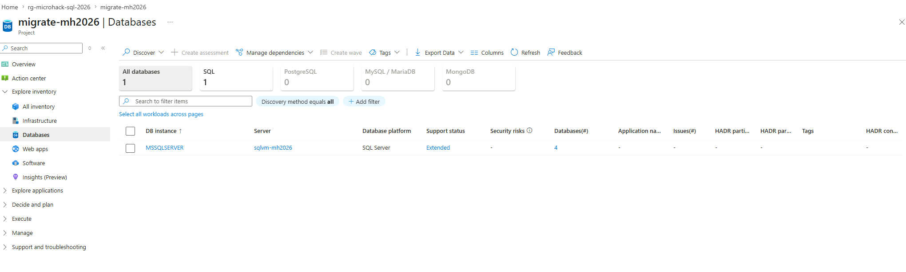

   Click the instance to see the **User databases** tab. The lab DBs appear with their compatibility
   level, size and **Online** status, all sourced from the **Appliance**:

   | User DB | Size (MB) | Compatibility level | Status |
   |---|---|---|---|
   | `WideWorldImporters` | 3172 | CompatLevel120 | Online |
   | `AdventureWorks2019` | 272 | CompatLevel110 | Online |

   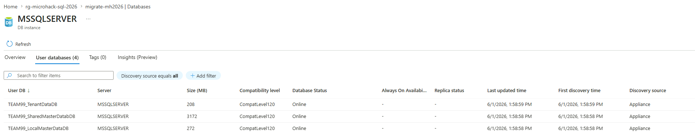

### 2.2 Create the assessment

Azure Migrate is now the **only** tooling that produces a full readiness + sizing + cost assessment for
SQL Server, so this is the heart of Challenge 1. The flow assesses the **whole workload** (the server, its
SQL databases and the backup file share) against the recommended Azure targets.

1. On the **Databases** blade, tick **`MSSQLSERVER`** and click **+ Create assessment**.

   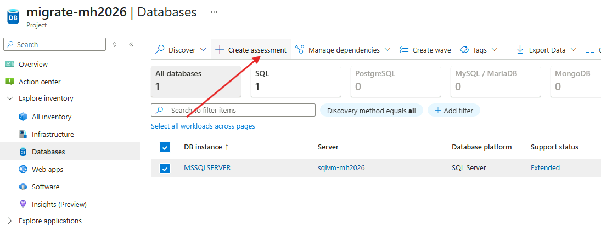

2. **Basics tab — name the assessment and confirm the workloads.** Give it a name (e.g.
   `microassessment26`) and keep the workloads Azure Migrate expanded from the instance selection — the
   SQL Server **instance** plus its **host server** — so it sizes the full estate:

   | Workload | Category | Type |
   |---|---|---|
   | `mhu01-srcvm19` | Server | Windows Server 2022 |
   | `MSSQLSERVER` | Database | SQL Server |

   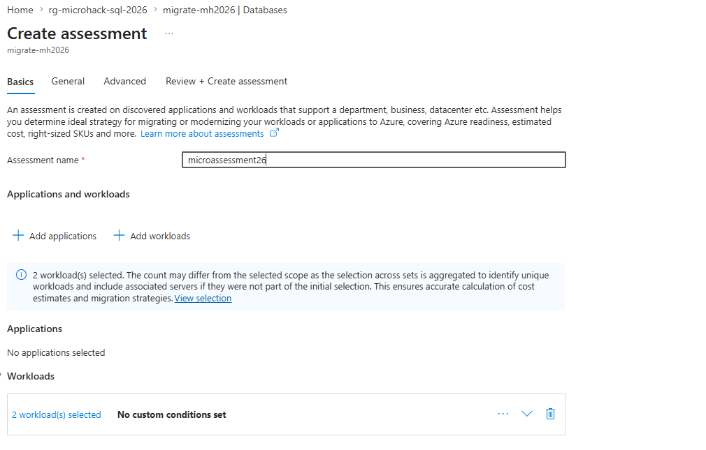

3. **General tab — target & pricing / assessment criteria.** Use the values below. *Performance-based*
   sizing reads the appliance metrics (don't pick *as-on-premises* — it just mirrors the current spec):

   | Setting | Value |
   |---|---|
   | Default target location | **Spain Central** (matches the Azure SQL target region) |
   | Default environment | Production |
   | Currency / Program | Euro (€) / Pay-As-You-Go |
   | Default savings option | 1 year reserved as applicable |
   | Sizing criteria | **Performance-based** |
   | Performance history / Percentile | 1 Day / 95th |
   | Comfort factor | 1 |
   | Azure Hybrid Benefit (Windows + SQL) | **Yes** (bring existing licenses) |
   | Include Microsoft Defender for cloud | Yes |

   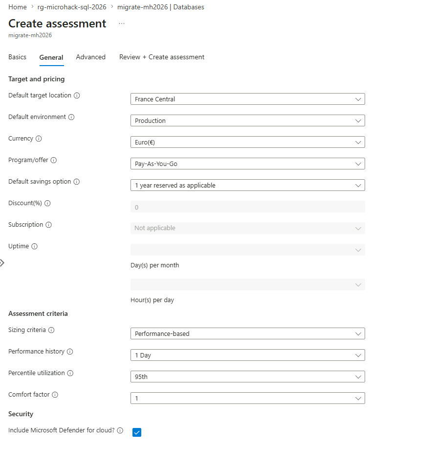

4. **Review + Create assessment.** Confirm the summary and click **Create assessment**. The assessment
   evaluates the workloads against the recommended Azure SQL targets — **Azure SQL MI**, **Azure SQL
   Database** and **SQL Server on Azure VM** — and returns a readiness + sizing + TCO estimate for each:

   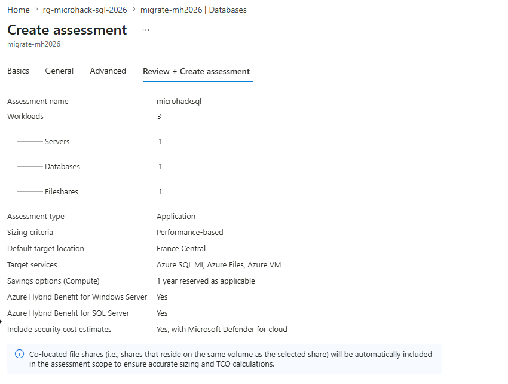

   Click **Create assessment** and wait a few minutes for it to compute.

> **Troubleshooting — assessment shows cost as *storage only* (Compute €0) and/or the Azure SQL
> assessment is empty (Gotcha #3).** Right after creation you'll usually see **`Performance coverage = 0%`**
> on the assessment list, and two distinct symptoms — both are *normal early state*, not a broken
> assessment:
>
> - **"Only storage" cost / Compute €0 (Application assessment).** With **Sizing criteria =
>   Performance-based**, Azure Migrate needs accumulated performance counters to right-size CPU/RAM.
>   With 0% coverage it can only price the disk, so Compute shows €0 and the recommended path looks
>   storage-dominated. **Two fixes:** *(a, fast — recommended for this lab)* open the assessment →
>   **Settings → Sizing criteria = `As on-premises` → Recalculate**: it sizes from allocated cores/RAM
>   immediately and Compute becomes non-zero; *(b, accurate)* leave it Performance-based and **wait ≥1
>   day** (the `Performance history` you set) for the appliance to profile the VM, then **Recalculate**.
> - **Azure SQL assessment shows `Servers/SQL instances/User databases = 0` and `Discovery success
>   0%`, even though discovery works.** First confirm discovery is healthy: **All inventory →
>   `mhu01-srcvm19` → MSSQLSERVER → User databases** should list the 2 user databases with their
>   **Size (MB)**, **Compatibility level** and **Online** status, Discovery source = *Appliance*
>   (reading DB size + compat level requires a working SQL connection, so if you see this, the
>   credential is fine). If the inventory is populated but the **assessment** is empty, the assessment
>   was simply **created before discovery finished** — just open it and **Recalculate** (or Settings →
>   Recalculate). Only if the *inventory itself* is empty do you have a credential problem: add a
>   **SQL Server** credential (**Manage credentials → Add → SQL Server credentials**, `sqladmin`, same
>   password) and wait for SQL discovery before recalculating.
>
> For the walkthrough, **Recalculate** the `microassessment26` assessment so the populated Readiness /
> Compute / cost fill in — that is exactly how the real results captured in 2.3–2.4 below were produced.

### 2.3 Capture SKU recommendation and cost

The recalculated `microassessment26` (Spain Central, Azure Hybrid Benefit + Defender) now reports
**Discovery success 100%** and a full readiness + sizing + cost result. The **Overview** lists 1 server,
1 SQL instance and 2 user databases, and recommends the modernization path to **Azure SQL Managed
Instance** at **€323.40/mo**:

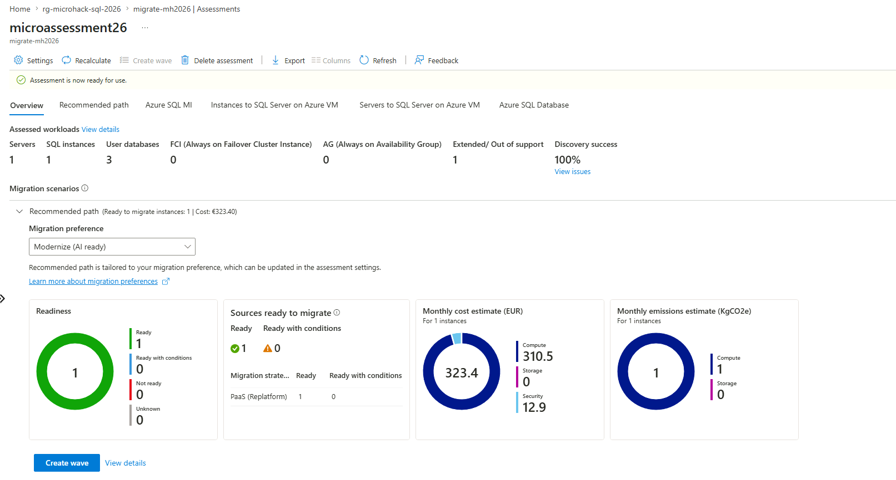

Open each target tab to read the recommended SKU and monthly cost:

| Target | Strategy | Readiness | Recommended SKU | Monthly cost (€) |
|---|---|---|---|---|
| **Azure SQL Managed Instance** (recommended path) | Replatform | **Ready** | 1 instance | **323.40** (Compute 310.50 + Storage 0 + Security 12.90) |
| **Azure SQL Database** (per-DB) | Replatform | **Ready with conditions** (2/2) | GeneralPurpose, Provisioned, Gen5, **2 vCores** | **320.34** (2 × 160.17 per-DB General Purpose estimate) |

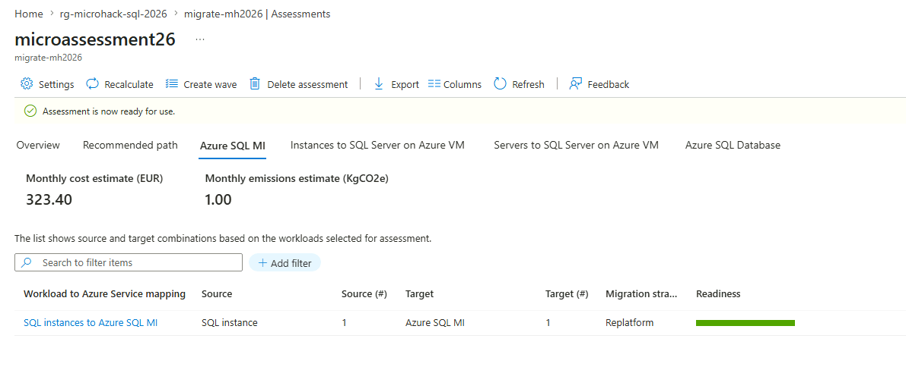

Azure SQL MI is a comparable fully-managed target here (**€323.40/mo**) because it consolidates the two
databases onto one shared instance; the Azure SQL Database path prices each database on its own General
Purpose compute (≈**€160.17/DB → €320.34/mo**). Both are valid — Challenge 2 migrates to **Azure SQL
Database** to keep the lab simple. Keep the assessment export; Challenge 2 references it when you build the
DMS migration project.

### 2.4 Review readiness findings

The assessment reports each database as **Ready**, **Ready with conditions**, or **Not ready**, and maps
each issue to the official rule catalogue (a **migration blocker** or a **warning**). Drilling into
**Databases → Azure SQL Database** shows **2 of 2 databases** with their readiness status for the
**GeneralPurpose, Provisioned, Gen5** target, with support status **Extended**:

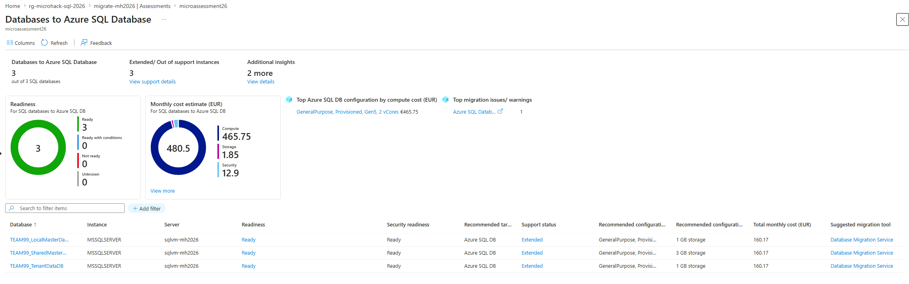

| Database | Readiness | Recommended target | Support status | Recommended config | Monthly cost (€) |
|---|---|---|---|---|---|
| `AdventureWorks2019` | **Ready with conditions** | Azure SQL DB | Extended | GeneralPurpose, Provisioned, 1 GB | 160.17 |
| `WideWorldImporters` | **Ready with conditions** | Azure SQL DB | Extended | GeneralPurpose, Provisioned, 3 GB | 160.17 |

The **Suggested migration tool** column points at **Database Migration Service** for every database — Azure
Migrate hands you straight into the Challenge 2 workflow:

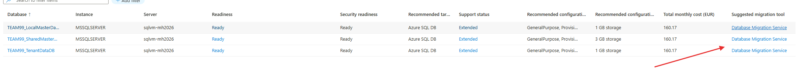

The samples surface the expected lab findings: **WideWorldImporters** has an In-Memory OLTP finding that
is tier-gated for Azure SQL Database, and **AdventureWorks2019** has the compatibility-level advisory.
The other rules below are the catalogue you *check against* for real customer databases:

| Rule / finding | Severity | What it means / decision |
|---|---|---|
| **Memory-optimized tables (In-Memory OLTP)** | Blocker / tier-gated | WideWorldImporters requires Azure SQL Database **Business Critical / Premium** for memory-optimized tables, or the tables must be dropped/converted before using General Purpose. |
| **Compatibility level below current default** | Warning | AdventureWorks2019 is supported but below the latest default. Raise with `ALTER DATABASE … SET COMPATIBILITY_LEVEL` **after** cut-over once validated. |
| `AgentJobs` / `WindowsAuthentication` | Warning (instance) | Agent jobs → Elastic Jobs / Azure Automation; Windows-auth logins → **Microsoft Entra ID** on the target. |
| `LinkedServer` / `CrossDatabaseReferences` / `XpCmdshell` / `ServiceBroker` / `ClrAssemblies` | Blocker | Hard blockers on Azure SQL DB. The stock samples don't use them, so they **didn't fire** — but this is the catalogue you validate on real databases. |

For every finding decide:

- **Fix on source before migration** (preferred for blockers).
- **Refactor on target after migration** (acceptable for some warnings, e.g. raising the compat
  level post-cutover).
- **Choose a different target tier** when a feature is tier-gated (e.g. pick Business Critical to
  keep In-Memory OLTP).

---

## Step 3 — (Quick alternative) Single-instance readiness in SSMS

When you only need the **readiness** result for **one** instance and don't need the SKU + cost sizing,
**SSMS 21 / 22** ships the **SQL Server hybrid and migration component** which connects **directly** to
the instance — no appliance, no discovery window. It shares the same rule engine as Step 2, so the
readiness findings (the table in **Step 2.4**) are identical; it simply **does not** produce the Azure
Migrate **SKU + monthly cost** sizing.

### 3.1 Run the readiness assessment

1. Connect to the source instance with **SSMS 21 / 22** (over Bastion on the VM, or from your
   workstation if 1433 is reachable).
2. Right-click the instance (or use the **Migration** landing page) → **Azure Migration** → **Migrate
   SQL Server to Azure**.
3. Under **Step 1 of 4 — Migration readiness assessment**, choose **Run readiness assessment**,
   target **Azure SQL Database**, and select the in-scope databases:
   - `AdventureWorks2019`
   - `WideWorldImporters`
4. Use **View assessment history** to revisit prior runs. The findings map to the same rule catalogue
   reviewed in **Step 2.4**.

The **Migrate SQL Server to Azure** landing page lays the flow out as the same four steps as the
Azure Migrate hub — readiness assessment → provision target → migrate data → monitor and cutover —
but driven directly from SSMS against the live instance (no appliance, no Arc):

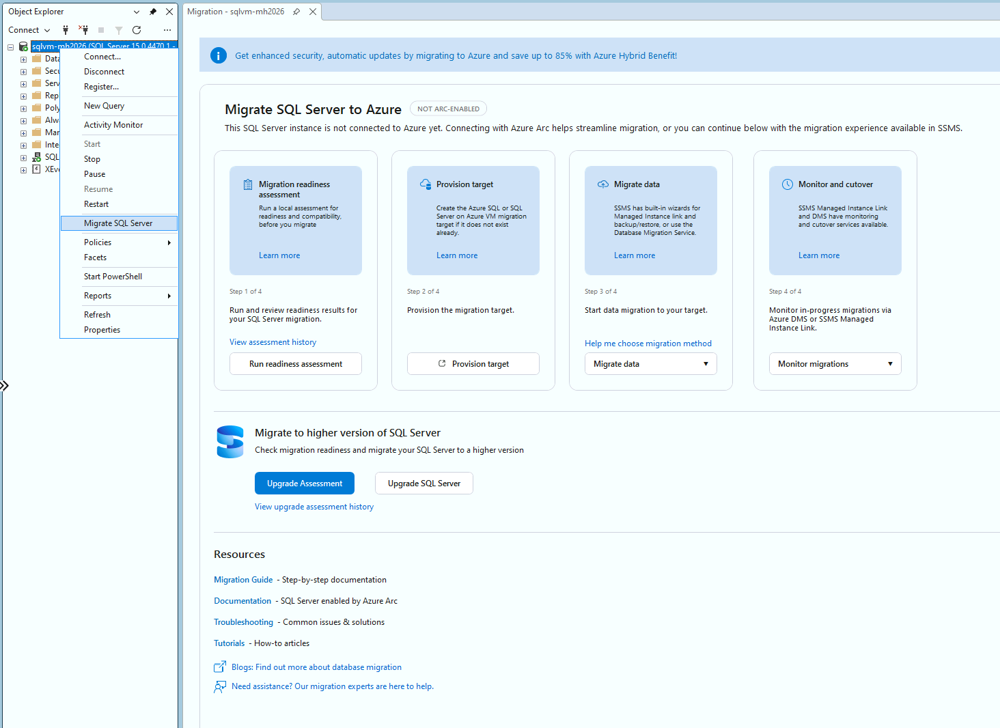

The readiness run produces the same **Azure SQL migration assessment report** as Step 2: it confirms
the source instance (`mhu01-srcvm19`, SQL Server 2019 Developer, Mixed mode, 2 user databases) and the
three **migration target recommendations** — **Azure SQL Managed Instance** (★ Recommended), **Azure
SQL Database** and **SQL Server on Azure VM** — each with its per-database readiness breakdown. Note it
matches the Step 2.4 findings exactly, including the In-Memory OLTP finding and compatibility advisory,
and the **Database compatibility** section flags the same single warning:

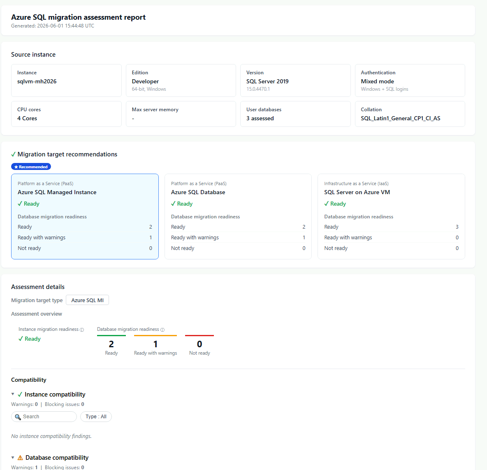

> The same SSMS panel also exposes an **Upgrade Assessment** ("Migrate to higher version of SQL
> Server") for in-place SQL Server version upgrades — out of scope here, but handy to know it lives in
> the same place.
> Reference:
> [Assess and upgrade with the SSMS migration component](https://techcommunity.microsoft.com/blog/microsoftdatamigration/assess-and-upgrade-to-sql-server-2025-with-ssms-migration-component/4470652).

---

## Step 4 — Review the migration target

Challenge 2 migrates a source database into the empty Azure SQL logical server already deployed in
the resource group. Note its properties now so the migration step is smooth:

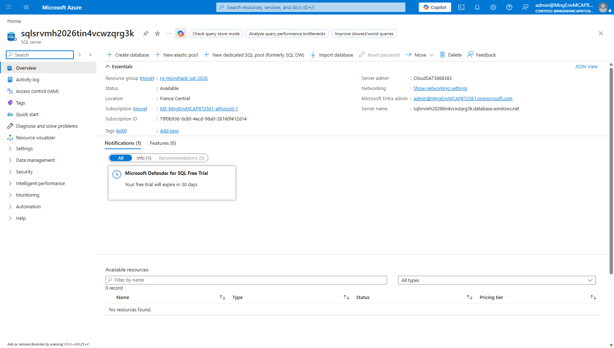

| Property | Value | Why it matters for Challenge 2 |
|---|---|---|
| Server name | `mhu01-sqlsrv-<suffix>.database.windows.net` | Target FQDN for DMS. |
| Location | Spain Central | Provision DMS in/near this region. |
| Authentication | **SQL authentication** | DMS connects to the target with a **SQL login** (`sqladmin`); the migration login is created on the target as described in Challenge 2. |
| SQL admin login | `sqladmin` | The server administrator login for the target logical server. |
| Databases | none yet | The target is empty — Challenge 2 creates the destination database and migrates into it. |

---

## Step 5 — Build the remediation backlog

Turn the readiness findings into a prioritized backlog. Tag each row with the
**official rule name** so reviewers can trace every item back to the
[assessment rules article](https://learn.microsoft.com/en-us/data-migration/sql-server/database/assessment-rules?view=azuresql).

| Finding | Source DB | Severity | Decision | When |
|---|---|---|---|---|
| Memory-optimized tables | `WideWorldImporters` | Blocker | Choose Business Critical target tier **or** convert the memory-optimized tables to disk-based before migrating to General Purpose | Before Challenge 2 |
| Compat level 110 | `AdventureWorks2019` | Warning | Raise compat level on the target after migration once validated | After Challenge 2 |
| Compat level 120 | `WideWorldImporters` | Warning | Raise compat level post-cutover | After Challenge 2 |
| `WindowsAuthentication` | instance | Warning | Re-create needed principals as Microsoft Entra users on the target | During Challenge 2 |

Persist this backlog as `assessment-backlog.md` (or a sheet) next to the exported Azure Migrate
assessment.

---

## Step 6 — (Optional) Command-line assessment without the appliance

If you don't want to deploy the Azure Migrate appliance, you can run an assessment from the command
line with the **`Az.DataMigration` PowerShell module / `az datamigration` Azure CLI**, which uses the
same rule engine. This is **optional** and produces the rule-mapped readiness findings (without the
SKU/cost sizing that Azure Migrate adds):

1. Install the extension: `az extension add --name datamigration`.
2. Run the SQL assessment against the local instance and export the report to JSON/CSV.
3. Reference:
   [Migrate databases at scale using automation (PowerShell / Azure CLI)](https://learn.microsoft.com/en-us/azure/dms/migration-dms-powershell-cli).

---

## Success criteria checklist

- [ ] You connected to `mhu01-srcvm19` (Bastion) and ran the **Azure Migrate** **Azure SQL Database**
      assessment for the in-scope databases, with findings mapped to official rule IDs.
- [ ] **SKU recommendation + monthly cost** captured per database from the Azure Migrate assessment.
- [ ] Tier-impacting finding (In-Memory OLTP in `WideWorldImporters`) identified and a target
      decision recorded.
- [ ] *(Optional, single instance)* SSMS migration-component readiness assessment run as a quick
      cross-check of the same findings.
- [ ] Prioritized remediation backlog written (fix-before vs fix-after Challenge 2).
- [ ] Assessment report exported and stored with the lab artifacts.

---

## Annex — Useful T-SQL discovery queries

Run these on the source instance (`localhost` on the VM) to sanity-check the Azure Migrate findings:

```sql
-- Databases, size, recovery model, compat level
SELECT
    d.name,
    d.database_id,
    d.state_desc,
    d.recovery_model_desc,
    d.compatibility_level,
    CAST(SUM(mf.size) * 8.0 / 1024 AS DECIMAL(10,2)) AS size_mb
FROM sys.databases d
JOIN sys.master_files mf ON d.database_id = mf.database_id
WHERE d.database_id > 4
GROUP BY d.name, d.database_id, d.state_desc, d.recovery_model_desc, d.compatibility_level
ORDER BY size_mb DESC;

-- Memory-optimized (In-Memory OLTP) tables — tier-gated on Azure SQL Database
SELECT DB_NAME() AS db, COUNT(*) AS memory_optimized_tables
FROM sys.tables WHERE is_memory_optimized = 1;

-- SQL Agent jobs (not supported on Azure SQL DB)
USE msdb;
SELECT name, enabled, date_created FROM dbo.sysjobs;

-- Linked servers (not supported on Azure SQL DB)
SELECT name, product, provider, data_source FROM sys.servers WHERE server_id > 0;

-- CLR assemblies (not supported on Azure SQL DB)
SELECT name, permission_set_desc, is_user_defined FROM sys.assemblies WHERE is_user_defined = 1;

-- Cross-database references (not supported on Azure SQL DB)
SELECT DISTINCT
    referencing_schema_name = OBJECT_SCHEMA_NAME(d.referencing_id),
    referencing_object_name = OBJECT_NAME(d.referencing_id),
    referenced_database_name = d.referenced_database_name
FROM sys.sql_expression_dependencies d
WHERE d.referenced_database_name IS NOT NULL
  AND d.referenced_database_name <> DB_NAME();
```

---

[Previous Solution](../challenge-00/solution-00.md) - **[Home](../../Readme.md)** - [Next Solution](../challenge-02/solution-02.md)
