# Solution 2 — DMS migration: SQL Server 2019 → Azure SQL Database (2026 edition)

[Previous Solution](../challenge-01/solution-01.md) - **[Home](../../Readme.md)** - [Next Solution](../challenge-03/solution-03.md)

> This walkthrough follows the official Microsoft tutorial
> [**Migrate SQL Server to Azure SQL Database (offline) with Database Migration Service**](https://learn.microsoft.com/en-us/data-migration/sql-server/database/database-migration-service?view=azuresql)
> and the
> [**SQL Server to Azure SQL Database migration guide**](https://learn.microsoft.com/en-us/data-migration/sql-server/database/guide?view=azuresql).
> Where the lab departs from the tutorial (a single database instead of the tutorial's sample
> databases and a SQL Server 2019 source migrated into a single Azure SQL Database) the changes
> are called out inline.

## Naming convention

> **Use your assigned lab names.** The deployed convention is `mhu<NN>` for user resources, where
> `<NN>` is your two-digit user number. The examples below use user `01` (`mhu01`) in resource group
> `rg-mh-user01`. The screenshots show one example run, so the resource names visible in them may
> differ from yours — follow the deployed convention below.

| Placeholder | What it is | Example |
|---|---|---|
| `<NN>` | Your two-digit user number | `01` |
| `rg-mh-user<NN>` | Resource group holding the lab resources | `rg-mh-user01` |
| `mhu<NN>-srcvm19` | Source SQL Server 2019 VM (from Challenge 1) | `mhu01-srcvm19` |
| `mhu<NN>-dms` | Azure Database Migration Service instance | `mhu01-dms` |
| `mhu<NN>-sqlsrv-<suffix>` | Target Azure SQL **logical server** (`mhu<NN>-sqlsrv-<suffix>.database.windows.net`) | `mhu01-sqlsrv-<suffix>` |
| `mhu<NN>-migrate` | Pre-provisioned Azure Migrate project (Challenge 1) | `mhu01-migrate` |
| `AdventureWorks2019` | The **single** database you migrate in this lab | `AdventureWorks2019` |
| `sqlmigration` | SQL login used by DMS on **both** the source and the target (created in this guide) | `sqlmigration` |

## Migration tooling for this challenge

This walkthrough migrates the database with **Azure Database Migration Service (DMS)**, driven
end-to-end from the **Azure portal**. DMS's **Migrate Missing Schema** option deploys schema and
data in a single migration project — the supported Microsoft-native flow for SQL Server → Azure
SQL Database. Key facts for this lab:

- **Connectivity:** the **SQL Server → Azure SQL Database** scenario requires a **self-hosted
  integration runtime (SHIR)**; the Azure portal **disables the migration wizard until a SHIR is
  connected** (verified in the portal — see Step 3.2), even when the source is an Azure VM. The SHIR
  is installed on the source VM.
- **Source:** **SQL Server 2019** on the Challenge 1 IaaS VM (`mhu<NN>-srcvm19`).
- **Database:** a **single** database — **AdventureWorks2019** — is migrated end-to-end to keep the
  wizard clear. `WideWorldImporters` is reserved for the Challenge 3 MI Link path.
- **Target:** **Azure SQL Database** (a single database on the logical server already deployed for
  this lab).
- **Schema + data:** both move in one wizard step via the **Migrate Missing Schema** checkbox.

> **Online migration is not available for Azure SQL Database targets.** Application downtime
> starts when the DMS migration starts. Plan an offline cut-over window.

## Lab architecture for this challenge

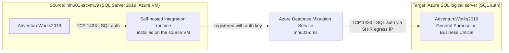

For the **SQL Server → Azure SQL Database** scenario the Azure portal **requires a self-hosted
integration runtime (SHIR)** and keeps the migration wizard disabled until the SHIR is registered
and running — this was verified directly in the portal (see Step 3.2). The SHIR is installed on the
source VM `mhu01-srcvm19`; it reaches the source instance over TCP 1433 and bridges the migration
back to DMS.

**Components**

- Resource group: `rg-mh-user01`
- Region: Sweden Central (`swedencentral`, matches the target logical server)
- Source: `mhu01-srcvm19` (SQL Server 2019 Developer, the Challenge 1 VM, hosting `AdventureWorks2019`)
- Target logical server: `mhu01-sqlsrv-<suffix>.database.windows.net` (**SQL authentication**)
- Target database (created empty before migration): `AdventureWorks2019` — pick the tier from your
  Challenge 1 assessment (General Purpose by default; **Business Critical** if the database uses
  memory-optimized / In-Memory OLTP tables; that finding applies to `WideWorldImporters` in this lab)
- DMS instance: `mhu01-dms`
- Connectivity: a **self-hosted integration runtime (SHIR)** installed on the source VM reaches the
  source instance over TCP 1433 and registers against DMS — **required** by the portal for the Azure
  SQL Database target (see Step 3.2).

## Prerequisites

### Azure access

You can use either built-in roles or the custom DMS role from the
[official custom roles article](https://learn.microsoft.com/en-us/data-migration/sql-server/database/custom-roles?view=azuresql).

**Option A — built-in roles** (as listed in the DMS tutorial):

- **Contributor** on the target Azure SQL Database (logical server scope).
- **Reader** on the resource group that contains the target Azure SQL Database.
- **Owner** or **Contributor** on the subscription **if you need to create the DMS instance**.

**Option B — custom role** (least-privilege, recommended for production): create a custom role
that grants only the DMS + SQL actions documented in
[custom-roles](https://learn.microsoft.com/en-us/data-migration/sql-server/database/custom-roles?view=azuresql).

### Source SQL Server 2019 permissions

The login that DMS uses to connect to the source must be a member of the **`db_datareader`**
role on each migrated database. For **schema migration via DMS** the login must be **`db_owner`**
on each source database.

The source SQL Server 2019 instance uses **SQL authentication**, so create a dedicated SQL login
for the migration rather than reusing a human or service account. Run the following on the source
instance, signed in with a `sysadmin` login (e.g. over Bastion with SSMS or `sqlcmd`):

```sql
-- Connect to: mhu01-srcvm19 (source SQL Server 2019), database: master
-- Authentication: a sysadmin login (Windows or SQL).

-- 1) Server-level login for the migration (replace the password with a strong secret).
CREATE LOGIN [sqlmigration] WITH PASSWORD = '<strong-password>';

-- 2) Map the login on the database to migrate and grant the role DMS needs.
USE [AdventureWorks2019];
CREATE USER [sqlmigration] FOR LOGIN [sqlmigration];
ALTER ROLE db_owner ADD MEMBER [sqlmigration];   -- db_owner is required for schema migration
-- For data-only migration db_datareader is sufficient:
-- ALTER ROLE db_datareader ADD MEMBER [sqlmigration];
```

> **Enable mixed-mode authentication.** SQL logins only work when the instance runs in **SQL Server
> and Windows Authentication mode**. If the source rejects the login with error **18456**, confirm
> mixed mode is enabled (SSMS → *Server Properties → Security → SQL Server and Windows
> Authentication mode*, then restart the SQL Server service). Azure SQL VM marketplace images
> (`sql2019-ws2022`) ship with mixed mode enabled by default.

### Create the target Azure SQL Database (DMS does not create it)

> **DMS migrates *into* an existing database — it never creates the target database.** The wizard's
> *Map source and target databases* step (Step 4.6) only lets you pick a database that **already
> exists** on the target logical server. Create an empty target database **before** you start the
> wizard, or the mapping step will have nothing to select.

You already have the **Azure SQL logical server** deployed for this lab — you only need to add an
empty database on it, sized from the **Azure Migrate** recommendation you captured in Challenge 1.
You create it **from the Azure portal in Step 2.3** (no CLI needed). It does **not** need a schema —
DMS deploys the schema when you enable *Migrate missing schema* (Step 4.7).

> **Name the target after the source.** The wizard maps by selecting a target database from a
> dropdown; matching the target name to the source database (`AdventureWorks2019`) makes the mapping
> unambiguous.

### Target Azure SQL Database permissions

DMS connects to the target with **SQL authentication** (a SQL login on the logical server). To keep
the credentials **unambiguous**, use the **same login name on both sides** — `sqlmigration`. For
schema migration the target login must hold the following **server-level** roles on `master` (the
exact roles called out in the official DMS tutorial):

| Server role | Purpose |
|---|---|
| `##MS_DatabaseManager##` | Create and own databases |
| `##MS_DatabaseConnector##` | Connect to any database without a user account |
| `##MS_DefinitionReader##` | Read all catalog views (`VIEW ANY DEFINITION`) |
| `##MS_LoginManager##` | Create and delete logins |

Run the following on the **`master`** database of `mhu01-sqlsrv-<suffix>`, signed in as the server admin
(SQL admin login or the Entra admin):

```sql
-- Connect to: mhu01-sqlsrv-<suffix>.database.windows.net , database: master
-- Authentication: server admin (SQL login or Microsoft Entra admin).
CREATE LOGIN [sqlmigration] WITH PASSWORD = '<strong-password>';

ALTER SERVER ROLE ##MS_DefinitionReader##  ADD MEMBER [sqlmigration];
ALTER SERVER ROLE ##MS_DatabaseConnector## ADD MEMBER [sqlmigration];
ALTER SERVER ROLE ##MS_DatabaseManager##   ADD MEMBER [sqlmigration];
ALTER SERVER ROLE ##MS_LoginManager##      ADD MEMBER [sqlmigration];

CREATE USER [sqlmigration] FOR LOGIN [sqlmigration];
EXECUTE sp_addRoleMember 'dbmanager', 'sqlmigration';
EXECUTE sp_addRoleMember 'loginmanager', 'sqlmigration';
```

> **Lab shortcut.** In the lab you can simply use the **server admin SQL login** (`sqladmin`,
> created with the logical server) for the target connection in Step 4.5 — it
> already has every right above. The dedicated `sqlmigration` login is the least-privilege pattern
> recommended for real migrations, and reusing the same name on source and target keeps the wizard
> unambiguous.

> **Entra-only servers.** If your target logical server was deployed with **Microsoft Entra
> authentication only**, you cannot `CREATE LOGIN … WITH PASSWORD`. Either enable SQL authentication
> on the server, or create an Entra principal `FROM EXTERNAL PROVIDER`, grant it the same four server
> roles, and pick **Microsoft Entra ID** authentication in Step 4.5. This lab uses **SQL
> authentication**, matching the official tutorial.

### Allow the SHIR to reach the target through the Azure SQL firewall

The self-hosted integration runtime opens the **target** connection from the source VM. The target
logical server's firewall must therefore allow the traffic the SHIR host uses to reach Azure SQL.
Configure this **from the portal** on the target logical server → **Security → Networking**:

1. Set **Public network access** to **Selected networks**.
2. Under **Firewall rules**, select **Add your client IPv4 address** (and add the source VM's public
   egress IP if it differs). For a lab you can use a broad rule such as `0.0.0.0` – `255.255.255.255`
   (`AllowAllForLab`); for anything beyond a lab, scope it to the explicit SHIR host IP instead.
3. Under **Exceptions**, tick **Allow Azure services and resources to access this server**, then
   **Save**.

If the firewall does not allow the SHIR host, the *Connect to target Azure SQL Database* step (4.5)
fails with `Cannot open server '…' requested by the login. Client with IP address '…' is not allowed
to access the server` (SqlErrorNumber 40615).

### Tools and connectivity

- Challenge 0 complete: connectivity to `mhu01-srcvm19` is validated.
- Challenge 1 complete: the SSMS migration component + Azure Migrate assessments produced a
  remediation backlog. Apply the **Before Challenge 2** items before continuing.
- Tools on the source VM (reached over Bastion):
  - **SSMS 21+**
  - **VS Code** + MSSQL extension
  - **SqlPackage** (latest) — only if you choose a schema-first DACPAC alternative
- Network: a **self-hosted integration runtime** on the source VM must reach the SQL Server 2019
  instance on TCP 1433 and register against DMS (the portal requires a SHIR for the Azure SQL
  Database target — see Step 3.2).

Sign in to the [Azure portal](https://portal.azure.com) with an account that has Contributor on
`rg-mh-user01` and is the Microsoft Entra admin (or a member) on the target logical server.

---

## Step 1 — Apply pre-migration remediation on the SQL 2019 source

From the Challenge 1 backlog, fix everything tagged **Before Challenge 2** on the SQL 2019
instance. Map each item back to its assessment rule:

| Backlog item | Assessment rule |
|---|---|
| Remove or rewrite cross-database queries | `CrossDatabaseReferences` |
| Disable / drop SQL Agent jobs targeting these DBs | `AgentJobs` |
| Drop linked servers referenced by these DBs | `LinkedServer` |
| Drop or refactor CLR assemblies (`UNSAFE` / `EXTERNAL_ACCESS`) | `ClrAssemblies` |
| Remove FileStream / FileTable columns | `FileStream` |
| Replace `xp_cmdshell` usage | `XpCmdshell` |
| Raise database compat level to ≥100 | `DbCompatLevelLowerThan100` |
| Disable [Change Data Capture (CDC)](https://learn.microsoft.com/en-us/sql/relational-databases/track-changes/about-change-data-capture-sql-server) on source if enabled | DMS limitation — see the tutorial |

Verify the remediation with the discovery queries from Challenge 1 against the source instance
before continuing.

> The DMS tutorial warns explicitly: **disable CDC on the source database before starting the
> migration**, otherwise DMS will migrate CDC-related objects and re-enabling CDC on the target
> will fail.

---

## Step 2 — Provision the target Azure SQL Database resources

### 2.1 Confirm the target logical server (already deployed)

The lab logical server `mhu01-sqlsrv-<suffix>` is **already deployed** with a **SQL admin login**
(`sqladmin`). You do not need to create the server — just confirm it
in the portal:

1. Open **SQL servers** → `mhu01-sqlsrv-<suffix>`.
2. Note the **Server admin** login under **Overview** (the `sqladmin` SQL login). You will use this
   login — or the dedicated `sqlmigration` login from **Prerequisites → Target Azure SQL Database
   permissions** — for the target connection in Step 4.5.

> If your server was instead deployed **Entra-only**, see the *Entra-only servers* note in
> **Prerequisites → Target Azure SQL Database permissions**.

### 2.2 Open the firewall for the source network

For a lab you can allow Azure services + your lab public IP. For production, use a **Private
Endpoint** instead. On the logical server, open **Security → Networking**:

1. Set **Public network access** to **Selected networks**.
2. Under **Firewall rules**, select **Add your client IPv4 address**, then add a rule for the
   source/lab public IP if different (a broad `AllowAllForLab` rule `0.0.0.0` – `255.255.255.255`
   is acceptable for the lab only).
3. Under **Exceptions**, tick **Allow Azure services and resources to access this server**, then
   **Save**.

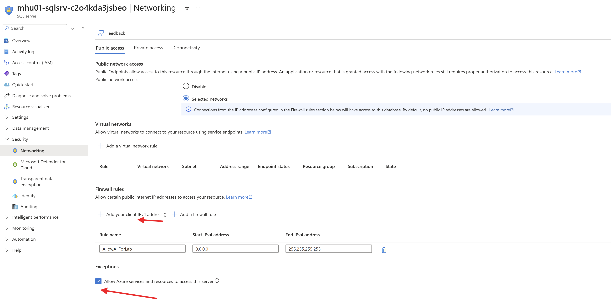

### 2.3 Create the empty target database

Provision **one** empty database — `AdventureWorks2019` — on the target logical server. Pick its service
tier from your Challenge 1 assessment:

- **General Purpose** (Gen5, e.g. 2 vCore) is the default for most workloads.
- **Business Critical** is **required** if a database uses **memory-optimized / In-Memory OLTP
  tables** — that finding applies to `WideWorldImporters` in this lab; the tier is the only one on Azure SQL Database that supports them
  ([In-Memory OLTP availability](https://learn.microsoft.com/en-us/azure/azure-sql/database/in-memory-oltp-overview?view=azuresql)).
  Provisioning such a database as General Purpose makes the **schema deployment of the
  memory-optimized tables fail** during the DMS migration.

> **Watch the assessment gap.** Azure Migrate may mark a database `Ready` for *General Purpose* even
> when it contains memory-optimized tables (the In-Memory readiness rule does not always fire).
> Confirm on the source (query `sys.tables` for `is_memory_optimized = 1`) before choosing the tier —
> if the database has any memory-optimized tables, provision it as **Business Critical** (or convert
> those tables to disk-based on the source first, which is out of scope for this lab).

Create the database **from the portal** on the target logical server. On the
`mhu01-sqlsrv-<suffix>` **SQL server** blade, select **+ Create database**:

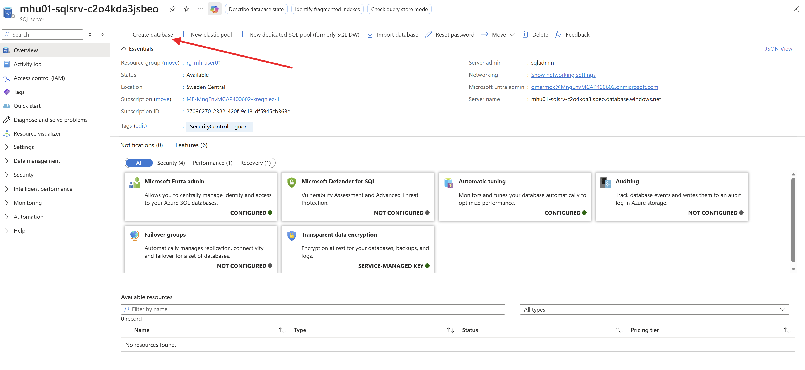

In the **Create SQL Database** wizard: select the lab subscription and `rg-mh-user01`, confirm the
server `mhu01-sqlsrv-<suffix>`, set **Want to use SQL elastic pool? = No**, name the database
`AdventureWorks2019`, choose the service tier (from your Azure Migrate recommendation) under
**Compute + storage → Configure database**, leave the database **empty** (Data source = **None**),
and **Review + create**.

> For the migration window itself, the official
> [migration guide](https://learn.microsoft.com/en-us/data-migration/sql-server/database/guide?view=azuresql)
> recommends temporarily scaling up to **Business Critical Gen5 8 vCore** (96 MB/s log generation
> rate) or **Hyperscale** (100 MB/s) to avoid log-rate throttling, then scaling back down after
> cut-over. You can change the tier from the database's **Compute + storage** blade.

If you are using a dedicated migration login (Prerequisites → Target Azure SQL Database
permissions), provision it on the target server now, before continuing.

---

## Step 3 — Review the DMS instance and register the SHIR

### 3.1 Confirm the DMS instance (already deployed)

The Azure Database Migration Service instance `mhu01-dms` is **already deployed** in your resource
group `rg-mh-user01` — you do **not** need to create it. Just confirm it in your subscription:

1. In the Azure portal, open **Azure Database Migration Services** → `mhu01-dms` (in `rg-mh-user01`).
2. On **Overview**, confirm the **Target = Azure SQL**, the **Location** (Sweden Central) and note the
   **Integration Runtime State** — you register the self-hosted integration runtime in **3.2**,
   because the Azure SQL Database scenario requires it.

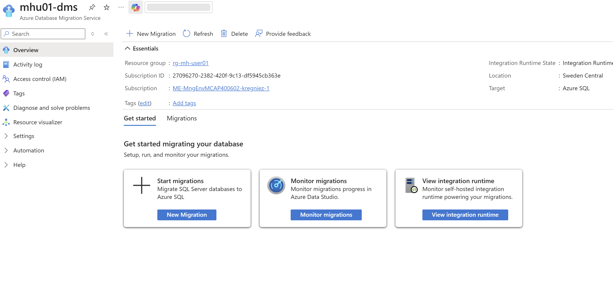

### 3.2 Register the self-hosted integration runtime

> **Reality check (from the portal):** for the **SQL Server → Azure SQL Database** scenario the
> migration wizard is **disabled until a self-hosted integration runtime (SHIR) is connected** — even
> when the source is an Azure VM. This is a hard portal prerequisite for this target, so we register a
> SHIR here. It stays **lean and portal-driven**: download the installer, paste an auth key — **no CLI**.

1. Start a new migration (Step 4.1). In **Select new migration scenario** the portal shows a red
   warning: *"This scenario is currently disabled and requires a self-hosted integration runtime to
   access the migration source and target servers."* The prerequisites list includes **"Install, set
   up and configure Self-hosted Integration Runtime"**.

   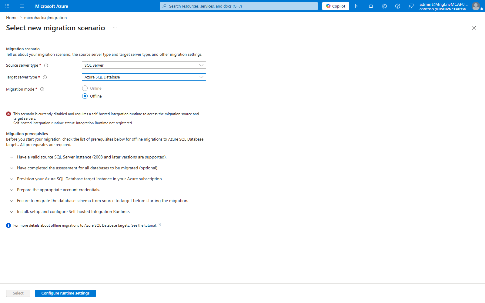

2. Open **Configure integration runtime**. On a host that can reach the source instance (the source
   VM `mhu01-srcvm19` itself is fine for this lab), follow the blade's two steps — **download the
   installer** (Step 1) and **copy an authentication key** (Step 2, `Key 1` or `Key 2`):

   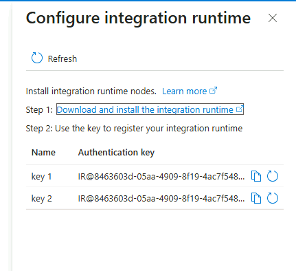

3. **Download and install** the self-hosted integration runtime on the host, then open the
   **Microsoft Integration Runtime Configuration Manager**. Paste the authentication key copied above
   and select **Register**:

   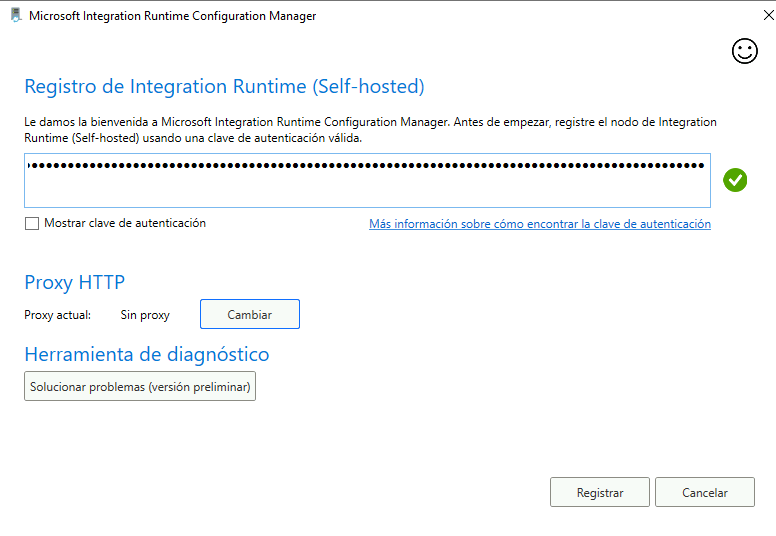

4. Confirm the **node name** for this host (the example run uses the source VM's name) and select
   **Finish** to complete the node registration:

   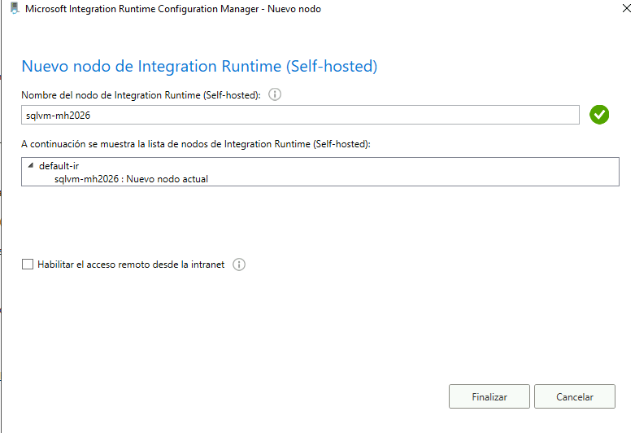

5. The Configuration Manager reports that **the self-hosted node is connected to the cloud service**,
   showing the Data Factory (your DMS instance) and Integration Runtime it is bound to:

   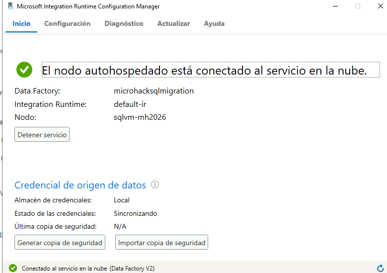

6. Back in the portal, refresh the DMS **Integration runtime** blade and confirm **Status = Online**
   with **Registered nodes = 1**. The migration scenario is now unlocked:

   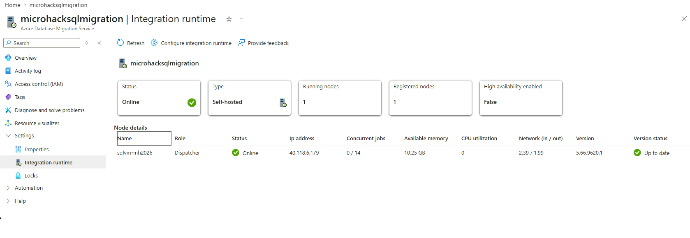

> Once the SHIR is **registered and running**, the migration scenario unlocks and the wizard in Step 4
> proceeds. Reference:
> [Tutorial: migrate SQL Server to Azure SQL Database (offline)](https://learn.microsoft.com/en-us/data-migration/sql-server/database/database-migration-service).

---

## Step 4 — Plan and start the DMS migration

DMS migrations for Azure SQL Database are launched from the **target database** blade or from
the **DMS instance** blade. The wizard is the same in both entry points.

### 4.1 Start a new migration

1. In the Azure portal, open the DMS instance `mhu01-dms` (or the target database
   `AdventureWorks2019`) and select **New migration**.
2. In **Select new migration scenario**, set:
   - **Source server type**: SQL Server
   - **Target server type**: Azure SQL Database
   - **Migration mode**: Offline (the only supported mode — *Online* is greyed out for Azure SQL Database)
   - Select **Select**.

   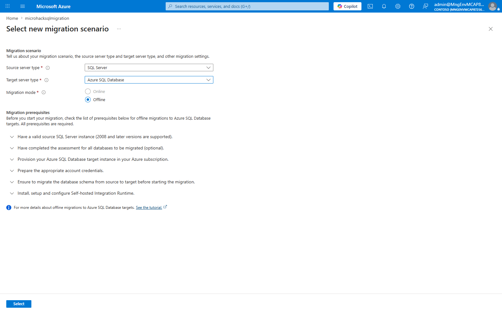

The **Azure SQL Database Offline Migration Wizard** opens (seven tabs).

### 4.2 Source details

The first tab registers an Azure resource that **tracks** the source SQL Server instance. Leave
**Is your source SQL Server instance tracked in Azure? = Yes** and point the picker at the Azure
SQL VM resource that represents your source.

| Field | Value |
|---|---|
| Is your source SQL Server instance tracked in Azure? | **Yes** |
| Subscription / Resource group | Lab subscription / `rg-mh-user01` |
| Location | Sweden Central |
| SQL Server Instance | The Azure SQL VM resource that tracks the source (e.g. `mhu01-srcvm19`) |

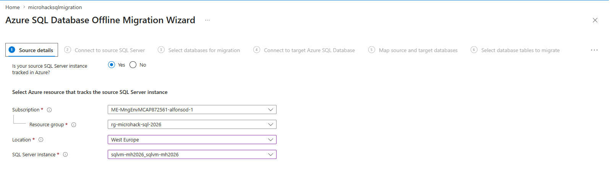

Select **Next: Connect to source SQL Server**.

### 4.3 Connect to source SQL Server

| Field | Value |
|---|---|
| Source server name | Hostname of the source SQL Server as the SHIR resolves it (e.g. `mhu01-srcvm19`) |
| Authentication type | SQL Authentication (the migration login from **Prerequisites → Source SQL Server permissions**) |
| User name | The migration login (e.g. `sqlmigration`) with `db_owner` on the source database |
| Password | (lab password) |
| Encrypt connection | Yes |
| Trust server certificate | Yes (the lab SQL Server uses a self-signed certificate) |

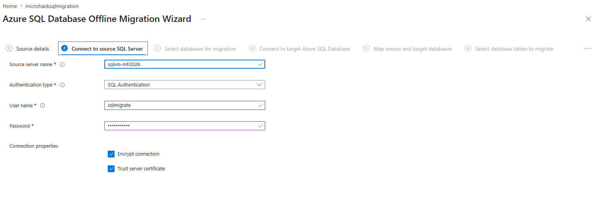

> **Tip — server name resolution.** The SHIR opens this connection **from the source VM itself**, so
> the value here is resolved on that host. In this lab the SHIR runs on the **same machine** as SQL
> Server, so the plain **hostname** (`mhu01-srcvm19`) — or even `localhost` — connects directly.
> If the SHIR were on a different host where DNS does not resolve the name, use the source VM's
> **private IP** instead. Append `,1433` only for a non-default port.

> **Troubleshooting — `Failed to test connections using provided Integration Runtime`.** When you
> select **Next**, DMS uses the SHIR to open a test connection to `master`. Two common failures:
>
> - **`error: 40 — Could not open a connection to SQL Server` / `network name is no longer
>   available` (SqlErrorNumber 64).** Network/name problem: the server name does not resolve or is
>   not reachable from the SHIR host. Use the hostname/private IP the SHIR can actually reach, and
>   confirm the source VM firewall allows inbound 1433.
> - **`Login failed for user '…'` (SqlErrorNumber 18456).** Connectivity is fine but the credentials
>   are rejected. Confirm the login exists, that **SQL Server authentication (mixed mode)** is
>   enabled on the source instance, and that the user/password are correct (a transposed character is
>   enough to fail).
>
> 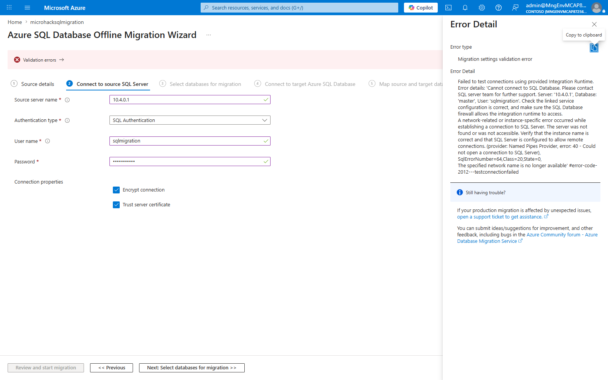

Select **Next: Select databases for migration**.

### 4.4 Select databases for migration

The wizard lists the databases on the source instance with their size and state. **Check the single
database `AdventureWorks2019`** you want to migrate (this lab migrates one database). The source
also contains `WideWorldImporters`, which is reserved for the Challenge 3 MI Link path. Populating
the list can take a few seconds. Select **Next: Connect to target Azure SQL Database**.

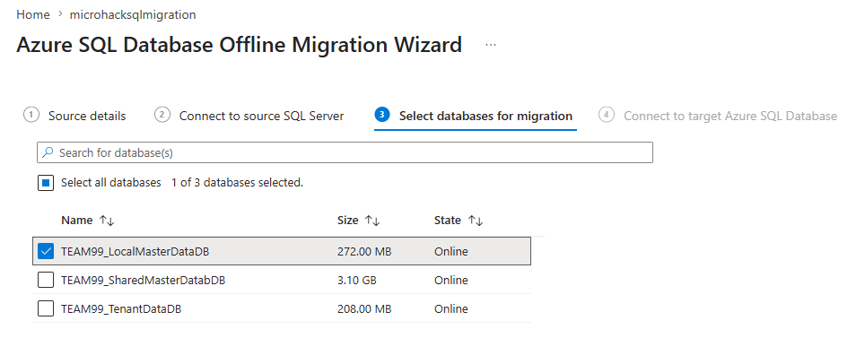

### 4.5 Connect to target Azure SQL Database

Connect to the **pre-created** target logical server (see **Prerequisites → Create the target Azure
SQL Database**). DMS uses **SQL authentication** here.

| Field | Value |
|---|---|
| Subscription / Resource group | Lab subscription / `rg-mh-user01` |
| Target Azure SQL Database Server | `mhu01-sqlsrv-<suffix>` |
| Target server name | `mhu01-sqlsrv-<suffix>.database.windows.net` |
| Authentication type | **SQL Authentication** |
| User name | The target SQL login — the server admin (`sqladmin`) in the lab, or the dedicated `sqlmigration` login from **Prerequisites → Target Azure SQL Database permissions** |
| Password | (target login password) |

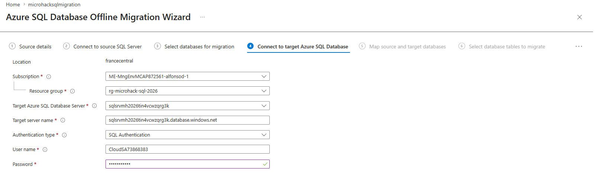

> **Firewall.** This connection comes from the SHIR host's public egress IP. If it is rejected with
> `Client with IP address '…' is not allowed to access the server` (40615), add that IP to the target
> server firewall — see **Prerequisites → Allow the SHIR to reach the target through the Azure SQL
> firewall**.

Select **Next: Map source and target databases**.

### 4.6 Map source and target databases

Pick the **target database** (which must already exist) for the source database. Matching names make
this unambiguous (`AdventureWorks2019 → AdventureWorks2019`). You can map only one target per source database.

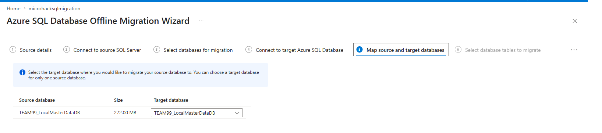

Select **Next: Select database tables to migrate**.

### 4.7 Select database tables to migrate

**Check `Migrate missing schema`.** Because the target database is empty, DMS must deploy the schema
before data; with this box checked it migrates the following objects in one step:

> Schemas, Tables, Indexes, Views, Stored Procedures, Synonyms, DDL Triggers, Defaults, Full Text
> Catalogs, Plan Guides, Roles, Rules, Application Roles, User Defined Aggregates, User Defined
> Data Types, User Defined Functions, User Defined Table Types, User Defined Types, Users
> (limited), XML Schema Collections.

Then use **Select all tables**, or filter and select individual tables. Tables with **no rows** show
`Table data cannot be migrated, source table is empty` and can be left unchecked (DMS skips empty
tables anyway). Select **Next: Database migration summary**.

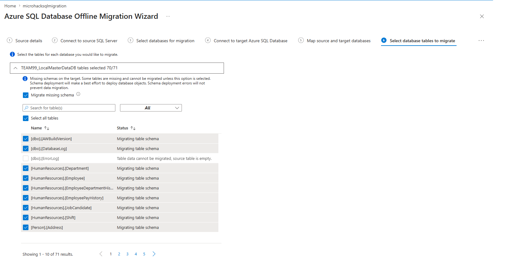

> **Note from the DMS tutorial:** if no tables exist on the target and **Migrate missing schema** is
> not selected, the **Next** button stays disabled. With the box checked, DMS deploys schema first,
> then data, even if schema migration reports object-level errors (except table-object errors, which
> stop the run).

### 4.8 Database migration summary

Review the summary — source instance, selected database(s), table count, the Azure SQL target, the
**Offline** migration mode, and the DMS instance with its SHIR node — then select **Start
migration**. The wizard returns you to the Database Migration Service dashboard.

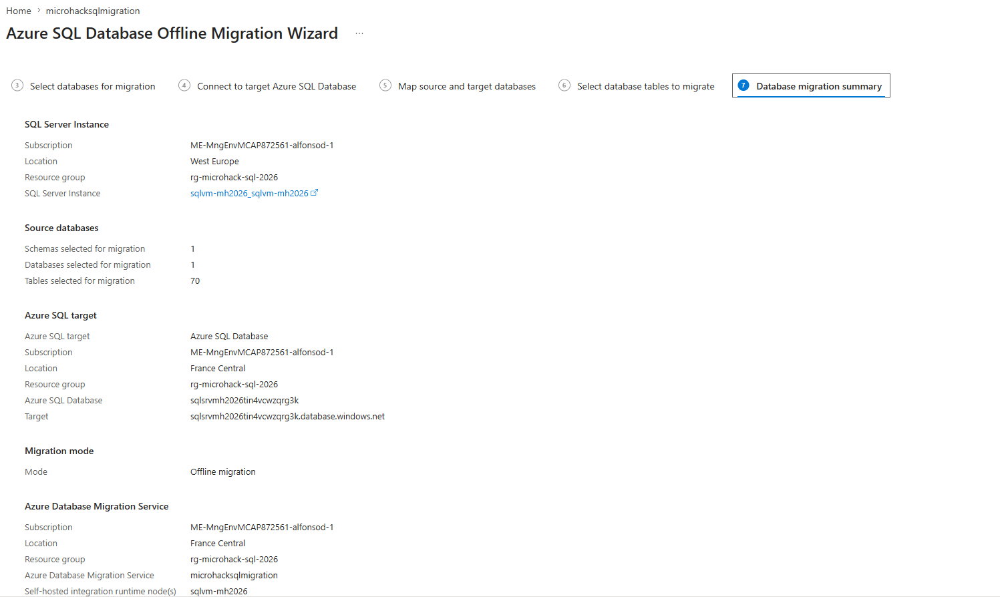

> **Offline migration: application downtime starts now.** Coordinate with the application owner
> before clicking **Start migration**.

---

## Step 5 — Monitor the migration

1. On the DMS instance **Overview** pane, select **Monitor migrations** (or the **Migrations** tab).
2. Use the **Migrations** tab to track in-progress, completed, and failed migrations. Use
   **Refresh** in the menu bar to update the status. Each row shows the source/target database,
   **Migration status**, **Migration mode** (Offline), target type, and **Duration**.

   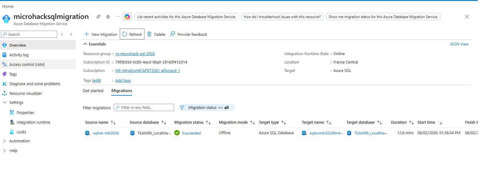

DMS reports the following statuses (per the official tutorial):

| Status | Meaning |
|---|---|
| **Creating** | DMS is starting the migration. |
| **Preparing for copy** | Disabling autostats, triggers, and indexes on target tables. |
| **Copying** | Data is being copied source → target. |
| **Copy finished** | Data copy complete; waiting on other tables to finish before final steps. |
| **Rebuilding indexes** | Rebuilding indexes on target tables. |
| **Succeeded** | All data copied and indexes rebuilt. |

3. Under **Source name**, select a database to drill into the per-migration detail. The blade
   summarizes the run — **Migration type** (*Schema and data migration*), **Schema migration status**
   (*Completed*), objects collected, script/deployment counts and **Deployment failed count = 0** —
   and lists every table with its **Status**, rows read, rows copied, throughput and copy duration:

   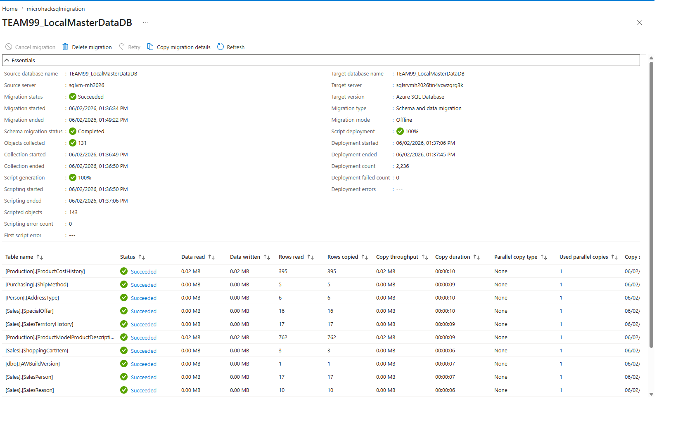

4. When the migration reports **Succeeded**, proceed to Step 6.

> DMS skips tables with **0 rows** in the source — they will not appear in the per-table list
> even if you selected them in the wizard.

> **Automating at scale?** The same migration can be driven from the CLI with
> [`az datamigration`](https://learn.microsoft.com/en-us/cli/azure/datamigration) — out of scope for
> this interactive lab, but useful for repeatable, multi-database runs.

---

## Step 6 — Validate and run post-migration tasks

### 6.1 Connect from the source VM (over Bastion)

In SSMS / VS Code MSSQL extension, connect to `mhu01-sqlsrv-<suffix>.database.windows.net`
using **SQL authentication** (the server admin or `sqlmigration` login). The migrated database
`AdventureWorks2019` should appear under **Databases** on the target logical server:

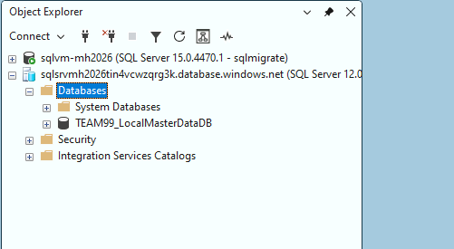

### 6.2 Compare row counts and schema

Compare row counts and schema between source (SQL 2019) and target (Azure SQL DB). Row counts on the
representative tables must match. The fastest check is to run the same row-count query in two SSMS
query windows — one connected to the source instance, one to the target — and compare side by side:

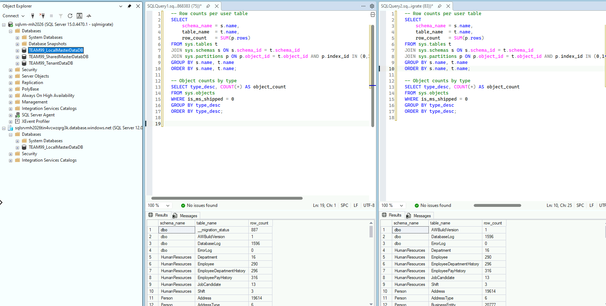

Investigate any mismatch before declaring success.

### 6.3 Smoke-test the application path

Pick the most-used stored procedure or view in `AdventureWorks2019` (for example a frequently called
reporting proc) and execute it against the migrated database. Confirm it returns rows
and that permissions are honored.

### 6.4 Post-migration tasks (from the official migration guide)

Items from the Challenge 1 backlog marked **After Challenge 2** are now in scope. The
[migration guide](https://learn.microsoft.com/en-us/data-migration/sql-server/database/guide?view=azuresql)
recommends:

- **Update statistics** (`UPDATE STATISTICS … WITH FULLSCAN`) on every migrated table (DMS rebuilds
  indexes but doesn't refresh stats).
- Raise the target **compatibility level** when the application supports it
  (e.g. `ALTER DATABASE [AdventureWorks2019] SET COMPATIBILITY_LEVEL = 160;`).
- Scale the target back down to the steady-state SKU recommended by Azure Migrate (e.g.
  General Purpose Gen5 2 vCore).
- Recreate scheduled work as **Elastic Jobs** or **Azure Automation** runbooks (SQL Agent jobs
  do not exist on Azure SQL DB).
- Recreate **logins** as Microsoft Entra ID logins where possible (Windows-auth users do not
  exist on Azure SQL DB).
- Confirm **TDE** is enabled (service-managed by default on Azure SQL DB) and document it.
- Configure **diagnostic settings** to the Log Analytics workspace `<log-analytics-workspace>` so
  Challenge 4 (Monitoring) has data when the team starts.

### 6.5 Known DMS limitations to verify

Per the official tutorial, validate the following do not apply to your databases (and document
any that do):

- ADF-based service limits (100,000 tables/database, 10,000 concurrent database migrations/service).
- **Double-byte characters** in table names are not supported — rename before migration.
- **Reserved keywords** or **semicolons** in database names are not supported.
- **Computed columns** are not migrated by DMS.
- Source columns with default constraints that contain `NULL` are written to the target with
  the **default value**, not `NULL`. Confirm this is acceptable for the application.
- **Large blob columns** can time out. Plan a partitioned migration if you have very wide
  tables.

---

[Previous Solution](../challenge-01/solution-01.md) - **[Home](../../Readme.md)** - [Next Solution](../challenge-03/solution-03.md)

