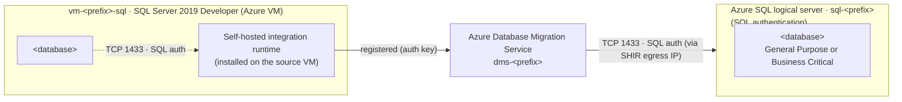
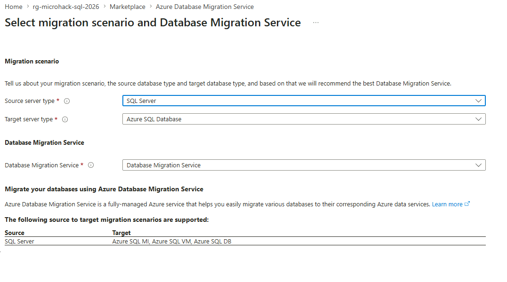
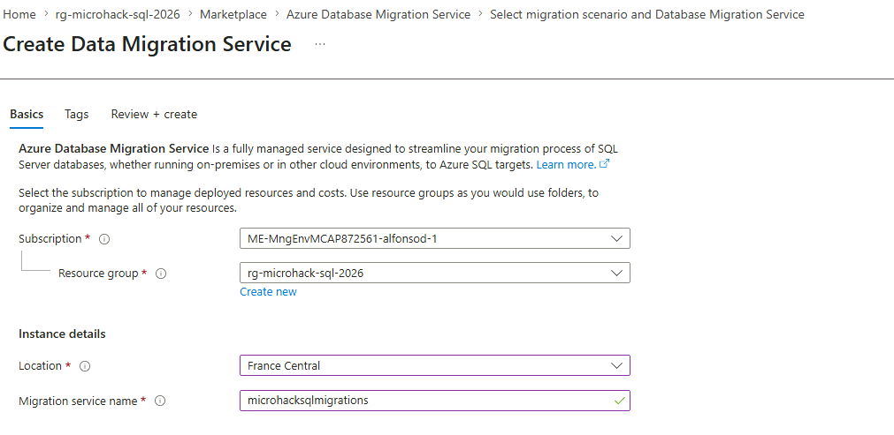
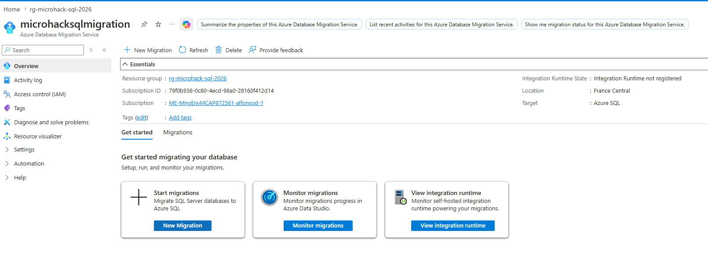

# Solution 2 — DMS migration: SQL Server 2019 → Azure SQL Database (2026 edition)

[Previous Solution](../challenge-01/solution-01.md) - **[Home](../../Readme.md)** - [Next Solution](../challenge-03/solution-03.md)

> This walkthrough follows the official Microsoft tutorial
> [**Migrate SQL Server to Azure SQL Database (offline) with Database Migration Service**](https://learn.microsoft.com/en-us/data-migration/sql-server/database/database-migration-service?view=azuresql)
> and the
> [**SQL Server to Azure SQL Database migration guide**](https://learn.microsoft.com/en-us/data-migration/sql-server/database/guide?view=azuresql).
> Where the lab departs from the tutorial (a single database instead of the tutorial's sample
> databases and a SQL Server 2019 source migrated into a single Azure SQL Database) the changes
> are called out inline.

## Naming convention

> **Use your own names.** Every Azure resource in this guide is written as a placeholder. Replace
> `<prefix>` with a short, unique string of your own (for example a team alias or project code) and
> substitute the remaining `<…>` tokens with your environment's values. The screenshots show one
> example run, so the resource names visible in them will differ from yours — **follow the
> placeholders, not the screenshots.**

| Placeholder | What it is | Example |
|---|---|---|
| `<prefix>` | Your unique identifier for this lab | `team07` |
| `rg-<prefix>` | Resource group holding the lab resources | `rg-team07` |
| `vm-<prefix>-sql` | Source SQL Server 2019 VM (from Challenge 1) | `vm-team07-sql` |
| `dms-<prefix>` | Azure Database Migration Service instance | `dms-team07` |
| `sql-<prefix>` | Target Azure SQL **logical server** (`sql-<prefix>.database.windows.net`) | `sql-team07` |
| `<database>` | The **single** database you migrate in this lab | `AppDb` |
| `<region>` | Azure region (keep source, DMS and target together) | `westeurope` |
| `sqlmigrate` | Source SQL login used by DMS (created in this guide) | `sqlmigrate` |
| `dms_migrator` | Dedicated **target** SQL login created in this guide (optional) | `dms_migrator` |

## What changed since the original

The original SQL Modernization MicroHack migrated databases through the Azure Data Studio (ADS)
SQL Migration extension. ADS was retired on **28-Feb-2026**. This 2026 edition rebuilds the
migration path on top of **Azure Database Migration Service (DMS)**, driven end-to-end from the
**Azure portal**, with the **Migrate Missing Schema** option of DMS deploying schema and data
in a single migration project — the supported Microsoft-native flow for SQL Server → Azure
SQL Database.

| Original lab choice | 2026 replacement | Why it changed |
|---|---|---|
| ADS + Azure SQL Migration extension | **Azure Database Migration Service** (driven from the Azure portal) | ADS is retired; DMS is the underlying service and remains supported. |
| Implicit runtime managed by ADS | A **self-hosted integration runtime (SHIR)** registered against DMS | For the **SQL Server → Azure SQL Database** scenario the Azure portal **disables the wizard until a SHIR is connected** (verified in the portal — see Step 3.2), even when the source is an Azure VM. The SHIR is installed on the source VM. |
| SQL Server 2019/2022 source | **SQL Server 2019** source (the Challenge 1 IaaS VM) | Same source instance assessed in Challenge 1 — one IaaS VM, no fleet. |
| Two sample databases (`AdventureWorks2019`, `WideWorldImporters`) | **One database** (`<database>`) migrated end-to-end | This lab focuses on the DMS flow itself, so we migrate a **single** database to keep the wizard clear. The same steps repeat per database at scale. |
| Target Azure SQL Managed Instance | **Azure SQL Database** (a single database on one logical server) | Matches the logical server already deployed for this lab. |
| Schema and data migrated in one wizard step | Schema and data migrated in one wizard step via the **Migrate Missing Schema** checkbox in DMS | Confirmed by the official DMS tutorial. SqlPackage / DACPAC remains a supported alternative (see Annex D). |

> **Online migration is not available for Azure SQL Database targets.** Application downtime
> starts when the DMS migration starts. Plan an offline cut-over window.

## Lab architecture for this challenge



For the **SQL Server → Azure SQL Database** scenario the Azure portal **requires a self-hosted
integration runtime (SHIR)** and keeps the migration wizard disabled until the SHIR is registered
and running — this was verified directly in the portal (see Step 3.2). The SHIR is installed on the
source VM `vm-<prefix>-sql`; it reaches the source instance over TCP 1433 and bridges the migration
back to DMS.

**Components**

- Resource group: `rg-<prefix>`
- Region: `<region>` (matches the target logical server)
- Source: `vm-<prefix>-sql` (SQL Server 2019 Developer, the Challenge 1 VM, hosting `<database>`)
- Target logical server: `sql-<prefix>.database.windows.net` (**SQL authentication**)
- Target database (created empty before migration): `<database>` — pick the tier from your
  Challenge 1 assessment (General Purpose by default; **Business Critical** if the database uses
  memory-optimized / In-Memory OLTP tables)
- DMS instance: `dms-<prefix>`
- Connectivity: a **self-hosted integration runtime (SHIR)** installed on the source VM reaches the
  source instance over TCP 1433 and registers against DMS — **required** by the portal for the Azure
  SQL Database target (see Step 3.2).

## Prerequisites

### Azure access

You can use either built-in roles or the custom DMS role from the
[official custom roles article](https://learn.microsoft.com/en-us/data-migration/sql-server/database/custom-roles?view=azuresql).

**Option A — built-in roles** (as listed in the DMS tutorial):

- **Contributor** on the target Azure SQL Database (logical server scope).
- **Reader** on the resource group that contains the target Azure SQL Database.
- **Owner** or **Contributor** on the subscription **if you need to create the DMS instance**.

**Option B — custom role** (least-privilege, recommended for production): create a custom role
that grants only the DMS + SQL actions documented in
[custom-roles](https://learn.microsoft.com/en-us/data-migration/sql-server/database/custom-roles?view=azuresql).
The full JSON is in **Annex E** of this walkthrough.

### Source SQL Server 2019 permissions

The login that DMS uses to connect to the source must be a member of the **`db_datareader`**
role on each migrated database. For **schema migration via DMS** the login must be **`db_owner`**
on each source database.

The source SQL Server 2019 instance uses **SQL authentication**, so create a dedicated SQL login
for the migration rather than reusing a human or service account. Run the following on the source
instance, signed in with a `sysadmin` login (e.g. over Bastion with SSMS or `sqlcmd`):

```sql
-- Connect to: vm-<prefix>-sql (source SQL Server 2019), database: master
-- Authentication: a sysadmin login (Windows or SQL).

-- 1) Server-level login for the migration (replace the password with a strong secret).
CREATE LOGIN [sqlmigration] WITH PASSWORD = '<strong-password>';

-- 2) Map the login on the database to migrate and grant the role DMS needs.
USE [<database>];
CREATE USER [sqlmigration] FOR LOGIN [sqlmigration];
ALTER ROLE db_owner ADD MEMBER [sqlmigration];   -- db_owner is required for schema migration
-- For data-only migration db_datareader is sufficient:
-- ALTER ROLE db_datareader ADD MEMBER [sqlmigration];
```

> **Enable mixed-mode authentication.** SQL logins only work when the instance runs in **SQL Server
> and Windows Authentication mode**. If the source rejects the login with error **18456**, confirm
> mixed mode is enabled (SSMS → *Server Properties → Security → SQL Server and Windows
> Authentication mode*, then restart the SQL Server service). Azure SQL VM marketplace images
> (`sql2019-ws2022`) ship with mixed mode enabled by default.

### Create the target Azure SQL Database (DMS does not create it)

> **DMS migrates *into* an existing database — it never creates the target database.** The wizard's
> *Map source and target databases* step (Step 4.6) only lets you pick a database that **already
> exists** on the target logical server. Create an empty target database **before** you start the
> wizard, or the mapping step will have nothing to select.

Create one empty Azure SQL Database per source database you intend to migrate. It does **not** need
a schema — DMS deploys the schema when you enable *Migrate missing schema* (Step 4.7). Using the
Azure CLI:

```bash
# Create the (empty) target database on the existing logical server sql-<prefix>.
az sql db create \
  --resource-group rg-<prefix> \
  --server sql-<prefix> \
  --name <database> \
  --service-objective S3        # pick a SKU sized for the migration throughput
```

> **Name the target after the source.** The wizard maps by selecting a target database from a
> dropdown; matching the target name to the source database (`<database>`) makes the mapping
> unambiguous.

### Target Azure SQL Database permissions

DMS connects to the target with **SQL authentication** (a SQL login on the logical server). Create a
dedicated login rather than reusing the server admin. For schema migration the login must hold the
following **server-level** roles on `master` (the exact roles called out in the official DMS
tutorial):

| Server role | Purpose |
|---|---|
| `##MS_DatabaseManager##` | Create and own databases |
| `##MS_DatabaseConnector##` | Connect to any database without a user account |
| `##MS_DefinitionReader##` | Read all catalog views (`VIEW ANY DEFINITION`) |
| `##MS_LoginManager##` | Create and delete logins |

Run the following on the **`master`** database of `sql-<prefix>`, signed in as the server admin
(SQL admin login or the Entra admin):

```sql
-- Connect to: sql-<prefix>.database.windows.net , database: master
-- Authentication: server admin (SQL login or Microsoft Entra admin).
CREATE LOGIN [dms_migrator] WITH PASSWORD = '<strong-password>';

ALTER SERVER ROLE ##MS_DefinitionReader##  ADD MEMBER [dms_migrator];
ALTER SERVER ROLE ##MS_DatabaseConnector## ADD MEMBER [dms_migrator];
ALTER SERVER ROLE ##MS_DatabaseManager##   ADD MEMBER [dms_migrator];
ALTER SERVER ROLE ##MS_LoginManager##      ADD MEMBER [dms_migrator];

CREATE USER [dms_migrator] FOR LOGIN [dms_migrator];
EXECUTE sp_addRoleMember 'dbmanager', 'dms_migrator';
EXECUTE sp_addRoleMember 'loginmanager', 'dms_migrator';
```

> **Lab shortcut.** In the lab you can simply use the **server admin SQL login** (e.g. the
> `CloudSA…` login created with the logical server) for the target connection in Step 4.5 — it
> already has every right above. The dedicated `dms_migrator` login is the least-privilege pattern
> recommended for real migrations.

> **Entra-only servers.** If your target logical server was deployed with **Microsoft Entra
> authentication only**, you cannot `CREATE LOGIN … WITH PASSWORD`. Either enable SQL authentication
> on the server, or create an Entra principal `FROM EXTERNAL PROVIDER`, grant it the same four server
> roles, and pick **Microsoft Entra ID** authentication in Step 4.5. This lab uses **SQL
> authentication**, matching the official tutorial.

### Allow the SHIR to reach the target through the Azure SQL firewall

The self-hosted integration runtime opens the **target** connection from the source VM. The target
logical server's firewall must therefore allow the **public egress IP** the SHIR host uses to reach
Azure SQL:

1. Find the source VM's outbound public IP (this is what Azure SQL sees as the client):

   ```bash
   az vm list-ip-addresses -g rg-<prefix> -n vm-<prefix>-sql \
     --query "[].virtualMachine.network.publicIpAddresses[].ipAddress" -o tsv
   ```

2. Add it as a server-level firewall rule on the target logical server:

   ```bash
   az sql server firewall-rule create \
     --resource-group rg-<prefix> --server sql-<prefix> \
     --name AllowSHIRHost --start-ip-address <vm-public-ip> --end-ip-address <vm-public-ip>
   ```

   > **Quick lab option.** Enabling **Allow Azure services and resources to access this server**
   > (the `0.0.0.0` rule) also lets the SHIR through, but it is broad — prefer the explicit host IP
   > above for anything beyond a lab.

If the firewall does not allow the SHIR host, the *Connect to target Azure SQL Database* step (4.5)
fails with `Cannot open server '…' requested by the login. Client with IP address '…' is not allowed
to access the server` (SqlErrorNumber 40615).

### Tools and connectivity

- Challenge 0 complete: connectivity to `vm-<prefix>-sql` is validated.
- Challenge 1 complete: the SSMS migration component + Azure Migrate assessments produced a
  remediation backlog. Apply the **Before Challenge 2** items before continuing.
- Tools on the source VM (reached over Bastion):
  - **SSMS 21+**
  - **VS Code** + MSSQL extension
  - **SqlPackage** (latest) — only if you choose the schema-first alternative in Annex D
- Network: a **self-hosted integration runtime** on the source VM must reach the SQL Server 2019
  instance on TCP 1433 and register against DMS (the portal requires a SHIR for the Azure SQL
  Database target — see Step 3.2).

Sign in to the [Azure portal](https://portal.azure.com) with an account that has Contributor on
`rg-<prefix>` and is the Microsoft Entra admin (or a member) on the target logical server.

---

## Step 1 — Apply pre-migration remediation on the SQL 2019 source

From the Challenge 1 backlog, fix everything tagged **Before Challenge 2** on the SQL 2019
instance. Map each item back to its assessment rule:

| Backlog item | Assessment rule |
|---|---|
| Remove or rewrite cross-database queries | `CrossDatabaseReferences` |
| Disable / drop SQL Agent jobs targeting these DBs | `AgentJobs` |
| Drop linked servers referenced by these DBs | `LinkedServer` |
| Drop or refactor CLR assemblies (`UNSAFE` / `EXTERNAL_ACCESS`) | `ClrAssemblies` |
| Remove FileStream / FileTable columns | `FileStream` |
| Replace `xp_cmdshell` usage | `XpCmdshell` |
| Raise database compat level to ≥100 | `DbCompatLevelLowerThan100` |
| Disable [Change Data Capture (CDC)](https://learn.microsoft.com/en-us/sql/relational-databases/track-changes/about-change-data-capture-sql-server) on source if enabled | DMS limitation — see the tutorial |

Verify the remediation using the queries in **Annex A** at the bottom of this walkthrough.

> The DMS tutorial warns explicitly: **disable CDC on the source database before starting the
> migration**, otherwise DMS will migrate CDC-related objects and re-enabling CDC on the target
> will fail.

---

## Step 2 — Provision the target Azure SQL Database resources

### 2.1 Confirm the target logical server (already deployed)

The lab logical server `sql-<prefix>` is **already deployed** with a **SQL admin login** (a
`CloudSA…` account created with the server). You do not need to create the server — just confirm it
in the portal:

1. Open **SQL servers** → `sql-<prefix>`.
2. Note the **Server admin** login under **Overview** (the `CloudSA…` SQL login). You will use this
   login — or the dedicated `dms_migrator` login from **Prerequisites → Target Azure SQL Database
   permissions** — for the target connection in Step 4.5.

> If your server was instead deployed **Entra-only**, see the *Entra-only servers* note in
> **Prerequisites → Target Azure SQL Database permissions**.

### 2.2 Open the firewall for the source network

For a lab you can allow Azure services + your lab public IP. For production, use a **Private
Endpoint** instead.

1. On the logical server, open **Security → Networking**.
2. Under **Firewall rules**, select **Add your client IPv4 address**, then add a rule for the
   source/lab public IP if different.
3. Set **Allow Azure services and resources to access this server** to **Yes** (lab only), then
   **Save**.

### 2.3 Create the empty target database

Provision **one** empty database — `<database>` — on the target logical server. Pick its service
tier from your Challenge 1 assessment:

- **General Purpose** (Gen5, e.g. 2 vCore) is the default for most workloads.
- **Business Critical** is **required** if `<database>` uses **memory-optimized / In-Memory OLTP
  tables** — that tier is the only one on Azure SQL Database that supports them
  ([In-Memory OLTP availability](https://learn.microsoft.com/en-us/azure/azure-sql/database/in-memory-oltp-overview?view=azuresql)).
  Provisioning such a database as General Purpose makes the **schema deployment of the
  memory-optimized tables fail** during the DMS migration.

> **Watch the assessment gap.** Azure Migrate may mark a database `Ready` for *General Purpose* even
> when it contains memory-optimized tables (the In-Memory readiness rule does not always fire).
> Confirm with the source query in **Annex A** before choosing the tier — if the database has any
> memory-optimized tables, provision it as **Business Critical** (or convert those tables to
> disk-based on the source first, which is out of scope for this lab).

Create it from the portal (**Create a resource → SQL Database**, or the logical server's
**+ Create database**): select the lab subscription and `rg-<prefix>`, the server `sql-<prefix>`,
set **Want to use SQL elastic pool? = No**, choose the service tier under
**Compute + storage → Configure database**, leave the database **empty** (Data source = **None**),
and **Review + create**.

> For the migration window itself, the official
> [migration guide](https://learn.microsoft.com/en-us/data-migration/sql-server/database/guide?view=azuresql)
> recommends temporarily scaling up to **Business Critical Gen5 8 vCore** (96 MB/s log generation
> rate) or **Hyperscale** (100 MB/s) to avoid log-rate throttling, then scaling back down after
> cut-over. You can change the tier from the database's **Compute + storage** blade.

If you are using a dedicated migration login (Prerequisites → Target Azure SQL Database
permissions), provision it on the target server now, before continuing.

---

## Step 3 — Create the DMS instance

### 3.1 Create the DMS instance from the portal

The `Microsoft.DataMigration` resource provider is registered automatically the first time you
create a DMS instance. Following the official tutorial:

1. In the Azure portal, navigate to **Azure Database Migration Services** and select **Create**.
2. In **Select migration scenario and Database Migration Service**, set:
   - **Source server type**: SQL Server
   - **Target server type**: Azure SQL Database
   - **Migration option**: Database Migration Service
   - Select **Create**.

   

3. In **Create Data Migration Service** (Basics):
   - Subscription: lab subscription
   - Resource group: `rg-<prefix>`
   - Database Migration Service name: `dms-<prefix>`
   - Location: `<region>`
   - **Review + Create**.

   

4. After deployment, the DMS **Overview** is your hub for the migration. Note the **integration
   runtime State = not registered** — you'll register one in the next substep, because the Azure SQL
   Database scenario requires it.

   

### 3.2 Register the self-hosted integration runtime

> **Reality check (from the portal):** for the **SQL Server → Azure SQL Database** scenario the
> migration wizard is **disabled until a self-hosted integration runtime (SHIR) is connected** — even
> when the source is an Azure VM. This is a hard portal prerequisite for this target, so we register a
> SHIR here. It stays **lean and portal-driven**: download the installer, paste an auth key — **no CLI**.

1. Start a new migration (Step 4.1). In **Select new migration scenario** the portal shows a red
   warning: *"This scenario is currently disabled and requires a self-hosted integration runtime to
   access the migration source and target servers."* The prerequisites list includes **"Install, set
   up and configure Self-hosted Integration Runtime"**.

   

2. Open **Configure integration runtime**. On a host that can reach the source instance (the source
   VM `vm-<prefix>-sql` itself is fine for this lab), follow the blade's two steps — **download the
   installer** (Step 1) and **copy an authentication key** (Step 2, `Key 1` or `Key 2`):

   

3. **Download and install** the self-hosted integration runtime on the host, then open the
   **Microsoft Integration Runtime Configuration Manager**. Paste the authentication key copied above
   and select **Register**:

   

4. Confirm the **node name** for this host (the example run uses the source VM's name) and select
   **Finish** to complete the node registration:

   

5. The Configuration Manager reports that **the self-hosted node is connected to the cloud service**,
   showing the Data Factory (your DMS instance) and Integration Runtime it is bound to:

   

6. Back in the portal, refresh the DMS **Integration runtime** blade and confirm **Status = Online**
   with **Registered nodes = 1**. The migration scenario is now unlocked:

   

> Once the SHIR is **registered and running**, the migration scenario unlocks and the wizard in Step 4
> proceeds. Reference:
> [Tutorial: migrate SQL Server to Azure SQL Database (offline)](https://learn.microsoft.com/en-us/data-migration/sql-server/database/database-migration-service).

---

## Step 4 — Plan and start the DMS migration

DMS migrations for Azure SQL Database are launched from the **target database** blade or from
the **DMS instance** blade. The wizard is the same in both entry points.

### 4.1 Start a new migration

1. In the Azure portal, open the DMS instance `dms-<prefix>` (or the target database
   `<database>`) and select **New migration**.
2. In **Select new migration scenario**, set:
   - **Source server type**: SQL Server
   - **Target server type**: Azure SQL Database
   - **Migration mode**: Offline (the only supported mode — *Online* is greyed out for Azure SQL Database)
   - Select **Select**.

   

The **Azure SQL Database Offline Migration Wizard** opens (seven tabs).

### 4.2 Source details

The first tab registers an Azure resource that **tracks** the source SQL Server instance. Leave
**Is your source SQL Server instance tracked in Azure? = Yes** and point the picker at the Azure
SQL VM resource that represents your source.

| Field | Value |
|---|---|
| Is your source SQL Server instance tracked in Azure? | **Yes** |
| Subscription / Resource group | Lab subscription / `rg-<prefix>` |
| Location | Region of the source VM, e.g. `<region>` |
| SQL Server Instance | The Azure SQL VM resource that tracks the source (e.g. `vm-<prefix>-sql`) |


Select **Next: Connect to source SQL Server**.

### 4.3 Connect to source SQL Server

| Field | Value |
|---|---|
| Source server name | Hostname of the source SQL Server as the SHIR resolves it (e.g. `vm-<prefix>-sql`) |
| Authentication type | SQL Authentication (the migration login from **Prerequisites → Source SQL Server permissions**) |
| User name | The migration login (e.g. `sqlmigrate`) with `db_owner` on the source database |
| Password | (lab password) |
| Encrypt connection | Yes |
| Trust server certificate | Yes (the lab SQL Server uses a self-signed certificate) |


> **Tip — server name resolution.** The SHIR opens this connection **from the source VM itself**, so
> the value here is resolved on that host. In this lab the SHIR runs on the **same machine** as SQL
> Server, so the plain **hostname** (`vm-<prefix>-sql`) — or even `localhost` — connects directly.
> If the SHIR were on a different host where DNS does not resolve the name, use the source VM's
> **private IP** instead. Append `,1433` only for a non-default port.

> **Troubleshooting — `Failed to test connections using provided Integration Runtime`.** When you
> select **Next**, DMS uses the SHIR to open a test connection to `master`. Two common failures:
>
> - **`error: 40 — Could not open a connection to SQL Server` / `network name is no longer
>   available` (SqlErrorNumber 64).** Network/name problem: the server name does not resolve or is
>   not reachable from the SHIR host. Use the hostname/private IP the SHIR can actually reach, and
>   confirm the source VM firewall allows inbound 1433.
> - **`Login failed for user '…'` (SqlErrorNumber 18456).** Connectivity is fine but the credentials
>   are rejected. Confirm the login exists, that **SQL Server authentication (mixed mode)** is
>   enabled on the source instance, and that the user/password are correct (a transposed character is
>   enough to fail).
>
> 

Select **Next: Select databases for migration**.

### 4.4 Select databases for migration

The wizard lists the databases on the source instance with their size and state. **Check the single
database `<database>`** you want to migrate (this lab migrates one database). Populating the list can
take a few seconds. Select **Next: Connect to target Azure SQL Database**.


### 4.5 Connect to target Azure SQL Database

Connect to the **pre-created** target logical server (see **Prerequisites → Create the target Azure
SQL Database**). DMS uses **SQL authentication** here.

| Field | Value |
|---|---|
| Subscription / Resource group | Lab subscription / `rg-<prefix>` |
| Target Azure SQL Database Server | `sql-<prefix>` |
| Target server name | `sql-<prefix>.database.windows.net` |
| Authentication type | **SQL Authentication** |
| User name | The target SQL login — the server admin (`CloudSA…`) in the lab, or the dedicated `dms_migrator` login from **Prerequisites → Target Azure SQL Database permissions** |
| Password | (target login password) |


> **Firewall.** This connection comes from the SHIR host's public egress IP. If it is rejected with
> `Client with IP address '…' is not allowed to access the server` (40615), add that IP to the target
> server firewall — see **Prerequisites → Allow the SHIR to reach the target through the Azure SQL
> firewall**.

Select **Next: Map source and target databases**.

### 4.6 Map source and target databases

Pick the **target database** (which must already exist) for the source database. Matching names make
this unambiguous (`<database> → <database>`). You can map only one target per source database.


Select **Next: Select database tables to migrate**.

### 4.7 Select database tables to migrate

**Check `Migrate missing schema`.** Because the target database is empty, DMS must deploy the schema
before data; with this box checked it migrates the following objects in one step:

> Schemas, Tables, Indexes, Views, Stored Procedures, Synonyms, DDL Triggers, Defaults, Full Text
> Catalogs, Plan Guides, Roles, Rules, Application Roles, User Defined Aggregates, User Defined
> Data Types, User Defined Functions, User Defined Table Types, User Defined Types, Users
> (limited), XML Schema Collections.

Then use **Select all tables**, or filter and select individual tables. Tables with **no rows** show
`Table data cannot be migrated, source table is empty` and can be left unchecked (DMS skips empty
tables anyway). Select **Next: Database migration summary**.


> **Note from the DMS tutorial:** if no tables exist on the target and **Migrate missing schema** is
> not selected, the **Next** button stays disabled. With the box checked, DMS deploys schema first,
> then data, even if schema migration reports object-level errors (except table-object errors, which
> stop the run).

### 4.8 Database migration summary

Review the summary — source instance, selected database(s), table count, the Azure SQL target, the
**Offline** migration mode, and the DMS instance with its SHIR node — then select **Start
migration**. The wizard returns you to the Database Migration Service dashboard.


> **Offline migration: application downtime starts now.** Coordinate with the application owner
> before clicking **Start migration**.

---

## Step 5 — Monitor the migration

1. On the DMS instance **Overview** pane, select **Monitor migrations** (or the **Migrations** tab).
2. Use the **Migrations** tab to track in-progress, completed, and failed migrations. Use
   **Refresh** in the menu bar to update the status. Each row shows the source/target database,
   **Migration status**, **Migration mode** (Offline), target type, and **Duration**.

   

DMS reports the following statuses (per the official tutorial):

| Status | Meaning |
|---|---|
| **Creating** | DMS is starting the migration. |
| **Preparing for copy** | Disabling autostats, triggers, and indexes on target tables. |
| **Copying** | Data is being copied source → target. |
| **Copy finished** | Data copy complete; waiting on other tables to finish before final steps. |
| **Rebuilding indexes** | Rebuilding indexes on target tables. |
| **Succeeded** | All data copied and indexes rebuilt. |

3. Under **Source name**, select a database to drill into the per-migration detail. The blade
   summarizes the run — **Migration type** (*Schema and data migration*), **Schema migration status**
   (*Completed*), objects collected, script/deployment counts and **Deployment failed count = 0** —
   and lists every table with its **Status**, rows read, rows copied, throughput and copy duration:

   

4. When the migration reports **Succeeded**, proceed to Step 6.

> DMS skips tables with **0 rows** in the source — they will not appear in the per-table list
> even if you selected them in the wizard.

> **Automating at scale?** The same migration can be driven from the CLI with
> [`az datamigration`](https://learn.microsoft.com/en-us/cli/azure/datamigration) — out of scope for
> this interactive lab, but useful for repeatable, multi-database runs.

---

## Step 6 — Validate and run post-migration tasks

### 6.1 Connect from the source VM (over Bastion)

In SSMS / VS Code MSSQL extension, connect to `sql-<prefix>.database.windows.net`
using **SQL authentication** (the server admin or `dms_migrator` login). The migrated database
`<database>` should appear under **Databases** on the target logical server:


### 6.2 Compare row counts and schema

Run the validation queries in **Annex B** against both source (SQL 2019) and target (Azure SQL
DB). Row counts on the representative tables must match. The fastest check is to run the same
row-count query in two SSMS query windows — one connected to the source instance, one to the target
— and compare side by side:


Investigate any mismatch before declaring success.

### 6.3 Smoke-test the application path

Pick the most-used stored procedure or view in `<database>` (for example a frequently called
reporting proc) and execute it against the migrated database. Confirm it returns rows
and that permissions are honored.

### 6.4 Post-migration tasks (from the official migration guide)

Items from the Challenge 1 backlog marked **After Challenge 2** are now in scope. The
[migration guide](https://learn.microsoft.com/en-us/data-migration/sql-server/database/guide?view=azuresql)
recommends:

- **Update statistics** on every migrated table (DMS rebuilds indexes but doesn't refresh
  stats — see Annex F).
- Raise the target **compatibility level** when the application supports it
  (e.g. `ALTER DATABASE [<database>] SET COMPATIBILITY_LEVEL = 160;`).
- Scale the target back down to the steady-state SKU recommended by Azure Migrate (e.g.
  General Purpose Gen5 2 vCore).
- Recreate scheduled work as **Elastic Jobs** or **Azure Automation** runbooks (SQL Agent jobs
  do not exist on Azure SQL DB).
- Recreate **logins** as Microsoft Entra ID logins where possible (Windows-auth users do not
  exist on Azure SQL DB).
- Confirm **TDE** is enabled (service-managed by default on Azure SQL DB) and document it.
- Configure **diagnostic settings** to the Log Analytics workspace `<log-analytics-workspace>` so
  Challenge 4 (Monitoring) has data when the team starts.

### 6.5 Known DMS limitations to verify

Per the official tutorial, validate the following do not apply to your databases (and document
any that do):

- ADF-based service limits (100,000 tables/database, 10,000 concurrent database migrations/service).
- **Double-byte characters** in table names are not supported — rename before migration.
- **Reserved keywords** or **semicolons** in database names are not supported.
- **Computed columns** are not migrated by DMS.
- Source columns with default constraints that contain `NULL` are written to the target with
  the **default value**, not `NULL`. Confirm this is acceptable for the application.
- **Large blob columns** can time out. Plan a partitioned migration if you have very wide
  tables.

---

## Success criteria checklist

- [ ] Pre-migration remediation completed on the SQL 2019 source (CDC disabled if present)
- [ ] `sql-<prefix>` logical server confirmed and the target SQL login
      (`dms_migrator` or the server admin) holds the four required server-level roles
- [ ] Target server **firewall** allows the SHIR host's public egress IP (or *Allow Azure services*)
- [ ] The empty target database `<database>` created with the recommended tier (Business Critical
      if it uses In-Memory OLTP, otherwise General Purpose)
- [ ] `Microsoft.DataMigration` provider registered (auto with the first DMS instance)
- [ ] DMS instance `dms-<prefix>` created via the **Select migration scenario** wizard
- [ ] DMS connectivity to the source validated through the **self-hosted integration runtime**
      (State = Running)
- [ ] DMS offline migration completed for `<database>` with **Migrate Missing Schema**
      enabled; status = **Succeeded**
- [ ] Row counts match between source and target
- [ ] Smoke test executes successfully on the migrated database
- [ ] Post-migration tasks captured for follow-up challenges; statistics updated and compat
      level raised where applicable

---

## Annex A — Pre-migration remediation queries (run on SQL 2019)

```sql
-- Cross-database references (must be removed for Azure SQL DB)
SELECT DISTINCT
    referencing_object  = QUOTENAME(OBJECT_SCHEMA_NAME(d.referencing_id)) + '.' + QUOTENAME(OBJECT_NAME(d.referencing_id)),
    referenced_database = d.referenced_database_name
FROM sys.sql_expression_dependencies d
WHERE d.referenced_database_name IS NOT NULL
  AND d.referenced_database_name <> DB_NAME();

-- SQL Agent jobs that touch the source databases
USE msdb;
SELECT j.name AS job_name, s.command
FROM dbo.sysjobs j
JOIN dbo.sysjobsteps s ON s.job_id = j.job_id
WHERE s.command LIKE '%<database>%';

-- Linked servers
SELECT name, product, provider, data_source FROM sys.servers WHERE server_id > 0;

-- Unsupported CLR (UNSAFE / EXTERNAL_ACCESS)
SELECT name, permission_set_desc FROM sys.assemblies
WHERE is_user_defined = 1 AND permission_set_desc IN ('UNSAFE', 'EXTERNAL_ACCESS');

-- CDC enabled databases (must be disabled before DMS migration)
SELECT name, is_cdc_enabled FROM sys.databases WHERE is_cdc_enabled = 1;
```

To disable CDC on a database before migration:

```sql
USE <database>;
EXEC sys.sp_cdc_disable_db;
```

## Annex B — Validation queries (run on both source and target)

```sql
-- Row counts per user table
SELECT
    schema_name = s.name,
    table_name  = t.name,
    row_count   = SUM(p.rows)
FROM sys.tables t
JOIN sys.schemas s ON s.schema_id = t.schema_id
JOIN sys.partitions p ON p.object_id = t.object_id AND p.index_id IN (0,1)
GROUP BY s.name, t.name
ORDER BY s.name, t.name;

-- Object counts by type
SELECT type_desc, COUNT(*) AS object_count
FROM sys.objects
WHERE is_ms_shipped = 0
GROUP BY type_desc
ORDER BY type_desc;

-- Sample checksum on a representative table (replace [Sales].[Orders])
SELECT COUNT_BIG(*) AS row_count, CHECKSUM_AGG(BINARY_CHECKSUM(*)) AS table_checksum
FROM [Sales].[Orders];
```

## Annex C — Troubleshooting cheatsheet

| Symptom | Likely cause | Fix |
|---|---|---|
| DMS cannot connect to the source | DMS cannot reach the source VM on TCP 1433 (NSG / firewall) | Allow inbound 1433 from the DMS service; for isolated sources register a [Self-hosted Integration Runtime](https://learn.microsoft.com/en-us/data-migration/sql-server/database/database-migration-service) |
| Wizard **Next** button greyed on schema/table step | No tables on target and `Migrate Missing Schema` not checked | Check the **Migrate Missing schema** box |
| Migration fails immediately with target login error | The target SQL login lacks the four server-level roles | Re-run the `CREATE LOGIN … / ALTER SERVER ROLE` script (Prerequisites → Target Azure SQL Database permissions) |
| Target connection fails with `Client with IP address '…' is not allowed` (40615) | Target server firewall does not allow the SHIR host's egress IP | Add the SHIR host public IP to the target server firewall (Prerequisites → Allow the SHIR to reach the target) |
| Migration fails at **Preparing for copy** with source login error | Source login lacks `db_owner` for schema migration | Grant `db_owner` to the migration login on each source DB |
| Migration fails with **collation mismatch** | Target collation differs from source | Re-create target DB with matching collation, or set `--target-db-collation` |
| Slow migration on large table | Log-rate throttling on target | Scale target to Business Critical 8 vCore (96 MB/s) or Hyperscale for the migration window |
| `Cannot open server` from the source VM | Firewall rule missing for lab admin IP | Add SQL server firewall rule for the current IP |
| CDC re-enable fails on target after migration | CDC was left enabled on source; DMS migrated CDC objects | Disable CDC on source before migration, re-create CDC fresh on target |

## Annex D — Alternative: schema-first with SqlPackage (DACPAC)

The official DMS tutorial mentions alternative schema-migration tooling. If your team prefers a
separate schema deployment step (e.g. to gate on SqlPackage validation before running DMS),
extract a DACPAC from SQL 2019 and publish it to the empty Azure SQL DB **before** running the
DMS wizard, and **do not** check the `Migrate Missing Schema` box in Step 4.6.

```powershell
$src = "vm-<prefix>-sql,1433"
$out = "C:\Lab\dacpacs"
$db  = "<database>"
New-Item -ItemType Directory -Path $out -Force | Out-Null

& SqlPackage.exe `
  /Action:Extract `
  /SourceServerName:$src /SourceDatabaseName:$db `
  /SourceUser:sa /SourcePassword:"<sql2019-sa-password>" `
  /TargetFile:"$out\$db.dacpac"

# Target uses SQL authentication — publish with the target SQL login.
$tgt = "sql-<prefix>.database.windows.net"
& SqlPackage.exe `
  /Action:Publish `
  /SourceFile:"$out\$db.dacpac" `
  /TargetServerName:$tgt /TargetDatabaseName:$db `
  /TargetUser:dms_migrator /TargetPassword:"<strong-password>" `
  /p:BlockOnPossibleDataLoss=false /p:DropObjectsNotInSource=false
```
```

The
[SQL Database Projects extension for VS Code](https://learn.microsoft.com/en-us/sql/tools/sql-database-projects/sql-database-projects)
is another supported alternative for repeatable schema deployments.

## Annex E — Custom Azure RBAC role for DMS migrations

From [custom-roles](https://learn.microsoft.com/en-us/data-migration/sql-server/database/custom-roles?view=azuresql).
Save as `DmsCustomRoleDemoForSqlDB.json` and create with
`az role definition create --role-definition DmsCustomRoleDemoForSqlDB.json`.

```json
{
  "properties": {
    "roleName": "DmsCustomRoleDemoForSqlDB",
    "description": "Least-privilege custom role to run DMS migrations to Azure SQL Database",
    "assignableScopes": [
      "/subscriptions/<SQLDatabaseSubscription>/resourceGroups/<SQLDatabaseResourceGroup>",
      "/subscriptions/<DatabaseMigrationServiceSubscription>/resourceGroups/<DatabaseMigrationServiceResourceGroup>"
    ],
    "permissions": [
      {
        "actions": [
          "Microsoft.Sql/servers/read",
          "Microsoft.Sql/servers/write",
          "Microsoft.Sql/servers/databases/read",
          "Microsoft.Sql/servers/databases/write",
          "Microsoft.Sql/servers/databases/delete",
          "Microsoft.DataMigration/locations/operationResults/read",
          "Microsoft.DataMigration/locations/operationStatuses/read",
          "Microsoft.DataMigration/locations/sqlMigrationServiceOperationResults/read",
          "Microsoft.DataMigration/databaseMigrations/write",
          "Microsoft.DataMigration/databaseMigrations/read",
          "Microsoft.DataMigration/databaseMigrations/delete",
          "Microsoft.DataMigration/databaseMigrations/cancel/action",
          "Microsoft.DataMigration/sqlMigrationServices/write",
          "Microsoft.DataMigration/sqlMigrationServices/delete",
          "Microsoft.DataMigration/sqlMigrationServices/read",
          "Microsoft.DataMigration/sqlMigrationServices/listAuthKeys/action",
          "Microsoft.DataMigration/sqlMigrationServices/regenerateAuthKeys/action",
          "Microsoft.DataMigration/sqlMigrationServices/deleteNode/action",
          "Microsoft.DataMigration/sqlMigrationServices/listMonitoringData/action",
          "Microsoft.DataMigration/sqlMigrationServices/listMigrations/read",
          "Microsoft.DataMigration/sqlMigrationServices/MonitoringData/read",
          "Microsoft.DataMigration/SqlMigrationServices/tasks/read",
          "Microsoft.DataMigration/SqlMigrationServices/tasks/write",
          "Microsoft.DataMigration/SqlMigrationServices/tasks/delete"
        ],
        "notActions": [],
        "dataActions": [],
        "notDataActions": []
      }
    ]
  }
}
```

Provisioning a new DMS instance still requires **Owner** or **Contributor** at the subscription
level — the custom role above only covers DMS + SQL operations within the assigned scopes.

## Annex F — Update statistics on the target after migration

```sql
-- Run on each migrated database on Azure SQL DB
DECLARE @sql nvarchar(max) = N'';
SELECT @sql = STRING_AGG(
    CONVERT(nvarchar(max),
        N'UPDATE STATISTICS ' + QUOTENAME(s.name) + N'.' + QUOTENAME(t.name)
        + N' WITH FULLSCAN;'
    ), CHAR(10))
FROM sys.tables t
JOIN sys.schemas s ON s.schema_id = t.schema_id;
EXEC sp_executesql @sql;
```

---

[Previous Solution](../challenge-01/solution-01.md) - **[Home](../../Readme.md)** - [Next Solution](../challenge-03/solution-03.md)
