# Solution 4 — Monitoring and Performance on Azure SQL Managed Instance (2026 edition)

[Previous Solution](../challenge-03/solution-03.md) - **[Home](../../Readme.md)** - [Next Solution](../challenge-05/solution-05.md)

> **Lab scenario:** Users report that the migrated CRM workload is slow after recent stored procedure changes. You will create monitoring signal, find the highest CPU consumers, inspect portal metrics and Log Analytics records, then apply Query Store and tuning features to validate the fix.

> **Timing:** Allow 45–60 minutes for Steps 1–7. If your facilitator pre-deployed diagnostic settings during the initial deployment, verify they are configured in Step 1 and proceed to Step 2.

## Step 0 — Establish admin
First of all we need to define the administator of the managed instance. Select you own user here,as the administrador of the Managed Instance:

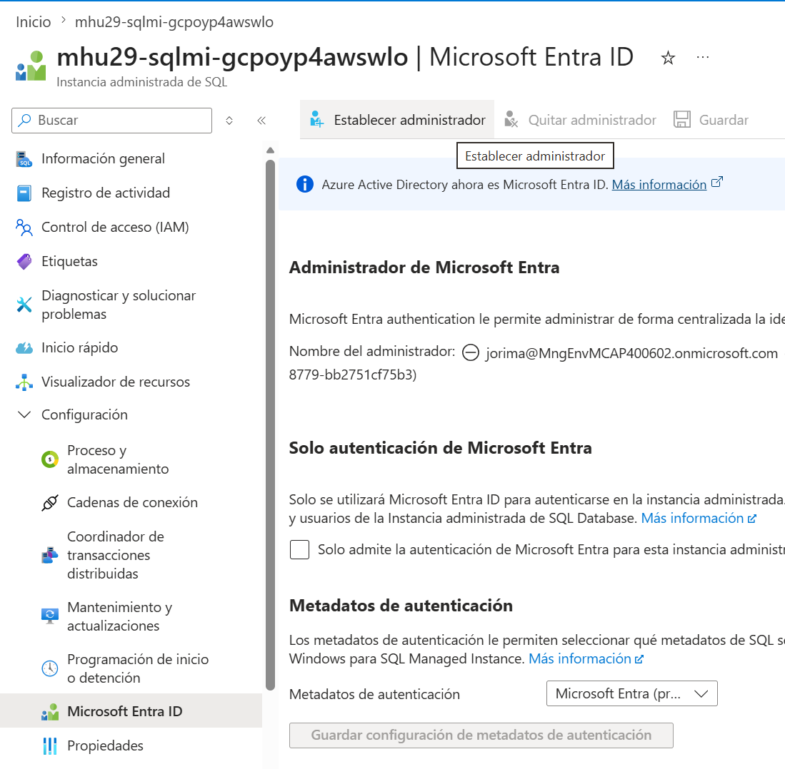

If the SQL Managed instance does not contain a database named AdventureWorks2019, please, find a dacpac file in the docs folder, download it and import the dacpac in the Managed Instance:

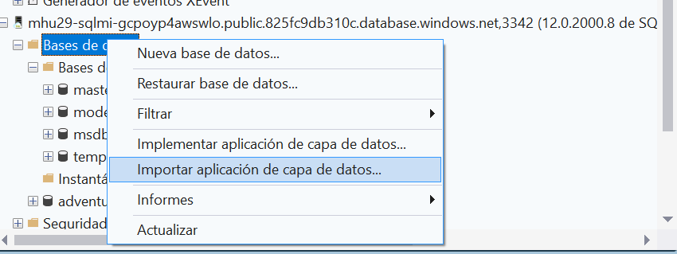

Follow the wizard and restore the dacpac file into the Managed Instance:

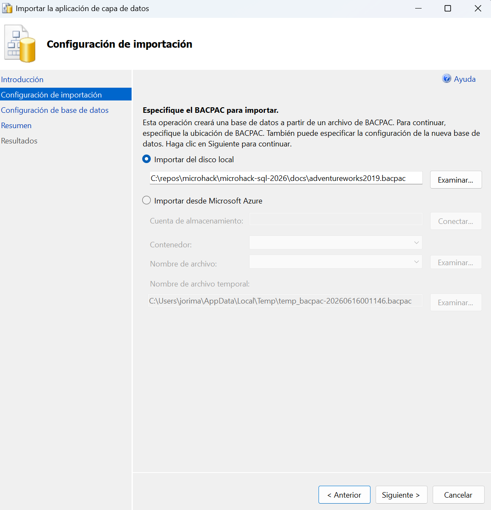


## Step 1 — Enable diagnostic settings on SQL MI

> **Note:** The deployment Bicep (`infra/modules/monitoring.bicep`) already provisions the Log Analytics workspace `log-<prefix>`. If your facilitator also pre-configured diagnostic settings on the SQL MI, verify the categories below are enabled and skip to Step 2.

SQL Managed Instance requires **two separate diagnostic settings**: one on the managed instance resource (instance-level telemetry) and one on each individual database (database-level telemetry). Open the Azure portal and navigate to **SQL managed instances** →  **Monitoring** → **Diagnostic settings**.

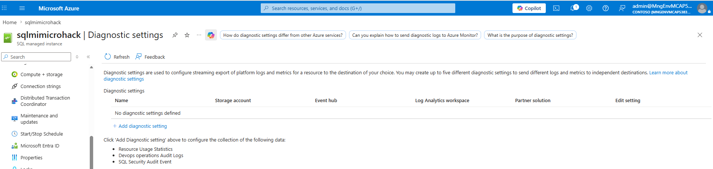

**Instance-level diagnostic setting** — Create a setting named `diag-sqlmi-instance-to-la` on the managed instance resource. Enable:

- `Resource Usage Statistics`

**Database-level diagnostic setting** — Navigate to your migrated database (e.g., `AdventureWorks2019`) within the managed instance → **Monitoring** → **Diagnostic settings**. Create a setting named `diag-sqlmi-db-to-la`. Enable:

- `SQLInsights`
- `QueryStoreRuntimeStatistics`
- `QueryStoreWaitStatistics`
- `Errors`

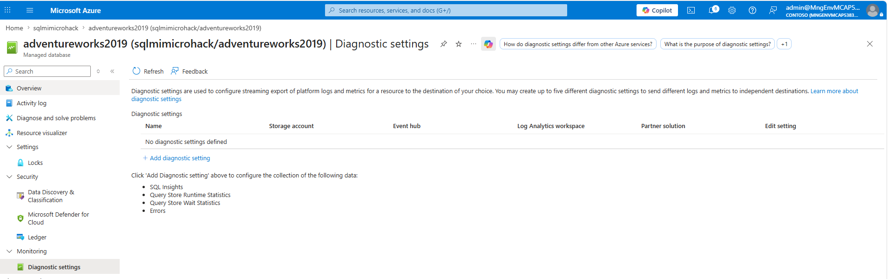

Send both diagnostic settings to the Log Analytics workspace `la-microhack-sql` in `rg-microhack-sql-2026`. Save and wait 5-10 minutes before expecting events in Log Analytics.

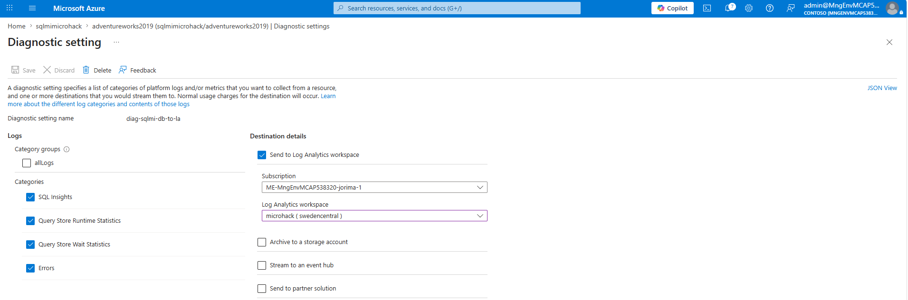

## Step 2 — Generate workload pressure

Connect to the migrated database `AdventureWorks2019`, from SQL Server Management Studio (SSMS). Use your AAD user and the fully qualified MI host name from the portal overview. Keep in mind we are connecting to the Public endpoint, so the connection is made via de 3342 port.

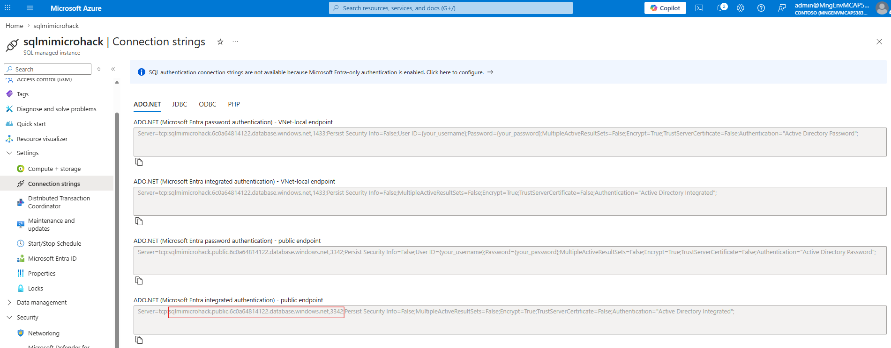

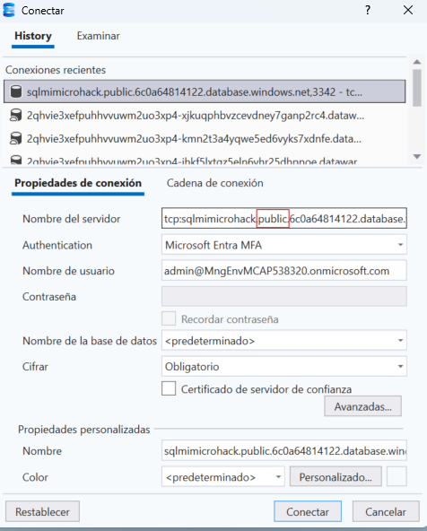

> **Multi-team deployments:** If your lab uses team-prefixed databases (e.g., `TEAM01_AdventureWorks2019`), replace every `AdventureWorks2019` reference in this walkthrough with your team-prefixed database name.

Run a synthetic workload for 10-15 minutes so the portal, Query Store, DMVs, and Log Analytics all have enough signal. The following script deliberately creates CPU pressure, logical reads, a cursor loop, and a missing-index-style scan.
(The script execution should take around 10 minutes)

```sql
USE AdventureWorks2019;
GO

CREATE OR ALTER PROCEDURE dbo.usp_MicroHackCpuPressure
AS
BEGIN
    SET NOCOUNT ON;

    SELECT TOP (3000000)
        h.SalesOrderID,
        h.CustomerID,
        h.OrderDate,
        SUM(d.LineTotal) OVER (PARTITION BY h.CustomerID ORDER BY h.OrderDate) AS running_total
        --,AVG(d.LineTotal) OVER (PARTITION BY h.TerritoryID) AS avg_territory_line_total
    FROM Sales.SalesOrderHeader AS h
    CROSS JOIN Sales.SalesOrderDetail AS d
    WHERE h.OrderDate >= '2013-01-01'
    OPTION (MAXDOP 1);
END;
GO

CREATE OR ALTER PROCEDURE dbo.usp_MicroHackCursorPressure
AS
BEGIN
    SET NOCOUNT ON;

    DECLARE @salesOrderId int;
    DECLARE order_cursor CURSOR FAST_FORWARD FOR
        SELECT TOP (100) SalesOrderID
        FROM Sales.SalesOrderHeader
        ORDER BY OrderDate DESC;

    OPEN order_cursor;
    FETCH NEXT FROM order_cursor INTO @salesOrderId;

    WHILE @@FETCH_STATUS = 0
    BEGIN
        SELECT COUNT_BIG(*)
        FROM Sales.SalesOrderDetail AS d
        WHERE d.SalesOrderID >= @salesOrderId;

        FETCH NEXT FROM order_cursor INTO @salesOrderId;
    END

    CLOSE order_cursor;
    DEALLOCATE order_cursor;
END;
GO

-- Deliberate missing-index scan pattern: filter on a non-covering expression.
SELECT TOP (1000)
    p.BusinessEntityID,
    p.FirstName,
    p.LastName
FROM Person.Person AS p
WHERE LEFT(p.LastName, 2) = 'Sm'
ORDER BY p.ModifiedDate DESC;
GO

-- Run from 2-3 query windows to create pressure.
DECLARE @i int = 0;
WHILE @i < 10
BEGIN
    EXEC dbo.usp_MicroHackCpuPressure;
    EXEC dbo.usp_MicroHackCursorPressure;
    WAITFOR DELAY '00:00:03';
    SET @i += 1;
END;
GO
```

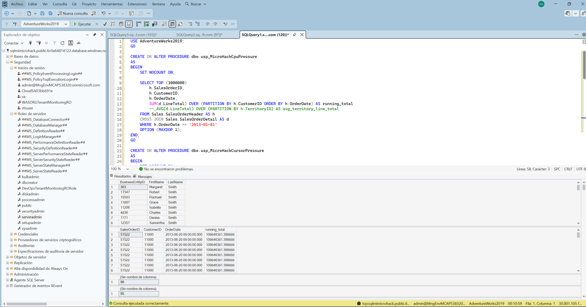

## Step 3 — Identify the top CPU consumers via DMVs

DMVs help you separate *running* issues from *waiting* issues. Running queries have CPU and are taking time to complete. Waiting queries are blocked on CPU, IO, locks, memory, log writes, or another resource. Start with aggregate CPU consumers since the lab workload intentionally creates CPU pressure.

Run this query in the migrated database:

```sql
SELECT TOP (20)
    DB_NAME(st.dbid) AS database_name,
    qs.execution_count,
    qs.total_worker_time / 1000 AS total_cpu_ms,
    (qs.total_worker_time / NULLIF(qs.execution_count, 0)) / 1000 AS avg_cpu_ms,
    qs.total_elapsed_time / 1000 AS total_elapsed_ms,
    qs.total_logical_reads,
    qs.total_logical_writes,
    qs.creation_time,
    qs.last_execution_time,
    SUBSTRING(
        st.text,
        (qs.statement_start_offset / 2) + 1,
        ((CASE qs.statement_end_offset
            WHEN -1 THEN DATALENGTH(st.text)
            ELSE qs.statement_end_offset
          END - qs.statement_start_offset) / 2) + 1
    ) AS statement_text,
    qp.query_plan
FROM sys.dm_exec_query_stats AS qs
CROSS APPLY sys.dm_exec_sql_text(qs.sql_handle) AS st
CROSS APPLY sys.dm_exec_query_plan(qs.plan_handle) AS qp
WHERE st.dbid = DB_ID()
ORDER BY qs.total_worker_time DESC;
```

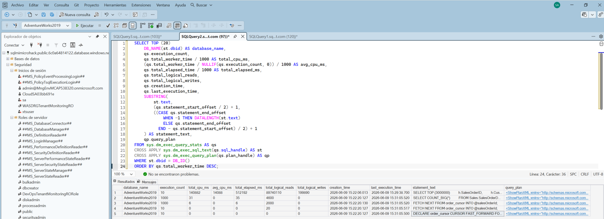

Open the XML execution plan for the top row. Look for scans, high estimated rows, warning icons, spills, missing index suggestions, repeated cursor activity, or expensive window aggregates. In this lab you should see the synthetic procedures near the top after several executions.

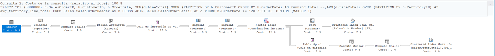

### Snapshot server-wide wait stats

This quick query shows the top wait types across the entire instance:

```sql
SELECT TOP (20)
    wait_type,
    wait_time_ms,
    signal_wait_time_ms,
    waiting_tasks_count
FROM sys.dm_os_wait_stats
WHERE wait_type NOT LIKE '%SLEEP%'
  AND wait_type NOT LIKE '%IDLE%'
  AND wait_type NOT LIKE '%QUEUE%'
  AND wait_type <> 'WAITFOR'
ORDER BY wait_time_ms DESC;
```
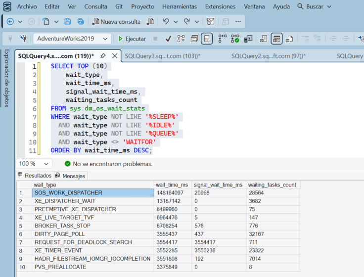

**Understanding the screenshot results:**

The screenshot shows SQL MI's accumulated wait statistics since the last restart or stats reset. Most of these are **benign system background tasks**, not user query bottlenecks:

- **SOS_WORK_DISPATCHER** (140 seconds) — Internal task scheduler for system workers. High accumulated time is normal on long-running instances; this is background noise, not a performance issue.
  
- **XE_DISPATCHER_WAIT** / **PREEMPTIVE_XE_DISPATCHER** / **XE_TIMER_EVENT** / **XE_LIVE_TARGET_TVF** — Extended Events (XE) infrastructure waits. These fire constantly for system health sessions and diagnostics. Safe to ignore unless you're running dozens of custom XE sessions.
  
- **BROKER_TASK_STOP** — Service Broker internal cleanup. Expected on all SQL MI instances even if you're not using Service Broker features.
  
- **DIRTY_PAGE_POLL** — Background checkpoint process checking for dirty pages to flush to disk. Part of normal database engine operation.
  
- **REQUEST_FOR_DEADLOCK_SEARCH** — Deadlock monitor waking up every 5 seconds to scan for deadlocks. Notice `signal_wait_time_ms` equals `wait_time_ms` (3554417), meaning it's just sleeping and waking on schedule — no actual deadlocks detected.
  
- **HADR_FILESTREAM_IOMGR_IOCOMPLETION** — Always-On availability group infrastructure wait (SQL MI uses AG under the hood). Background process, not a user query bottleneck.
  
- **PVS_PREALLOCATE** — Persistent Version Store (used for snapshot isolation and accelerated database recovery). Low signal wait time (0 ms) means it's idle most of the time.

- **SOS_SCHEDULER_YIELD** or **CXPACKET** → CPU pressure from queries

- **PAGEIOLATCH_SH** / **PAGEIOLATCH_EX** → Data page reads/writes

- **WRITELOG** → Transaction log writes

- **LCK_M_** → Lock waits from blocking


For active requests, use this companion query. 
Execute again the initial synthetic load and then run the following query in a new window to see how the active queries are being hapenning and the type of waiting they have.

```sql
SELECT
    r.session_id,
    r.status,
    r.command,
    r.cpu_time,
    r.total_elapsed_time,
    r.logical_reads,
    r.wait_type,
    r.blocking_session_id,
    DB_NAME(r.database_id) AS database_name,
    SUBSTRING(
        t.text,
        (r.statement_start_offset / 2) + 1,
        ((CASE r.statement_end_offset
            WHEN -1 THEN DATALENGTH(t.text)
            ELSE r.statement_end_offset
          END - r.statement_start_offset) / 2) + 1
    ) AS running_statement
FROM sys.dm_exec_requests AS r
CROSS APPLY sys.dm_exec_sql_text(r.sql_handle) AS t
WHERE r.session_id <> @@SPID
ORDER BY r.cpu_time DESC;
```

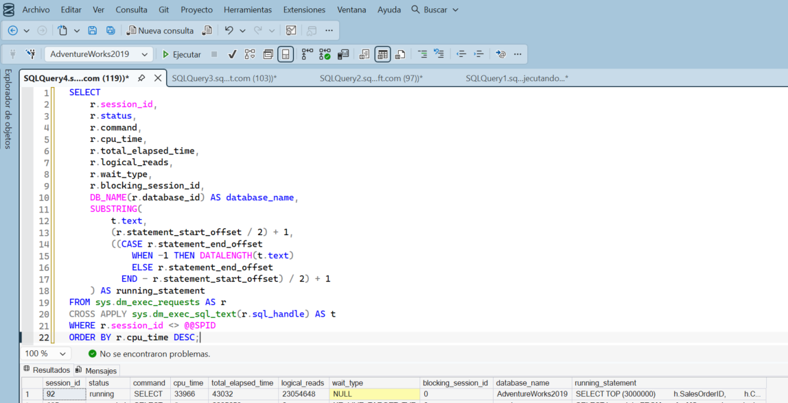

## Step 4 — Review Performance Overview in the Portal

Return to the Azure portal → **SQL managed instances** → `sqlmi-microhack-2026` → **Overview**. Review the built-in CPU chart for the last hour, then switch to 24 hours and 7 days. Confirm whether the workload changed the CPU pattern.

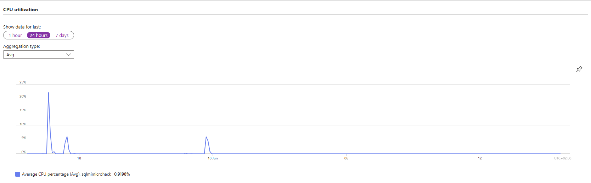

Open **Monitoring** → **Metrics**. Set scope to `sqlmi-microhack-2026`, metric namespace to SQL managed instance metrics, and add:

- `Average CPU percentage`
- `IO bytes read` and/or `IO bytes written`
- `IO requests count`
- `Storage space used`
- `Virtual core count`

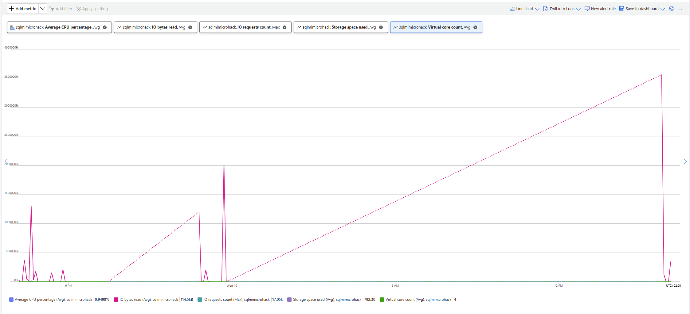


In **Logs** tab, in the right top corner try the new **Observability agent**, a temporary chat that can assist you analyze the metrics and logs.
To start you can click to Key metric overview to check the suggested analysis:

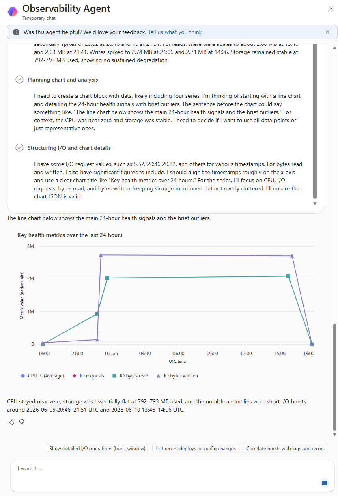

### Try these questions with the Observability agent

The agent has access to the same metrics, diagnostic logs, and resource health signals you just opened in the portal. Use it to **shortcut the manual KQL and DMV work** of Steps 3, 5 and 6 — then validate its answers against the queries you ran yourself. Ask the questions below in order; each one builds on the previous answer the same way a real incident investigation does.

> **Tip:** Keep each prompt **short and single-focus**. The agent is slow on compound questions ("when, how long, and peak…") because it runs a separate KQL query per intent. One question = one signal = a fast answer. Ask in order; each builds on the previous.

> **Tip:** The agent is a *temporary* chat — copy answers you want to keep before closing the blade.

1. **"Show CPU usage for the last hour."**
   - *Why ask:* Anchors the investigation to a concrete time window. Every later query (DMV, Log Analytics, Query Store) should target that window so you can compare apples to apples.

2. **"Is the current pressure CPU or IO?"**
   - *Why ask:* The Step 2 workload hits both. Knowing which dominates tells you whether to fix queries/indexes (CPU/IO) or scale vCores (capacity).

3. **"Top 5 CPU-consuming queries on `AdventureWorks2019` in the last hour."**
   - *Why ask:* The agent's version of the Step 3 DMV query. If `usp_MicroHackCpuPressure` / `usp_MicroHackCursorPressure` appear, your diagnostic settings from Step 1 are working end-to-end.

4. **"Top wait types on `AdventureWorks2019` right now."**
   - *Why ask:* Waits explain *why* a query is slow, not just *that* it is. Natural-language equivalent of Step 5 Query 5 and the `sys.dm_os_wait_stats` snapshot in Step 3.

5. **"Any missing-index recommendations for `AdventureWorks2019`?"**
   - *Why ask:* Catches the non-SARGable `LEFT(LastName, 2) = 'Sm'` scan and the CROSS JOIN from Step 2. Missing-index hints are the highest-signal recommendations and map directly to the Step 8 remediation.

6. **"Give me a KQL query to chart CPU per database for the last 6 hours."**
   - *Why ask:* Turns the agent into a launchpad for Step 5 — leaves you with a ready-to-paste KQL query instead of writing one from scratch.

> **Lab discipline:** Always cross-check the agent's answers against the DMV results from Step 3 and the Query Store reports from Step 6. 

## Step 5 — Query Log Analytics with KQL

Open the Log Analytics workspace `la-microhack-sql` → **Logs**. The diagnostic records land in the `AzureDiagnostics` table. In many workspaces string and numeric diagnostic fields have suffixes such as `_s`, `_d`, `_g`, and `_b`; use `project`/`getschema` if your column names differ.

> **Tip:** If you are unsure which columns exist for a given category, run this schema discovery query first:
>
> ```kusto
> AzureDiagnostics
> | where TimeGenerated > ago(1h)
> | where Category == "ResourceUsageStats"
> | getschema
> ```
>
> Replace the `Category` value with any category from Step 1 to inspect its columns.

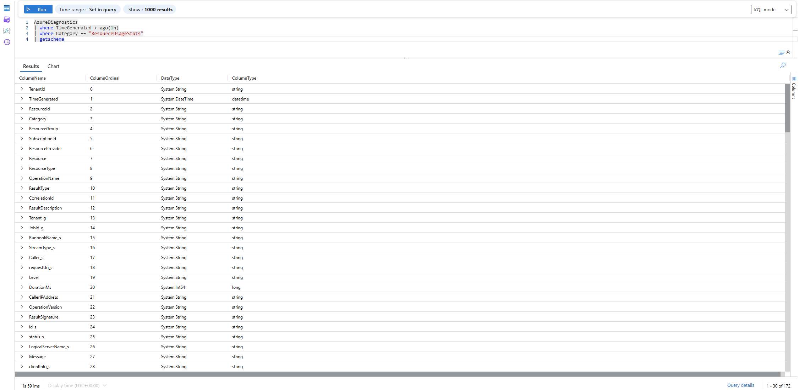

### Query 1 — CPU utilization over time

This query charts SQL MI CPU from the `ResourceUsageStats` category and validates whether the synthetic pressure is visible outside the database engine.

```kusto
AzureDiagnostics
| where TimeGenerated > ago(6h)
| where Category == "ResourceUsageStats"
| extend cpu_percent = todouble(avg_cpu_percent_s)
| summarize avg_cpu_percent = avg(cpu_percent), max_cpu_percent = max(cpu_percent) by bin(TimeGenerated, 5m)
| order by TimeGenerated asc
| render timechart
```

### Query 2 — Top long-running Query Store runtime records

This query uses `QueryStoreRuntimeStatistics` records to find queries with the highest duration or CPU reported through diagnostics.

```kusto
AzureDiagnostics
| where TimeGenerated > ago(24h)
| where Category == "QueryStoreRuntimeStatistics"
| extend database_name = coalesce(DatabaseName_s, Resource)
| extend query_id = tostring(query_id_d), plan_id = tostring(plan_id_d)
| extend duration_us = todouble(duration_d), max_duration_us = todouble(max_duration_d)
| extend cpu_time_us = todouble(cpu_time_d), execution_count = todouble(count_executions_d)
| summarize executions = sum(execution_count),
    avg_duration_ms = avg(duration_us / execution_count) / 1000,
    max_duration_ms = max(max_duration_us) / 1000,
    avg_cpu_ms = avg(cpu_time_us / execution_count) / 1000
    by database_name, query_id, plan_id
| top 20 by max_duration_ms desc
```

> **Tip:** The `QueryStoreRuntimeStatistics` fields `duration_d`, `cpu_time_d`, etc. store values in **microseconds**. Divide by 1,000 to convert to milliseconds. Use `getschema` (see the Tip above) to discover the exact column names in your workspace.


### Query 3 — Query Store wait stats trend

This query trends waits by category so you can distinguish CPU, IO, lock, memory, and log pressure over time.

```kusto
AzureDiagnostics
| where TimeGenerated > ago(24h)
| where Category == "QueryStoreWaitStatistics"
| extend database_name = coalesce(DatabaseName_s, Resource)
| extend wait_category = coalesce(wait_category_s, "unknown")
| extend total_wait_ms = todouble(total_query_wait_time_ms_d)
| summarize total_wait_ms = sum(total_wait_ms) by database_name, wait_category, bin(TimeGenerated, 15m)
| order by TimeGenerated asc
| render timechart
```

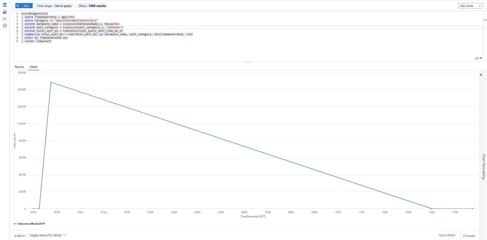

## Step 6 — Use Query Store for regression analysis
Query Store is supported on Azure SQL Managed Instance and is the best built-in feature for query regression analysis because it persists query text, runtime statistics, waits, and plans over time.

Query Store is **enabled by default** on Azure SQL MI for newly created and migrated databases. Verify and adjust the configuration for the lab:

```sql
-- Clear all existing Query Store data
ALTER DATABASE AdventureWorks2019 SET QUERY_STORE CLEAR ALL;
GO

-- Configure Query Store to capture ALL queries immediately
ALTER DATABASE AdventureWorks2019
SET QUERY_STORE = ON
(
    OPERATION_MODE = READ_WRITE,
    QUERY_CAPTURE_MODE = ALL,              -- Capture everything
    MAX_STORAGE_SIZE_MB = 1000,
    INTERVAL_LENGTH_MINUTES = 1,           -- Short intervals for quick results
    SIZE_BASED_CLEANUP_MODE = AUTO,
    MAX_PLANS_PER_QUERY = 200,
    DATA_FLUSH_INTERVAL_SECONDS = 60
);
GO
```

Now we are going to generate load to see a query with different executions plans:
We will create a stored procedure to run a specifc query, first with the needed indexing for performance and then, dropping this index to verify the performance degradation:

```sql
DROP PROCEDURE IF EXISTS dbo.usp_GetSalesOrdersByCustomer;
GO

CREATE PROCEDURE dbo.usp_GetSalesOrdersByCustomer
    @CustomerID INT = 29825  -- Default customer with many orders
AS
BEGIN
    SET NOCOUNT ON;
    
    -- This query will perform DRAMATICALLY differently with/without index
    -- With index: Index Seek (milliseconds)
    -- Without index: Table Scan of 31K+ rows (much slower)
    
    SELECT 
        soh.SalesOrderID,
        soh.OrderDate,
        soh.DueDate,
        soh.ShipDate,
        soh.Status,
        soh.SubTotal,
        soh.TaxAmt,
        soh.Freight,
        soh.TotalDue,
        c.AccountNumber,
        p.FirstName + ' ' + p.LastName AS CustomerName,
        st.Name AS TerritoryName,
        COUNT(sod.SalesOrderDetailID) AS LineItemCount,
        SUM(sod.LineTotal) AS OrderLineTotal
    FROM Sales.SalesOrderHeader soh
    INNER JOIN Sales.Customer c ON soh.CustomerID = c.CustomerID
    INNER JOIN Person.Person p ON c.PersonID = p.BusinessEntityID
    LEFT JOIN Sales.SalesTerritory st ON soh.TerritoryID = st.TerritoryID
    INNER JOIN Sales.SalesOrderDetail sod ON soh.SalesOrderID = sod.SalesOrderID
    WHERE soh.CustomerID = @CustomerID
    GROUP BY 
        soh.SalesOrderID,
        soh.OrderDate,
        soh.DueDate,
        soh.ShipDate,
        soh.Status,
        soh.SubTotal,
        soh.TaxAmt,
        soh.Freight,
        soh.TotalDue,
        c.AccountNumber,
        p.FirstName,
        p.LastName,
        st.Name
    ORDER BY soh.OrderDate DESC;
END;
GO

-- Check if the critical index exists
IF NOT EXISTS (
    SELECT 1 
    FROM sys.indexes 
    WHERE name = 'IX_SalesOrderHeader_CustomerID' 
    AND object_id = OBJECT_ID('Sales.SalesOrderHeader')
)
BEGIN
    PRINT 'Index does not exist - creating it...';
    CREATE NONCLUSTERED INDEX IX_SalesOrderHeader_CustomerID 
    ON Sales.SalesOrderHeader (CustomerID)
    INCLUDE (OrderDate, TotalDue, Status, SubTotal, TaxAmt, Freight, DueDate, ShipDate, TerritoryID, SalesOrderID);
    PRINT 'Index created successfully.';
END
ELSE
BEGIN
    PRINT 'Index already exists - ready for baseline testing.';
END
```

Now we will execute the procedure 40 times, to get result for the optimized query:

```sql
-- Clear execution plan cache to ensure fresh execution
DBCC FREEPROCCACHE;
GO

-- Execute multiple times to establish a solid baseline
EXEC dbo.usp_GetSalesOrdersByCustomer @CustomerID = 29825;
GO 30  -- Run 30 times
```

Now we check the baseline performance:

```sql
SELECT 
    'BASELINE (with index)' AS Phase,
    COUNT(rs.plan_id) AS Executions,
    AVG(rs.avg_duration) / 1000.0 AS AvgDurationMs,
    AVG(rs.avg_cpu_time) / 1000.0 AS AvgCpuMs,
    AVG(rs.avg_logical_io_reads) AS AvgLogicalReads
FROM sys.query_store_query q
JOIN sys.query_store_plan p ON q.query_id = p.query_id
JOIN sys.query_store_runtime_stats rs ON p.plan_id = rs.plan_id
WHERE q.object_id = OBJECT_ID('dbo.usp_GetSalesOrdersByCustomer');
```

Now, we drop the index and execute the Stored Procedure 30 times :

```sql
DROP INDEX IX_SalesOrderHeader_CustomerID ON Sales.SalesOrderHeader;
GO


-- Clear plan cache to force recompile with new (worse) plan
DBCC FREEPROCCACHE;
GO


EXEC dbo.usp_GetSalesOrdersByCustomer @CustomerID = 29825;
GO 30  -- Run 30 times with poor performance
```

Now we can see the times it took to execute the query depending on the plan:

```sql
SELECT TOP 5
    q.query_id,
    OBJECT_NAME(q.object_id) AS StoredProcedure,
    p.plan_id,
    rs.runtime_stats_interval_id,
    rsi.start_time AS IntervalStart,
    rs.count_executions AS Executions,
    rs.avg_duration / 1000.0 AS AvgDurationMs,
    rs.avg_cpu_time / 1000.0 AS AvgCpuMs,
    rs.avg_logical_io_reads AS AvgLogicalReads,
    rs.avg_physical_io_reads AS AvgPhysicalReads,
    TRY_CAST(p.query_plan AS XML) AS QueryPlan
FROM sys.query_store_query q
JOIN sys.query_store_plan p ON q.query_id = p.query_id
JOIN sys.query_store_runtime_stats rs ON p.plan_id = rs.plan_id
JOIN sys.query_store_runtime_stats_interval rsi ON rs.runtime_stats_interval_id = rsi.runtime_stats_interval_id
WHERE q.object_id = OBJECT_ID('dbo.usp_GetSalesOrdersByCustomer')
ORDER BY rsi.start_time, p.plan_id;
```

The previous query returns both queries and the execution plans associated, as well as the times it the query took

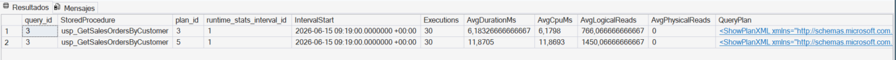


In the following figure we can see how the current query (in our case, query 3) presents the two execution plans. For this, we need to open the Top Resouce Consuming Queries in the Query Store folder.

Plan 4 presents worse times, as it is the one without the index. From this screen, navigate to the plans and explore the differences:

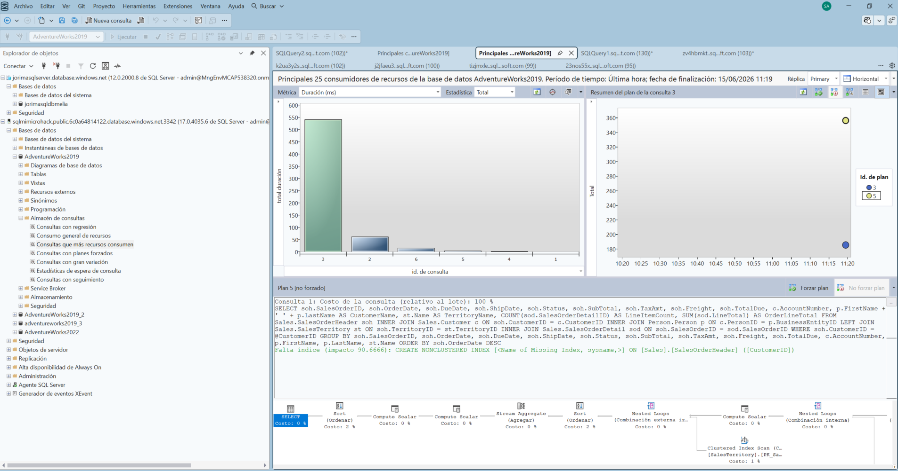

Compare the previous plan and current plan. If a known good plan is available, force it from the SSMS report or use T-SQL.

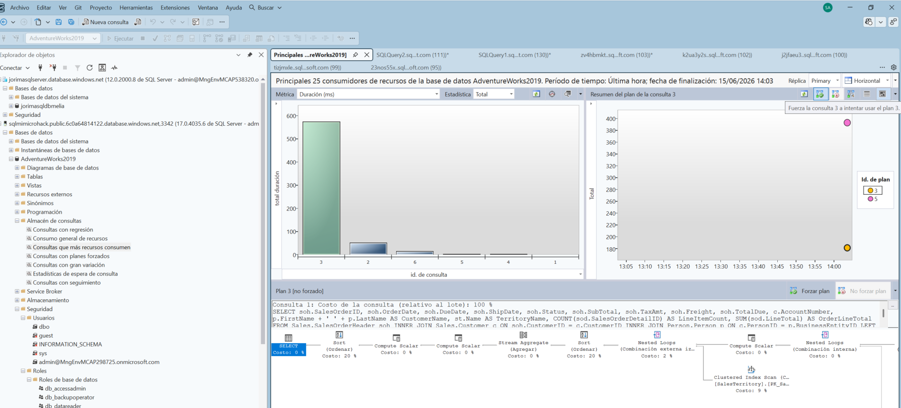

## Step 7 — Configure Automatic Tuning + alerts

Automatic tuning can help stabilize workloads by automatically correcting plan regressions. On Azure SQL Managed Instance, the only supported automatic tuning option is **`FORCE_LAST_GOOD_PLAN`** (automatic plan correction). 

Enable automatic plan correction using T-SQL:

```sql
ALTER DATABASE AdventureWorks2019 SET AUTOMATIC_TUNING (FORCE_LAST_GOOD_PLAN = ON);
GO

SELECT name, desired_state_desc, actual_state_desc, reason_desc
FROM sys.database_automatic_tuning_options;
```

The T-SQL query above (`sys.database_automatic_tuning_options`) is the way to confirm the setting on Managed Instance.

Next, create an Azure Monitor alert. Open **Monitoring** → **Alerts** → **Create** → **Alert rule**. Use scope `sqlmi-microhack-2026`, signal **Average CPU percentage**, threshold **Greater than 80**, aggregation **Average**, evaluation frequency **1 minute**, and lookback/window **5 minutes**.

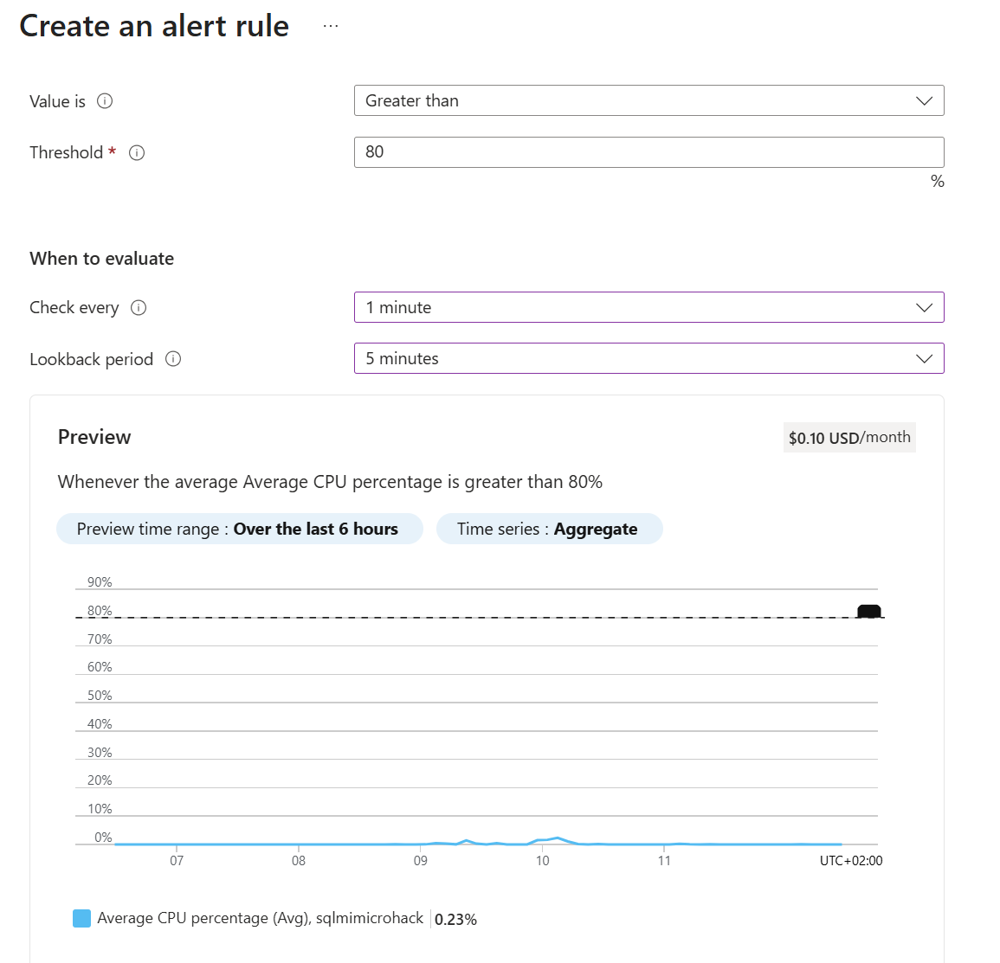

Create or select an action group named `ag-microhack-sql-ops`. Add an email receiver for the lab operator. 

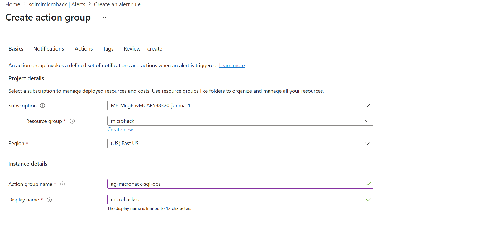


---

## Learning resources

- [Monitor Azure SQL Managed Instance with Azure Monitor](https://learn.microsoft.com/en-us/azure/azure-sql/managed-instance/monitoring-sql-managed-instance-azure-monitor?view=azuresql)
- [Azure SQL monitoring with Azure Monitor SQL insights](https://learn.microsoft.com/en-us/azure/azure-monitor/insights/azure-sql?tabs=portal)
- [Monitor Azure SQL Database and Azure SQL Managed Instance using database watcher](https://learn.microsoft.com/en-us/azure/azure-sql/database-watcher-overview?view=azuresql)
- [Intelligent Insights performance diagnostics](https://learn.microsoft.com/en-us/azure/azure-sql/database/intelligent-insights-overview?view=azuresql)
- [Monitor performance by using the Query Store](https://learn.microsoft.com/en-us/sql/relational-databases/performance/monitoring-performance-by-using-the-query-store?view=sql-server-ver17)
- [Query Store usage scenarios](https://learn.microsoft.com/en-us/sql/relational-databases/performance/query-store-usage-scenarios?view=sql-server-ver17)
- [Automatic tuning in Azure SQL Database and Azure SQL Managed Instance](https://learn.microsoft.com/en-us/azure/azure-sql/database/automatic-tuning-overview?view=azuresql)
- [Kusto Query Language reference](https://learn.microsoft.com/en-us/azure/data-explorer/kusto/query/)
- [AzureDiagnostics table reference](https://learn.microsoft.com/en-us/azure/azure-monitor/reference/tables/azurediagnostics)
- [Quickstart: Create a watcher to monitor Azure SQL (preview)](https://learn.microsoft.com/en-us/azure/azure-sql/database-watcher-quickstart?view=azuresql)
- [Create and configure a database watcher (preview)](https://learn.microsoft.com/en-us/azure/azure-sql/database-watcher-manage?view=azuresql)
- [Database watcher data collection and datasets (preview)](https://learn.microsoft.com/en-us/azure/azure-sql/database-watcher-data?view=azuresql)

---

[Previous Solution](../challenge-03/solution-03.md) - **[Home](../../Readme.md)** - [Next Solution](../challenge-05/solution-05.md)
