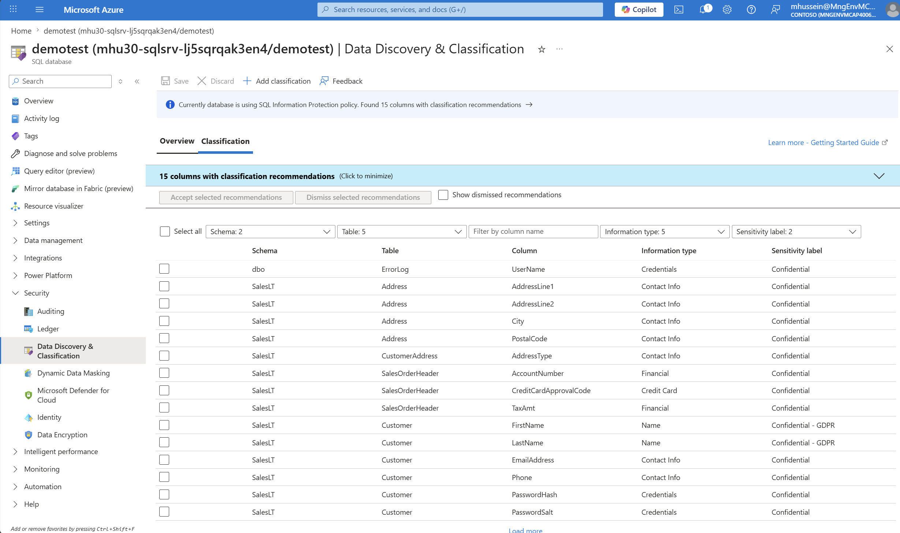

# Solution 5 — Security on Azure SQL Managed Instance (2026 edition)

[Previous Solution](../challenge-04/solution-04.md) - **[Home](../../Readme.md)** - [Finish](../../challenges/finish.md)

## Introduction

This hands-on lab introduces you to the layered security model available when running databases in Azure. The activities within this hands-on lab will progress from the outer security layers that protect access to the instance through to the innermost layers that govern database queries and data usage.


Because SQL Managed Instance always runs in a private network, the Network Security layer has already been implemented at the vNet level. Equally, we have already defined and implemented Microsoft Enterprise security controls in earlier challenges.

So this lab will focus on the Threat Protection, Information Protection, and Customer Data layers of the security model and how these are implemented in Azure SQL Managed Instance through:

- Using **Data Discovery & Classification**
- **Microsoft Defender for SQL**
  - Vulnerability Assessment
  - Advanced Threat Protection


---

## Step 1 — Data Discovery & Classification

[Data Discovery & Classification](https://learn.microsoft.com/en-us/azure/azure-sql/database/data-discovery-and-classification-overview) helps discover, classify, label, and report sensitive data across your databases.

1. Open the Azure portal and go to **SQL managed instances**.
2. Select the managed instance **`sqlmi-microhack-2026`**.
3. In the database list, open the migrated AdventureWorks database used by your team. If the lab used a team naming convention, use the database that corresponds to your team, for example `AdventureWorks2022_team01`.
4. In the database menu, under **Security**, select **Data Discovery & Classification**.

5. Review the **Overview** page. The database may show no saved classifications yet, but the service should display a banner or link indicating that classification recommendations are available.
6. Select the recommendations banner, for example **View recommendations** or **We have found columns with classification recommendations**.



7. Review the recommendation list. On AdventureWorks you should see recommendations for common sensitive attributes such as names, national identifiers, email addresses, phone numbers, addresses, and financial account information.
8. Select the recommendations that apply to the lab data. Include columns such as:
   - `Person.Person.FirstName`
   - `Person.Person.LastName`
   - `Person.EmailAddress.EmailAddress`
   - `Sales.CreditCard.CardNumber` or equivalent credit-card columns
   - Any national ID, SSN, phone, or address columns present in your restored sample database
9. Select **Accept selected recommendations**.
10. Select **Save** to persist the classifications.

11. Return to the **Overview** tab and confirm that the dashboard now shows classified columns grouped by sensitivity label and information type.

12. Add one manual classification so you understand how to tag a column that was not automatically recommended. Select **+ Add classification**.
13. Use the following values:

| Field | Value |
|---|---|
| Schema | `Person` |
| Table | `EmailAddress` |
| Column | `EmailAddress` |
| Information type | `Contact Info` or `Email` |
| Sensitivity label | `Confidential` |

14. Select **Add classification**, then select **Save**.

15. Optional validation from SSMS: connect to `sqlmi-microhack-2026` and run the following query in the lab database. Classifications are stored in the [`sys.sensitivity_classifications`](https://learn.microsoft.com/en-us/sql/relational-databases/system-catalog-views/sys-sensitivity-classifications-transact-sql) system catalog view.

```sql
SELECT
    schema_name(o.schema_id) AS schema_name,
    o.name AS table_name,
    c.name AS column_name,
    sc.label,
    sc.information_type,
    sc.rank_desc
FROM sys.sensitivity_classifications AS sc
JOIN sys.all_columns AS c
    ON sc.major_id = c.object_id
   AND sc.minor_id = c.column_id
JOIN sys.objects AS o
    ON c.object_id = o.object_id
ORDER BY schema_name, table_name, column_name;
```

16. Confirm that the classifications appear in `sys.sensitivity_classifications`.

> **Remember:** classification is a governance and metadata feature. It complements access control, encryption, auditing, and Defender alerts, but it is not a runtime access-control mechanism.

---

## Step 2 — Enable Microsoft Defender for SQL

[Microsoft Defender for SQL](https://learn.microsoft.com/en-us/azure/defender-for-cloud/defender-for-sql-introduction) is part of [Microsoft Defender for Cloud](https://learn.microsoft.com/en-us/azure/defender-for-cloud/defender-for-cloud-introduction) and provides a comprehensive suite of security features.

1. In the Azure portal, search for and open **Microsoft Defender for Cloud**.
2. In the left navigation, select **Environment settings**.
3. Select the subscription that contains `sqlmi-microhack-2026`.

4. Select **Defender plans**.
5. Locate the database-related plans. In the current portal these are shown under the **Databases** plan family and include coverage for SQL servers on machines and Azure SQL Managed Instance.
6. Turn the relevant database plan **On**. For this lab, make sure Azure SQL resources are covered.
7. Select **Save**.

8. Return to the SQL managed instance or database resource and open **Microsoft Defender for Cloud** from the resource **Security** section.
9. Confirm that the database is protected. It can take a few minutes for the status to refresh.

If the plan is already enabled by the lab owner or proctor, do not disable it. Just capture the protected status and continue.

---

## Step 3 — Vulnerability Assessment baseline

[Vulnerability Assessment (VA)](https://learn.microsoft.com/en-us/azure/defender-for-cloud/sql-azure-vulnerability-assessment-overview) scans the database and related server configuration against a knowledge base of security best practices and known vulnerabilities.

1. In **Microsoft Defender for Cloud**, go to **Recommendations**.
2. Search for **SQL Managed Instance should have vulnerability assessment configured** or an equivalent recommendation for your resource type.
3. Open the recommendation and locate the resource for `sqlmi-microhack-2026`.

4. Select the affected SQL managed instance or database.
5. Choose **Configure** or **Fix**.
6. Use [**Express configuration**](https://learn.microsoft.com/en-us/azure/defender-for-cloud/sql-azure-vulnerability-assessment-overview#set-up-vulnerability-assessment) when prompted. Express configuration automatically sets up recurring scans and stores results in your configured storage account.
7. Save the configuration.

8. Open the vulnerability assessment experience for the database. Depending on the portal blade, this may be under the database **Microsoft Defender for Cloud** page or directly under **Vulnerability Assessment** in the database menu.
9. Select **Scan** to run a manual scan.
10. Wait for the scan to complete. It usually takes a few minutes.

11. Review the failed checks. Typical lab findings can include configuration items such as excessive permissions, database owners, disabled auditing, guest access, cross-database ownership chaining, and SQL authentication fallback options.
12. Open a representative finding, such as a finding that recommends disabling cross-database ownership chaining or reducing broad permissions.
13. Read the description, impact, query results, and remediation script.

14. Decide whether the finding is a real risk to remediate or an expected lab condition to baseline. For example, if a legacy dependency is intentionally present for the MicroHack, baseline it and document the justification.
15. For an expected finding, choose **Approve as baseline** or **Add all results as baseline**.
16. Confirm the baseline change.

17. Run the scan again.
18. Confirm that approved baseline findings no longer appear as active failures, while unapproved findings remain visible.
19. Export or capture the scan result if your proctor wants evidence for the challenge.

A good lab outcome is not necessarily a perfect score. A good outcome is that you can explain each finding, identify which ones should be fixed, and baseline only those that are expected and justified.

---

## Step 4 — Advanced Threat Protection

[Advanced Threat Protection](https://learn.microsoft.com/en-us/azure/azure-sql/database/threat-detection-overview) in Microsoft Defender for SQL detects suspicious database activity such as potential SQL injection, data exfiltration attempts, and credential abuse.

> **Important:** Run this only in the lab database. Do not run suspicious test patterns against customer, production, or shared corporate databases.

1. Open SSMS on the lab VM.
2. Connect to `sqlmi-microhack-2026` using a SQL authentication account provided by the lab. The query pattern is easier to identify when it resembles an application connection.
3. Open a new query window against the AdventureWorks database.
4. If needed, use **Query > Connection > Change Connection** and set an application name in **Additional Connection Parameters**:

```text
Application Name=microhack-webapp-sql-injection-test
```

5. Run the following simulated SQL injection pattern:

```sql
SELECT *
FROM Person.Person
WHERE LastName = '' OR '1' = '1' --';
```

If your AdventureWorks schema differs, use any simple table in the database and keep the suspicious predicate pattern.

6. Confirm that the query returns rows. The point is not the result set; the point is to generate a suspicious query shape.

7. Wait about 5 minutes. Alerts can take longer, sometimes up to 10–15 minutes in a lab subscription.
8. In the Azure portal, open **Microsoft Defender for Cloud**.
9. Select **Security alerts**.
10. Filter by the SQL managed instance resource, by severity, or by the lab resource group.
11. Open the alert that indicates a potential SQL injection or suspicious database activity. See [Security alerts for Microsoft Defender for SQL](https://learn.microsoft.com/en-us/azure/defender-for-cloud/alerts-sql-database-and-azure-synapse-analytics) for a complete alert taxonomy.

12. Review the alert detail page. Capture the alert name, affected resource, severity, description, evidence, MITRE ATT&CK mapping if shown, and recommended remediation steps.
13. If the portal provides an investigation graph or related entities, open it and capture the screen.

14. Discuss what would be different in production:
    - The source application and principal should be identifiable.
    - Alerts should route to the security operations process.
    - Application code should use [parameterized queries or stored procedures](https://learn.microsoft.com/en-us/sql/relational-databases/security/sql-injection#parameterized-queries) to prevent SQL injection and should not construct SQL statements through string concatenation.
    - Repeated alerts should become an incident, not just a lab screenshot.

---

## Step 5 — Microsoft Entra authentication (recommended)

[Microsoft Entra ID authentication](https://learn.microsoft.com/en-us/azure/azure-sql/database/authentication-aad-overview) avoids unnecessary SQL logins, enables centralized identity governance, and supports passwordless and risk-based authentication policies.

1. In the Azure portal, open the SQL managed instance **`sqlmi-microhack-2026`**.
2. Under **Settings** or **Security**, select **Microsoft Entra ID**.
3. Select **Set admin**.
4. Choose the lab administrator account or, preferably, a Microsoft Entra group created for SQL administrators.
5. Save the setting.

6. Connect to the managed instance using SSMS or the [SQL Server (mssql) extension for Visual Studio Code](https://learn.microsoft.com/en-us/sql/tools/visual-studio-code-sql-server-extension) with Microsoft Entra authentication (integrated or interactive).
7. In the AdventureWorks database, create a contained database user mapped to a Microsoft Entra group. Replace the group name with the group provided by your lab tenant.

```sql
CREATE USER [sg-sqlmi-microhack-readers] FROM EXTERNAL PROVIDER;
ALTER ROLE db_datareader ADD MEMBER [sg-sqlmi-microhack-readers];
```

8. For a contributor group, grant only the minimum permissions needed for the lab:

```sql
CREATE USER [sg-sqlmi-microhack-contributors] FROM EXTERNAL PROVIDER;
ALTER ROLE db_datareader ADD MEMBER [sg-sqlmi-microhack-contributors];
ALTER ROLE db_datawriter ADD MEMBER [sg-sqlmi-microhack-contributors];
```

9. Validate the effective users and roles:

```sql
SELECT
    dp.name,
    dp.type_desc,
    rp.name AS role_name
FROM sys.database_role_members AS drm
JOIN sys.database_principals AS rp
    ON drm.role_principal_id = rp.principal_id
JOIN sys.database_principals AS dp
    ON drm.member_principal_id = dp.principal_id
WHERE dp.name LIKE 'sg-sqlmi-microhack%'
ORDER BY dp.name, rp.name;
```

10. Optional hardening: evaluate [Microsoft Entra-only authentication](https://learn.microsoft.com/en-us/azure/azure-sql/database/authentication-azure-ad-only-authentication) for production workloads to eliminate SQL authentication entirely.

---

## Step 6 — Validate the security posture

The final step is to verify that the managed instance is visible in Defender for Cloud, that the VA baseline is understood, and that the security controls configured in the lab are producing evidence that can be reviewed in subsequent audit or compliance activities.

1. Open **Microsoft Defender for Cloud**.
2. Go to **Inventory** or **Security posture** and locate `sqlmi-microhack-2026`.
3. Review the resource recommendations, secure score contribution, and current alerts.

4. Re-run Vulnerability Assessment for the lab database.
5. Confirm that expected findings are covered by baseline and unexpected findings remain visible.
6. Confirm that Microsoft Defender for SQL is enabled.
7. Confirm that Data Discovery & Classification shows saved classifications.
8. If you completed the optional encryption steps, confirm the TDE protector and Always Encrypted configuration.

Use the following checklist as your completion evidence:

| Control | Expected evidence |
|---|---|
| Data Discovery & Classification | Sensitive AdventureWorks columns are labeled and visible in the portal |
| Microsoft Defender for SQL | Database plan enabled in Defender for Cloud |
| Vulnerability Assessment | Initial scan completed and justified baseline applied |
| Advanced Threat Protection | Suspicious query alert reviewed in Defender for Cloud |
| Microsoft Entra authentication | Microsoft Entra admin configured and contained group users created |

---

## Learning resources

- [Microsoft Defender for SQL overview](https://learn.microsoft.com/en-us/azure/defender-for-cloud/defender-for-sql-introduction)
- [Data Discovery & Classification for Azure SQL](https://learn.microsoft.com/en-us/azure/azure-sql/database/data-discovery-and-classification-overview)
- [Vulnerability Assessment for Azure SQL — express configuration](https://learn.microsoft.com/en-us/azure/defender-for-cloud/sql-azure-vulnerability-assessment-overview)
- [Advanced Threat Protection alerts for Azure SQL](https://learn.microsoft.com/en-us/azure/defender-for-cloud/alerts-sql-database-and-azure-synapse-analytics)
- [SQL injection prevention — parameterized queries](https://learn.microsoft.com/en-us/sql/relational-databases/security/sql-injection#parameterized-queries)
- [Microsoft Entra authentication for Azure SQL Managed Instance](https://learn.microsoft.com/en-us/azure/azure-sql/managed-instance/aad-security-configure-tutorial)
- [Microsoft Entra-only authentication for Azure SQL](https://learn.microsoft.com/en-us/azure/azure-sql/database/authentication-azure-ad-only-authentication)
- [Contained database users](https://learn.microsoft.com/en-us/sql/relational-databases/security/contained-database-users-making-your-database-portable)
- [KQL quick reference](https://learn.microsoft.com/en-us/kusto/query/)
- [Secure score in Microsoft Defender for Cloud](https://learn.microsoft.com/en-us/azure/defender-for-cloud/secure-score-security-controls)
- [SQL Server (mssql) extension for Visual Studio Code](https://learn.microsoft.com/en-us/sql/tools/visual-studio-code-sql-server-extension)

---

[Previous Solution](../challenge-04/solution-04.md) - **[Home](../../Readme.md)** - [Finish](../../challenges/finish.md)
